## Lifecycle

```mermaid
flowchart LR
    A([Choose endpoint]) --> B{Content type?}
    
    subgraph Ingestion [" "]
      direction LR
      UK([POST /ingestion/upload_knowledge])
      AM([POST /memories/add_memory])
    end

    B -- Files / app sources --> UK
    B -- User memories --> AM
    
    UK --> Q([queued])
    AM --> Q
    
    subgraph Pipeline [" "]
      direction LR
      Q --> P([processing])
      P --> G([graph_creation])
    end

    G --> C([completed])
    
    P -. failure .-> E([errored])
    G -. failure .-> E
    
    C --> R([Recall ready])

    %% Global Link Styling
    linkStyle default stroke:#64748b,stroke-width:2px,color:#f8fafc

    %% Standard Node Styling (Deep Slate)
    style A fill:#0f172a,stroke:#334155,stroke-width:2px,color:#f8fafc
    style B fill:#1e293b,stroke:#334155,stroke-width:2px,color:#f8fafc
    style UK fill:#1e293b,stroke:#334155,stroke-width:2px,color:#f8fafc
    style AM fill:#1e293b,stroke:#334155,stroke-width:2px,color:#f8fafc
    style Q fill:#1e293b,stroke:#334155,stroke-width:2px,color:#f8fafc
    style P fill:#1e293b,stroke:#334155,stroke-width:2px,color:#f8fafc
    
    %% Hydra Purple Accent (Core Innovation)
    style G fill:#4c1d95,stroke:#8b5cf6,stroke-width:3px,color:#ffffff,font-weight:bold
    
    %% Status Highlights
    style C fill:#0f172a,stroke:#10b981,stroke-width:2px,color:#f8fafc
    style R fill:#0f172a,stroke:#10b981,stroke-width:3px,color:#f8fafc
    style E fill:#0f172a,stroke:#ef4444,stroke-width:2px,color:#f8fafc

    %% Subgraph Transparency
    style Ingestion fill:none,stroke:none
    style Pipeline fill:none,stroke:none
```



## Endpoint reference

| Endpoint | Method | Purpose | Async? |
|---|---|---|---|
| [`/ingestion/upload_knowledge`](/api-reference/endpoint/upload-knowledge) | `POST` | Ingest files and/or app sources | Yes |
| [`/ingestion/verify_processing`](/api-reference/endpoint/verify-processing) | `POST` | Check processing status | No |

For user memories, see [`POST /memories/add_memory`](/api-reference/endpoint/add-memory).

## Which endpoint should I use?

| Content | Endpoint |
|---|---|
| PDFs, DOCX, CSVs, and other files HydraDB should parse | [`/ingestion/upload_knowledge`](/api-reference/endpoint/upload-knowledge) (`files`) |
| Slack messages, Notion pages, Gmail threads, webpages with pre-extracted text | [`/ingestion/upload_knowledge`](/api-reference/endpoint/upload-knowledge) (`app_knowledge`) |
| User preferences, conversation history, inline notes | [`/memories/add_memory`](/api-reference/endpoint/add-memory) |

## Typical call sequence

```
1. POST /ingestion/upload_knowledge   → returns source_ids, status: queued
2. POST /ingestion/verify_processing  → poll until status: completed
3. POST /recall/full_recall           → content is now retrievable
```

For batched uploads with mixed content:

```
1. POST /ingestion/upload_knowledge with files=[...] AND app_knowledge=[...]
   → single request, multiple source_ids in response
2. POST /ingestion/verify_processing with all source_ids
   → check all statuses in one call
```

## Status pipeline

| Status | Searchable? |
|---|---|
| `queued` | No |
| `processing` | No |
| `graph_creation` | **Yes** – via `full_recall` and `recall_preferences` |
| `completed` | Yes – via all recall endpoints, with full graph context |
| `errored` | No – inspect `error_code` and `message` on the status object (OpenAPI `ProcessingStatus`) |

Items in `graph_creation` are already retrievable. Wait for `completed` only when you specifically need full graph traversal.

## Key concepts

**Source** – Any unit of ingested content. Files become sources, app knowledge payloads become sources, memory items become sources. Each gets a unique `source_id`.

**Files vs app knowledge** – Files require parsing (HydraDB extracts text, layout, metadata). App knowledge items arrive pre-parsed – you supply the text and structured metadata directly in the `app_knowledge` multipart field.

**Multipart form data** – `/ingestion/upload_knowledge` always uses `multipart/form-data`, even when sending only `app_knowledge` (no actual files). Nested JSON fields (`file_metadata`, `app_knowledge`) must be sent as JSON-stringified form values.

**Upsert** – By default, ingesting a source with an existing ID overwrites the previous version. Set `upsert: false` to fail instead.

**Forceful relations** – At ingestion time, you can declare relationships between sources via the `relations` field. These are surfaced in `thinking`-mode recall as `additional_context`.

## Related sections

- [Essentials → Memories](/essentials/memories) – memories vs knowledge, when to use which
- [Essentials → Metadata](/essentials/metadata) – tenant-level vs document-level metadata
- [Essentials → Forceful Relations](/essentials/knowledge#7-forceful-relations) – linking sources at ingestion
- [API Reference → Recall](/api-reference/endpoint/full-recall) – retrieve ingested content
