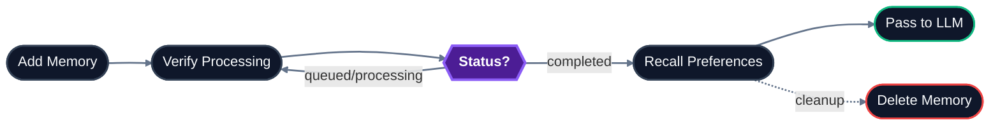

## Lifecycle



## Endpoint reference

| Endpoint | Method | Purpose | Async? |
|---|---|---|---|
| [`/memories/add_memory`](/api-reference/endpoint/add-memory) | `POST` | Ingest user memories – text, markdown, or conversation pairs | Yes |
| [`/memories/delete_memory`](/api-reference/endpoint/delete-memory) | `DELETE` | Permanently remove a single memory by ID | No |

For verifying ingestion status, see [`POST /ingestion/verify_processing`](/api-reference/endpoint/verify-processing).

For retrieving memories, see [`POST /recall/recall_preferences`](/api-reference/endpoint/recall-preferences).

## Typical call sequence

For storing a new memory:

```
1. POST   /memories/add_memory          → returns source_id, status: queued
2. POST   /ingestion/verify_processing  → poll until status: completed
3. POST   /recall/recall_preferences    → memory is now retrievable
```

For removing a memory:

```
DELETE /memories/delete_memory?memory_id=... → permanent removal
```

## Memories vs knowledge

HydraDB distinguishes two classes of ingested content:

| | Memories | Knowledge |
|---|---|---|
| **Endpoint** | `POST /memories/add_memory` | `POST /ingestion/upload_knowledge` |
| **Best for** | User preferences, conversation history, inline notes | Documents, PDFs, app-generated content |
| **Content format** | Text, markdown, conversation pairs | Files, structured app sources |
| **Retrieval** | `POST /recall/recall_preferences` | `POST /recall/full_recall` |
| **Metadata fields** | `metadata`, `additional_metadata` (object) | `metadata`, `additional_metadata` (object) |

Both go through the same processing pipeline (queued → processing → completed) and are searchable via the `boolean_recall` endpoint.

## Key concepts

**Memory** – A single unit of user-specific context. Identified by `source_id`. Created by `POST /memories/add_memory`.

**Inference (`infer`)** – When `true`, HydraDB extracts implicit signals (preferences, entities, relationships) from the content. When `false` (default), content is indexed as-is.

**Conversation pairs** – User-assistant exchanges stored as memory. Useful for capturing chat history with full context.

**Expiry** – Optional TTL in seconds (`expiry_time`). After this duration, the memory is automatically deleted. Useful for ephemeral context.

**Sub-tenants** – Memories are scoped to a sub-tenant. For B2C apps, each end user typically has their own sub-tenant.

## Related sections

- [Essentials → Memories](/essentials/memories) – conceptual overview, when to use memories vs knowledge
- [Essentials → Multi-Tenant Support](/essentials/multi-tenant) – sub-tenant patterns for B2B and B2C
- [API Reference → Recall](/api-reference/endpoint/recall-preferences) – retrieve stored memories
