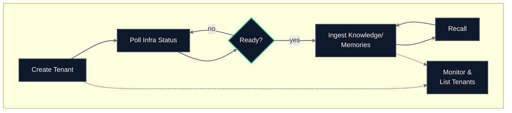

## Lifecycle



## Endpoint reference

| Endpoint | Method | Purpose | Async? |
|---|---|---|---|
| [`/tenants/create`](/api-reference/endpoint/create-tenant) | `POST` | Create a new isolated workspace | Yes |
| [`/tenants/infra/status`](/api-reference/endpoint/infra-status) | `GET` | Check provisioning readiness | No |
| [`/tenants/monitor`](/api-reference/endpoint/monitor-tenant) | `GET` | Get object counts and vector dimensions | No |
| [`/tenants/sub_tenant_ids`](/api-reference/endpoint/list-sub-tenant-ids) | `GET` | List active sub-tenants | No |
| [`/tenants/tenant_ids`](/api-reference/endpoint/list-tenant-ids) | `GET` | List all tenants for the organization | No |
| [`/tenants/delete`](/api-reference/endpoint/delete-tenant) | `DELETE` | Permanently remove a tenant | Yes |

<Info>
**OpenAPI scope:** [`api-reference/openapi.json`](/api-reference/openapi.json) documents `/tenants/create`, `/tenants/infra/status`, `/tenants/monitor`, `/tenants/sub_tenant_ids`, and `/tenants/delete`. The companion page [List tenant IDs](/api-reference/endpoint/list-tenant-ids) describes **`GET /tenants/tenant_ids`**, which does **not** appear in that OpenAPI file.
</Info>

## Typical call sequence

For a new tenant from scratch:

```
1. POST   /tenants/create              → returns "accepted"
2. GET    /tenants/infra/status (poll) → wait for all statuses true
3. POST   /ingestion/upload_knowledge  → start ingesting data
4. POST   /recall/full_recall          → query your data
5. GET    /tenants/monitor             → verify storage
```

For routine operations on an existing tenant:

```
GET /tenants/sub_tenant_ids → list active sub-tenants
GET /tenants/tenant_ids     → list all tenants in the org
GET /tenants/monitor        → check storage growth
```

For teardown:

```
DELETE /tenants/delete → schedule deletion (irreversible)
```

## Key concepts

**Tenant** – Top-level isolated workspace. One per organization in most cases.

**Sub-tenant** – Subdivision inside a tenant. Created automatically the first time a `sub_tenant_id` is used. No explicit creation step, no confirmation.

**Default sub-tenant** – Every tenant gets one at creation. API calls that omit `sub_tenant_id` target this default.

**Tenant metadata schema** – Immutable field definitions set at creation. Cannot be changed later.


## Related sections

- [Essentials → Multi-Tenant Support](/essentials/multi-tenant) – concepts, isolation guarantees, use cases
- [Essentials → Metadata](/essentials/metadata) – tenant and document metadata
- [API Reference → Ingestion](/api-reference/endpoint/upload-knowledge) – after tenant setup, start ingesting
