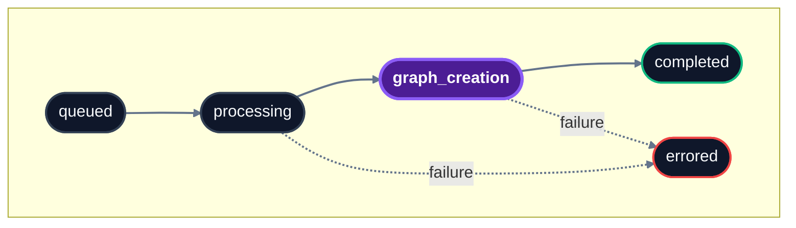

## When to use it

Both `/ingestion/upload_knowledge` and `/memories/add_memory` are asynchronous. After ingesting, use this endpoint to check whether content is fully indexed and ready to be recalled.

Common patterns:

- **Polling after upload** – wait until status is `completed` before running recall queries
- **Bulk progress tracking** – pass multiple IDs to check many sources in one call
- **Error inspection** – see why a specific item failed

## Endpoint

```
POST /ingestion/verify_processing
```

- **Auth:** Bearer token
- **Idempotency:** Read-only
- **Async:** No

## Example

<CodeGroup>
```bash cURL
curl -X POST 'https://api.hydradb.com/ingestion/verify_processing?file_ids=ef3ea754019855e2b39e9ab5c2d26096&file_ids=9a8b7c6d5e4f3a2b1c0d9e8f7a6b5c4d&tenant_id=my_first_tenant' \
  -H "Authorization: Bearer <your_api_key>"
```
```typescript TypeScript SDK
const response = await client.upload.verifyProcessing({
  tenantId: "my_first_tenant",
  fileIds: [
    "ef3ea754019855e2b39e9ab5c2d26096",
    "9a8b7c6d5e4f3a2b1c0d9e8f7a6b5c4d",
  ],
});
```
```python Python SDK
response = client.upload.verify_processing(
    tenant_id="my_first_tenant",
    file_ids=[
        "ef3ea754019855e2b39e9ab5c2d26096",
        "9a8b7c6d5e4f3a2b1c0d9e8f7a6b5c4d",
    ],
)
```
</CodeGroup>

## Query parameters

| Name | Type | Required | Description |
|---|---|---|---|
| `tenant_id` | string | Yes | The tenant the items belong to. |
| `file_ids` | string[] | Yes | One or more `source_id` values returned at ingestion. |
| `sub_tenant_id` | string | No | Sub-tenant scope. If omitted, the default sub-tenant is used. |

<Info>
The query parameter is named `file_ids` for legacy reasons. It accepts the `source_id` returned by both `/ingestion/upload_knowledge` and `/memories/add_memory` – not just file IDs.
</Info>

## Response

```json
{
  "statuses": [
    {
      "file_id": "ef3ea754019855e2b39e9ab5c2d26096",
      "indexing_status": "completed",
      "error_code": "",
      "error_message": "",
      "success": true,
      "message": "Processing status retrieved successfully"
    },
    {
      "file_id": "9a8b7c6d5e4f3a2b1c0d9e8f7a6b5c4d",
      "indexing_status": "graph_creation",
      "error_code": "",
      "error_message": "",
      "success": true,
      "message": "Processing status retrieved successfully"
    }
  ]
}
```

| Field | Description |
|---|---|
| `statuses[]` | One entry per requested ID. |
| `statuses[].file_id` | The ID being reported on. |
| `statuses[].indexing_status` | Current status. See [Status values](#status-values). |
| `statuses[].error_code` | Diagnostic code if `errored`. Empty otherwise. |
| `statuses[].error_message` | Human-readable explanation if `errored`. Empty otherwise. |
| `statuses[].success` | `true` if the status retrieval call succeeded. Does not mean indexing succeeded – check `indexing_status` for that. |

## Status values



| Status | Meaning |
|---|---|
| `queued` | Accepted by the server, not yet picked up by a worker. |
| `processing` | Content is being parsed, chunked, and embedded. |
| `graph_creation` | Content is indexed; the knowledge graph is being built on top. Already searchable via vector recall, but graph context may still be incomplete. |
| `completed` | Fully indexed and graphed. Ready for all recall modes. |
| `errored` | Processing failed. Check `error_code` and `error_message` for details. |
| `success` | Alias for `completed`. May appear in some legacy responses. |

## Polling pattern

```python
import time

source_ids = ["ef3ea754019855e2b39e9ab5c2d26096", "9a8b7c6d5e4f3a2b1c0d9e8f7a6b5c4d"]

while True:
    response = client.upload.verify_processing(
        tenant_id="my_first_tenant",
        file_ids=source_ids,
    )
    statuses = [s.indexing_status for s in response.statuses]

    if all(s == "completed" for s in statuses):
        break
    if any(s == "errored" for s in statuses):
        # inspect response.statuses for which failed
        break

    time.sleep(5)
```

Typical processing time:

- **Memories** (text, markdown, conversation pairs): seconds
- **Small documents** (under 50 pages): 1–5 minutes
- **Large documents** (50+ pages): 5–15 minutes

## Behavior notes

<Info>
**`graph_creation` is searchable.** Items in the `graph_creation` state are already retrievable via `full_recall` and `recall_preferences`. Wait for `completed` only if you specifically need full graph context.
</Info>

## Related endpoints

- **Before this:** [Upload knowledge](/api-reference/endpoint/upload-knowledge) · [Add memory](/api-reference/endpoint/add-memory)
- **After completion:** [Full recall](/api-reference/endpoint/full-recall) · [Recall preferences](/api-reference/endpoint/recall-preferences)

## Errors

Common codes: `400 INVALID_PARAMETERS`, `404 TENANT_NOT_FOUND`, `422 VALIDATION_ERROR`. See [Error Responses](/api-reference/error-responses) for the full list.

Read more: [Essentials → Memories](/essentials/memories)
