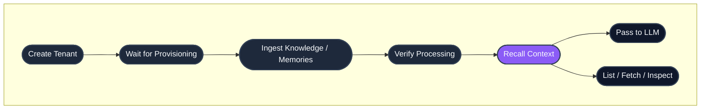

## Quick links

- **New to HydraDB?** Start with the [Quickstart](/get-started/quickstart)
- **Prefer SDKs?** See the [Python and TypeScript SDKs](#sdks) below
- **Authentication:** Every endpoint requires `Authorization: Bearer <your_api_key>`
- **Base URL:** `https://api.hydradb.com`
- **Errors:** See [Error Responses](/api-reference/error-responses)

## Endpoint groups

| Group | What it does | Pages |
|---|---|---|
| [Tenants](/api-reference/endpoint/tenants-overview) | Create, monitor, and manage isolated workspaces | 6 endpoints |
| [Ingestion](/api-reference/endpoint/ingestion-overview) | Upload knowledge sources (files, app content) | 2 endpoints |
| [Memories](/api-reference/endpoint/memories-overview) | Add and remove user-specific context | 2 endpoints |
| [Recall](/api-reference/endpoint/recall-overview) | Retrieve context with semantic or keyword search | 3 endpoints |
| [List](/api-reference/endpoint/list-overview) | Browse stored content and inspect graph relationships | 2 endpoints |
| [Fetch](/api-reference/endpoint/fetch-content) | Retrieve original file content | 1 endpoint |
| [Knowledge Deletion](/api-reference/endpoint/delete-knowledge) | Remove knowledge sources | 1 endpoint |

## End-to-end lifecycle



## SDKs

HydraDB publishes official SDKs for Python and TypeScript/Node. They wrap every endpoint in this reference with typed methods and IDE autocomplete.

| Language | Package | Install |
|---|---|---|
| **Python** | [`hydradb-sdk` on PyPI](https://pypi.org/project/hydradb-sdk/) | `pip install hydradb-sdk` |
| **TypeScript / Node** | [`@hydradb/sdk` on npm](https://www.npmjs.com/package/@hydradb/sdk) | `npm install @hydradb/sdk` |

**Quick init:**

<CodeGroup>

```python Python
import os
from hydra_db import HydraDB, AsyncHydraDB

client = HydraDB(token=os.environ["HYDRA_DB_API_KEY"])
async_client = AsyncHydraDB(token=os.environ["HYDRA_DB_API_KEY"])
```

```typescript TypeScript
import { HydraDBClient } from "@hydradb/sdk";

const client = new HydraDBClient({
  token: process.env.HYDRA_DB_API_KEY,
});
```

</CodeGroup>

SDK methods mirror the API: `client.<group>.<method>()` maps to the corresponding endpoint. Every per-endpoint page below includes Python and TypeScript tabs alongside the cURL example.

See the full reference at [SDKs](/api-reference/sdks).

## Full endpoint inventory

### Tenants

| Endpoint | Method | Purpose |
|---|---|---|
| [`/tenants/create`](/api-reference/endpoint/create-tenant) | `POST` | Create a new isolated workspace |
| [`/tenants/infra/status`](/api-reference/endpoint/infra-status) | `GET` | Check provisioning readiness |
| [`/tenants/monitor`](/api-reference/endpoint/monitor-tenant) | `GET` | Get object counts and vector dimensions |
| [`/tenants/sub_tenant_ids`](/api-reference/endpoint/list-sub-tenant-ids) | `GET` | List active sub-tenants |
| [`/tenants/tenant_ids`](/api-reference/endpoint/list-tenant-ids) | `GET` | List all tenants for the organization |
| [`/tenants/delete`](/api-reference/endpoint/delete-tenant) | `DELETE` | Permanently delete a tenant |

### Ingestion

| Endpoint | Method | Purpose |
|---|---|---|
| [`/ingestion/upload_knowledge`](/api-reference/endpoint/upload-knowledge) | `POST` | Ingest files and/or app sources |
| [`/ingestion/verify_processing`](/api-reference/endpoint/verify-processing) | `POST` | Check processing status |

### Memories

| Endpoint | Method | Purpose |
|---|---|---|
| [`/memories/add_memory`](/api-reference/endpoint/add-memory) | `POST` | Ingest user memories |
| [`/memories/delete_memory`](/api-reference/endpoint/delete-memory) | `DELETE` | Delete a single memory |

### Recall

| Endpoint | Method | Purpose |
|---|---|---|
| [`/recall/full_recall`](/api-reference/endpoint/full-recall) | `POST` | Hybrid recall over knowledge |
| [`/recall/recall_preferences`](/api-reference/endpoint/recall-preferences) | `POST` | Hybrid recall over user memories |
| [`/recall/boolean_recall`](/api-reference/endpoint/boolean-recall) | `POST` | Exact-match full-text search |

### List

| Endpoint | Method | Purpose |
|---|---|---|
| [`/list/data`](/api-reference/endpoint/list-data) | `POST` | Paginated browse of knowledge or memories |
| [`/list/graph_relations_by_id`](/api-reference/endpoint/graph-relations) | `GET` | Inspect entity relationships for a source |

### Fetch

| Endpoint | Method | Purpose |
|---|---|---|
| [`/fetch/content`](/api-reference/endpoint/fetch-content) | `POST` | Retrieve original file content or presigned URL |

### Knowledge Deletion

| Endpoint | Method | Purpose |
|---|---|---|
| [`/knowledge/delete_knowledge`](/api-reference/endpoint/delete-knowledge) | `POST` | Bulk delete sources by IDs |

## Conventions

**Authentication.** Every endpoint requires `Authorization: Bearer <your_api_key>` in the request header. Get your key at [app.hydradb.com](https://app.hydradb.com).

**Tenant scoping.** Every endpoint requires a `tenant_id`. Most endpoints also accept an optional `sub_tenant_id` for finer-grained scoping. If omitted, the default sub-tenant is used.

**Async operations.** Tenant creation, deletion, and content ingestion are asynchronous. They return immediately after queuing. Use the relevant status endpoint to confirm completion before downstream operations.

**Pagination.** Listing endpoints (`/list/data`) return a `pagination` object with `page`, `page_size`, `total`, `total_pages`, `has_next`, and `has_previous`.

**Parameter casing.** The REST API uses snake_case (`tenant_id`). The TypeScript SDK accepts the same snake_case keys; method names are camelCase (`fullRecall`, `addMemory`). The Python SDK uses snake_case throughout.

**Status codes.** Successful responses return `200` (or `202` for async accepts). Errors follow standard HTTP semantics:

| Code | Meaning |
|---|---|
| `200` | Success |
| `202` | Accepted (async operation queued) |
| `400` | Invalid parameters |
| `401` | Authentication required |
| `403` | Forbidden |
| `404` | Resource not found |
| `409` | Conflict (e.g., tenant already exists) |
| `422` | Validation error |
| `429` | Rate limit exceeded |
| `500` | Internal server error |
| `503` | Service unavailable |

See [Error Responses](/api-reference/error-responses) for response shapes and error codes.

## Rate limits

Rate limits apply per API key. For production deployments, build retry logic with exponential backoff against the `429` response. Contact [founders@hydradb.com](mailto:founders@hydradb.com) for current limit values.

## Next steps

- **Build something:** [Quickstart](/get-started/quickstart) walks through your first integration in five minutes
- **Understand the model:** [Core Concepts](/get-started/core-concepts) explains tenants, memories, recall, and metadata
- **Go deeper:** [Essentials](/essentials) covers each primitive in depth
- **Install an SDK:** [Python](https://pypi.org/project/hydradb-sdk/) · [TypeScript](https://www.npmjs.com/package/@hydradb/sdk)
