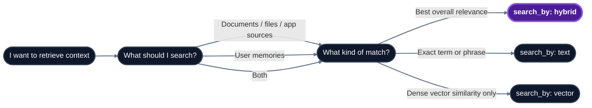

## Which search mode should I use?



## Endpoint reference

| Endpoint | Method | SDK method | Purpose | Returns |
|---|---|---|---|---|
| [`/search`](/api-reference/v2/endpoint/search) | `POST` | `search.query` | Unified retrieval over knowledge, memories, or both | Ranked chunks + optional graph context |

## Source selection

Use `source` to choose what collection to search:

| Source | Searches | Best for |
|---|---|---|
| `sources` | Knowledge documents, files, and app sources | Document Q&A, RAG context |
| `memories` | User memories | Personalization and user preferences |
| `all` | Sources and memories, merged together | Personalized answers grounded in both shared and user-specific context |

## Search methods

Use `search_by` to choose the retrieval method:

| Method | Match type | Best for |
|---|---|---|
| `hybrid` | Semantic + keyword | General-purpose retrieval and RAG |
| `text` | BM25 full-text search | Compliance lookups, exact matches, phrase search |
| `vector` | Dense vector search | Pure semantic similarity |

## Modes

For `hybrid` and `vector`, use `mode` to control retrieval quality:

| Mode | Behavior | When to use |
|---|---|---|
| `fast` | Single query pass, lower latency | Real-time chat, autocomplete, simple lookups |
| `thinking` | Multi-query expansion, reranking, forceful-relation context | Complex queries, customer-facing answers, anything where quality matters |

## Common parameters

| Parameter | Type / values | Default | Purpose |
|---|---|---|---|
| `tenant_id` | string |  -  (required) | Tenant to search. |
| `sub_tenant_id` | string | default sub-tenant | Optional sub-tenant scope. |
| `query` | string |  -  (required) | Search terms or natural-language question. Cannot be empty. |
| `source` | `"sources"` \| `"memories"` \| `"all"` | `"sources"` | What collection to search over. `"all"` runs `sources` and `memories` in parallel and merges by `relevancy_score`. |
| `search_by` | `"hybrid"` \| `"text"` \| `"vector"` | `"hybrid"` | Retrieval method. `hybrid` = dense vectors + BM25, `text` = BM25 only, `vector` = dense only. |
| `operator` | `"or"` \| `"and"` \| `"phrase"` | `"or"` | BM25 matching when `search_by: "text"`. `or` = any term, `and` = all terms, `phrase` = exact phrase. Ignored for `hybrid` and `vector`. |
| `mode` | `"fast"` \| `"thinking"` | `"fast"` | Retrieval quality vs latency. `fast` = single query pass. `thinking` = multi-query expansion + reranking + forceful-relation context. Applies to `hybrid` and `vector` only. |
| `alpha` | float `0.0`–`1.0`, or `"auto"` | `0.8` | Hybrid weight: `1.0` = pure semantic, `0.0` = pure BM25, `"auto"` = let HydraDB pick per query. Applies to `search_by: "hybrid"` only. |
| `recency_bias` | float `0.0`–`1.0` | `0.0` | Prefer newer content. `0.0` = no recency preference, `1.0` = strong preference for recent items. |
| `metadata_filters` | object |  -  | Deterministic narrowing before ranking. **Top-level keys** match `tenant_metadata` (must be declared in `tenant_metadata_schema` and `enable_match`). **Nest under `document_metadata`** to filter on free-form per-document fields. See the example below. |
| `graph_context` | boolean | `false` | When `true`, includes the entity/relation graph slice for retrieved chunks in the response (`graph_context` field). Off by default  -  turn on when you need to show how things connect, not just what is similar. |
| `search_forceful_relations` | boolean | `true` | Pull author-declared related sources into `additional_context`. **Only applies when `mode: "thinking"`**  -  ignored in `fast` mode. |
| `additional_context` | string |  -  | Free-form text to bias retrieval (e.g., "user is on the Pro plan"). |

### Filter examples

```json
{
  "metadata_filters": {
    "department": "engineering",
    "region": "us-east",
    "document_metadata": {
      "source": "account_plan",
      "author": "alex"
    }
  }
}
```

Top-level keys (`department`, `region`) are matched against tenant-schema fields. The nested `document_metadata` object filters free-form per-document fields.

## Typical patterns

### Document Q&A

```json
{
  "tenant_id": "acme",
  "query": "What's our refund policy?",
  "source": "sources",
  "search_by": "hybrid",
  "mode": "thinking",
  "graph_context": true
}
```

### Personalized Q&A

```json
{
  "tenant_id": "acme",
  "sub_tenant_id": "user_alex",
  "query": "What's our refund policy, and how should I explain it to this user?",
  "source": "all",
  "search_by": "hybrid",
  "mode": "thinking"
}
```

### Exact-match lookup

```json
{
  "tenant_id": "acme",
  "query": "GDPR Article 17",
  "source": "sources",
  "search_by": "text",
  "operator": "phrase"
}
```

## Key concepts

**Hybrid retrieval** - Combines semantic similarity (embeddings) with keyword matching (BM25). The `alpha` parameter controls the weight. Default `0.8` favors semantic.

**Source merging** - With `source: all`, HydraDB searches knowledge and memories and returns a merged ranked result set.

**Graph context** - Entity relationships extracted from your data. Optional. Helps surface how things connect in addition to what is similar.

**`thinking` mode** - Expands the query into multiple sub-queries, retrieves for each, and reranks the combined results. Higher quality, higher latency.

**Forceful relations** - Sources can be explicitly linked at ingestion. In `thinking` mode, search surfaces context from these linked sources via the `additional_context` field.

## Related sections

- [Essentials - Recall](/essentials/v2/recall) - conceptual overview, the multi-stage pipeline
- [Essentials - Context Graphs](/essentials/v2/context-graphs) - how graph context is built and used
- [API Reference v2 - Sources](/api-reference/v2/endpoint/sources-overview) - ingest content before search
