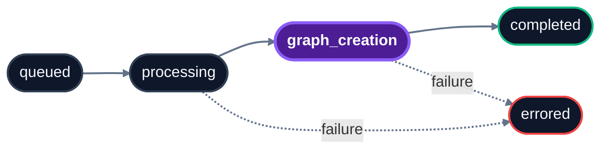

import { Field } from "/snippets/field.jsx";

Check the processing status of ingested sources by their IDs. Since ingestion is asynchronous, use this endpoint to determine when content is ready to be searched.

Pass one or more `source_id` values in `file_ids` to retrieve status. Works for files, app sources, and memories. For more information, see the [Knowledge](/essentials/v2/knowledge) and [Memories](/essentials/v2/memories) guides.

<RequestExample>
```bash cURL
curl -G 'https://api.hydradb.com/source/status' \
  -H "Authorization: Bearer <your_api_key>" \
  -H "API-Version: 2" \
  --data-urlencode "tenant_id=acme_corp" \
  --data-urlencode "sub_tenant_id=team_docs" \
  --data-urlencode "file_ids=policy_main" \
  --data-urlencode "file_ids=runbook_deploy"
```
```typescript TypeScript SDK
const status = await client.source.status({
  tenant_id: "acme_corp",
  sub_tenant_id: "team_docs",
  file_ids: ["policy_main", "runbook_deploy"],
});
```
```python Python SDK
status = client.source.status(
    tenant_id="acme_corp",
    sub_tenant_id="team_docs",
    file_ids=["policy_main", "runbook_deploy"],
)
```
</RequestExample>


## Query parameters

 Provide `tenant_id` and at least one source ID using `file_ids` or the deprecated single `file_id`.

<Info>
For multiple IDs over raw HTTP, repeat the query parameter: `/source/status?tenant_id=acme_corp&file_ids=policy_main&file_ids=runbook_deploy`
</Info>

| Name | Description |
| --- | --- |
| <Field name="file_id" type="string" /> | **Deprecated**  -  single ID. Use `file_ids` instead. |
| <Field name="file_ids" type="string[]" recommended /> | One or more `source_id` values returned at ingestion. Despite the name, accepts IDs of any source  -  files, app sources, memories. Required unless using deprecated `file_id`. |
| <Field name="tenant_id" type="string" required /> | Tenant the items belong to. |
| <Field name="sub_tenant_id" type="string or null" /> | Sub-tenant scope. If omitted, the default sub-tenant is used. (default=`null`) |

<Info> 
TODO: remove and fix api
The query parameter is named `file_ids` for legacy reasons. It accepts the `source_id` returned by both file uploads and app sources and memories  -  not only file-backed sources.
</Info>

## Response

`200` response body matches OpenAPI schema **`BatchProcessingStatus`** with one `ProcessingStatus` per requested ID.

<ResponseExample>

```json Response
{
  "statuses": [
    {
      "file_id": "policy_main",
      "indexing_status": "completed",
      "error_code": "",
      "success": true,
      "message": "Processing status retrieved successfully"
    },
    {
      "file_id": "runbook_deploy",
      "indexing_status": "graph_creation",
      "error_code": "",
      "success": true,
      "message": "Processing status retrieved successfully"
    }
  ]
}
```

</ResponseExample>

| Field | Description |
|---|---|
| <Field name="statuses[]" type="array" /> | Array  -  one entry per requested ID. |
| <Field name="statuses[].file_id" type="string" /> | The ID being reported on (string). |
| <Field name="statuses[].indexing_status" type="enum" /> | Current status (enum). See [Status values](#status-values). |
| <Field name="statuses[].error_code" type="string" /> | Diagnostic code if `errored`; empty string otherwise. |
| <Field name="statuses[].success" type="boolean" /> | Boolean indicating the status lookup succeeded for that ID. Use `indexing_status`  -  not this boolean  -  to decide whether the source is searchable or graph-ready. |
| <Field name="statuses[].message" type="string" /> | Detailed status message (string). |

## Status values



| Status | Searchable? | Meaning |
|---|---|---|
| `queued` | No | Accepted by the server, not yet picked up by a worker. |
| `processing` | No | Content is being parsed, chunked, and embedded. |
| `graph_creation` | **Yes** | Indexed and retrievable; the knowledge graph is still being built. Already searchable via `/search`, but graph context may still be incomplete. |
| `completed` | Yes | Fully indexed and graphed. Ready for all retrieval modes. |
| `errored` | No | Processing failed. Inspect `error_code` and `message`. |

The normal progression is `queued` → `processing` → `graph_creation` → `completed`. Treat `errored` as terminal.

## Polling patterns

### Stop when content is searchable

Use this for normal RAG/search flows. `graph_creation` means chunks are indexed and can be retrieved.

<CodeGroup>
```typescript TypeScript
const sourceIds = ["policy_main", "runbook_deploy"];

while (true) {
  const response = await client.source.status({
    tenant_id: "acme_corp",
    sub_tenant_id: "team_docs",
    file_ids: sourceIds,
  });

  const statuses = response.statuses.map((s) => s.indexing_status);
  if (statuses.every((s) => s === "graph_creation" || s === "completed")) break;
  if (statuses.some((s) => s === "errored")) throw new Error("Source processing failed");

  await new Promise((r) => setTimeout(r, 5000));
}
```
```python Python
import time

source_ids = ["policy_main", "runbook_deploy"]

while True:
    response = client.source.status(
        tenant_id="acme_corp",
        sub_tenant_id="team_docs",
        file_ids=source_ids,
    )
    statuses = [s.indexing_status for s in response.statuses]

    if all(s in ("graph_creation", "completed") for s in statuses):
        break
    if any(s == "errored" for s in statuses):
        raise RuntimeError("Source processing failed")

    time.sleep(5)
```
</CodeGroup>

### Stop when graph processing is complete

Use this before graph-heavy operations such as `/source/relations` or when you require complete `graph_context`.

```python
while True:
    response = client.source.status(
        tenant_id="acme_corp",
        sub_tenant_id="team_docs",
        file_ids=["policy_main", "runbook_deploy"],
    )
    statuses = [s.indexing_status for s in response.statuses]

    if all(s == "completed" for s in statuses):
        break
    if any(s == "errored" for s in statuses):
        raise RuntimeError("Graph processing failed")

    time.sleep(5)
```

Typical processing time:

- **Memories** (text, markdown, conversation pairs): seconds
- **Small documents** (under 50 pages): 1–5 minutes
- **Large documents** (50+ pages): 5–15 minutes

## Behavior notes

<Info>
**`graph_creation` is searchable.** Items in this state are already retrievable via `/search`. Wait for `completed` only when you specifically need full graph traversal (`graph_context: true`).
</Info>

- **Unknown IDs return as `errored`:** If you pass an ID that does not exist (e.g., a typo), HydraDB returns an entry with `indexing_status: "errored"` rather than silently dropping it.

## Related endpoints

- **Before this:** [Ingest Content](/api-reference/v2/endpoint/ingest-content)  -  to get the IDs
- **After completion:** [Search](/api-reference/v2/endpoint/search) · [Fetch Content](/api-reference/v2/endpoint/fetch-content) · [Source Relations](/api-reference/v2/endpoint/source-relations)

## Errors

Common codes: `400 INVALID_PARAMETERS`, `404 TENANT_NOT_FOUND`, `422 VALIDATION_ERROR`. See [Error Responses](/api-reference/v2/error-responses) for the full list.

Read more: [Essentials → Knowledge](/essentials/v2/knowledge) · [Essentials → Memories](/essentials/v2/memories)
