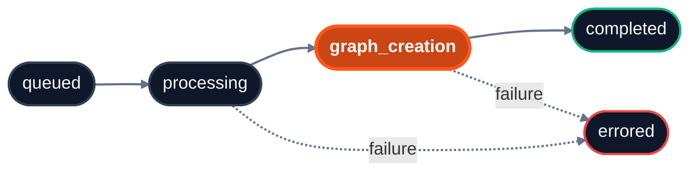

import { Field } from "/snippets/field.jsx";

Since ingestion is asynchronous, use this endpoint to determine when context is ready to be retrieved.

Pass one or more IDs in `ids` to retrieve status. Works for documents, app sources, and memories. When passing multiple IDs on the query string, use either repeated params (`?ids=policy_main&ids=runbook_deploy`) or a single comma-joined value (`?ids=policy_main,runbook_deploy`); both forms are equivalent and can be mixed. Surrounding whitespace is trimmed and empty entries are dropped. For more information, see the [Knowledge](/essentials/v2/knowledge) and [Memories](/essentials/v2/memories) guides.

<Info>
  **Prefer webhooks over polling?** Register a webhook for `indexing.status_changed` events and HydraDB will `POST` to your endpoint when content reaches a terminal state (`completed` or `errored`). See [Webhooks](/essentials/v2/webhooks) for setup and receiver examples.
</Info> 

<RequestExample>

```python Python SDK
status = client.context.status(
    database="acme_corp",
    collection="team_docs",
    ids=["policy_main", "runbook_deploy"],
)
```

```typescript TypeScript SDK
const status = await client.context.status({
  database: "acme_corp",
  collection: "team_docs",
  ids: ["policy_main", "runbook_deploy"],
});
```

```bash cURL
curl -G 'https://api.hydradb.com/context/status' \
  -H "Authorization: Bearer <your_api_key>" \
  -H "API-Version: 2" \
  --data-urlencode "database=acme_corp" \
  --data-urlencode "collection=team_docs" \
  --data-urlencode "ids=policy_main,runbook_deploy"
```

</RequestExample>

## Query parameters

| Name | Description |
| --- | --- |
| <Field name="ids" type="string[]" required /> | One or more `id` values returned at ingestion. Accepts IDs for documents, app sources, or memories. Pass either repeated params (`ids=a&ids=b`) or a single comma-joined value (`ids=a,b`). Source IDs never contain commas (they are rejected at ingest), so the comma-joined form always splits unambiguously. |
| <Field name="database" type="string" required /> | Database the items belong to. Formerly `tenant_id`; the `tenant_id` alias is still accepted (deprecated). |
| <Field name="collection" type="string or null" /> | Collection scope. If omitted, the default collection is used. Formerly `sub_tenant_id`; the `sub_tenant_id` alias is still accepted (deprecated). (default=`null`) |

<ResponseExample>

```json Success
{
  "success": true,
  "data": {
    "statuses": [
      {
        "id": "policy_main",
        "indexing_status": "completed",
        "error_code": "",
        "success": true,
        "message": "Processing status retrieved successfully"
      },
      {
        "id": "runbook_deploy",
        "indexing_status": "graph_creation",
        "error_code": "",
        "success": true,
        "message": "Processing status retrieved successfully"
      },
      {
        "id": "typo_in_id",
        "indexing_status": "errored",
        "error_code": "FILE_NOT_FOUND",
        "error_message": "ID not found",
        "success": false,
        "message": "Processing status retrieved successfully"
      }
    ]
  },
  "error": null,
  "meta": {
    "request_id": "9d13aef4-02f4-4e73-8c62-4c2601d04f9d",
    "latency_ms": 12.3
  }
}
```

```json Failure
{
  "success": false,
  "data": null,
  "error": {
    "code": "DATABASE_NOT_FOUND",
    "message": "Database not found"
  },
  "meta": {
    "request_id": "9d13aef4-02f4-4e73-8c62-4c2601d04f9d",
    "latency_ms": 4.8
  }
}
```

</ResponseExample>

## Status item fields

Each entry in `data.statuses` describes one requested `id`:

| Field | Type | Description |
| --- | --- | --- |
| `id` | string | The source, app-source, or memory ID you asked about (echoed back). |
| `indexing_status` | string | One of the [status values](#status-values) below. `errored` is terminal. |
| `error_code` | string | Machine-readable reason an entry is `errored`; **empty string (`""`) when the entry is not errored.** See [`error_code` values](#error-code-values). |
| `error_message` | string | Human-readable explanation that accompanies a non-empty `error_code`; empty otherwise. |
| `success` | boolean | `false` when `indexing_status` is `errored`, otherwise `true`. Describes the item, **not** the HTTP request - a `200` response can contain `errored` items. |
| `message` | string | Status of the *lookup* itself ("Processing status retrieved successfully"). It does **not** describe the ingestion outcome - read `indexing_status` / `error_code` for that. |

### Error code values

`error_code` is the field that lets you tell a **caller mistake** apart from a **real ingestion failure** - a distinction you cannot make from `indexing_status: "errored"` alone. It is empty on any non-errored entry.

| `error_code` | Meaning | What to do |
| --- | --- | --- |
| `FILE_NOT_FOUND` | No source with this `id` exists in the given `database`/`collection` - usually a typo or an `id` that was never ingested (or whose status has expired). | Fix the `id`, or (re-)ingest the source. Not a processing failure - retrying the status call will not change it. |
| `INVALID_FILE_ID` | The `id` was empty or blank. | Send a non-empty `id`. |
| *ingestion-pipeline codes* | A genuine processing failure (e.g. `PARSE_FAILED`, `UNSUPPORTED_FORMAT`, `PROCESSING_FAILED`, `EMBEDDING_FAILED`, …). | Act on the specific code - see the [Error Responses reference](/api-reference/v2/error-responses#common-error-codes). Many are re-ingest-and-retry; some are terminal (unsupported format, empty content). |

<Info>
  Branch on `error_code`, not on the text in `message` or `error_message`. `message` describes the lookup, not the ingestion result, and human-readable text may change. The full list of codes an `errored` entry can carry is in the [Error Responses reference](/api-reference/v2/error-responses#common-error-codes).
</Info>

## Status values



| Status | Searchable? | Meaning |
| --- | --- | --- |
| `queued` | No | Accepted by the server, not yet picked up by a worker. |
| `processing` | No | Content is being parsed, chunked, and embedded. |
| `graph_creation` | **Yes** | Indexed and retrievable; the knowledge graph is still being built. Already searchable via `/query`, but graph context may still be incomplete. |
| `completed` | Yes | Fully indexed and graphed. Ready for all retrieval modes. |
| `errored` | No | Processing failed. Inspect `error_code` and `error_message`. |

The normal progression is `queued` → `processing` → `graph_creation` → `completed`. Treat `errored` as terminal.

## Polling patterns

### Stop when content is searchable

Use this for normal RAG/search flows. `graph_creation` means chunks are indexed and can be retrieved.

<CodeGroup>

```python Python
import time

ids = ["policy_main", "runbook_deploy"]

while True:
    response = client.context.status(
        database="acme_corp",
        collection="team_docs",
        ids=ids,
    )
    statuses = [s.indexing_status for s in response.data.statuses]

    if all(s in ("graph_creation", "completed") for s in statuses):
        break
    if any(s == "errored" for s in statuses):
        raise RuntimeError("Context processing failed")

    time.sleep(5)
```

```typescript TypeScript
const ids = ["policy_main", "runbook_deploy"];

while (true) {
  const response = await client.context.status({
    database: "acme_corp",
    collection: "team_docs",
    ids: ids,
  });

  const statuses = response.data.statuses.map((s) => s.indexingStatus);
  if (statuses.every((s) => s === "graph_creation" || s === "completed")) break;
  if (statuses.some((s) => s === "errored")) throw new Error("Context processing failed");

  await new Promise((r) => setTimeout(r, 5000));
}
```

</CodeGroup>

### Stop when graph processing is complete

Use this before graph-heavy operations such as `/context/relations` or when you require complete `graph_context`.

```python
while True:
    response = client.context.status(
        database="acme_corp",
        collection="team_docs",
        ids=["policy_main", "runbook_deploy"],
    )
    statuses = [s.indexing_status for s in response.data.statuses]

    if all(s == "completed" for s in statuses):
        break
    if any(s == "errored" for s in statuses):
        raise RuntimeError("Graph processing failed")

    time.sleep(5)
```

Typical processing time:

- **Memories** (text, markdown, conversation pairs): seconds
- **Small documents** (under 50 pages): 1–5 minutes
- **Large documents** (50\+ pages): 5–15 minutes

## Behavior notes

<Info>
  **`graph_creation` is searchable.** Items in this state are already retrievable via `/query`. Wait for `completed` only when you specifically need full graph traversal (`graph_context: true`).
</Info>

- **Unknown IDs return as `errored`:** If you pass an ID that does not exist (e.g., a typo), HydraDB returns an entry with `indexing_status: "errored"` and `error_code: "FILE_NOT_FOUND"` rather than silently dropping it. Use `error_code` to distinguish this from a genuine ingestion failure - see [`error_code` values](#error-code-values).

## Errors

Common codes: `400 INVALID_PARAMETERS`, `404 DATABASE_NOT_FOUND`, `422 VALIDATION_ERROR`. See [Error Responses](/api-reference/v2/error-responses) for the full list.

<div className="api-before-related-resources" />

<Tip>
  **Related Resources**

  - **Before this:** [Ingest Context](/api-reference/v2/endpoint/ingest-context) - to get the IDs
  - **After completion:** [Query](/api-reference/v2/endpoint/query)
  - **After completion:** [Fetch Content](/api-reference/v2/endpoint/fetch-content)
  - **After completion:** [Context Relations](/api-reference/v2/endpoint/source-relations)
  - **Read more:** [Usage → Knowledge](/essentials/v2/knowledge)
  - **Read more:** [Usage → Memories](/essentials/v2/memories)
</Tip>
