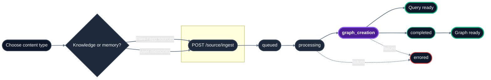

import { Field } from "/snippets/field.jsx";

## Lifecycle

## Endpoint reference

| Endpoint | Method | SDK method | Purpose | Async? |
|---|---|---|---|---|
| [`/source/ingest`](/api-reference/v2/endpoint/ingest-content) | `POST` | `source.ingest` | Ingest files, app sources, or memories | Yes |
| [`/source/status`](/api-reference/v2/endpoint/source-status) | `GET` | `source.status` | Check processing status | No |
| [`/source/fetch`](/api-reference/v2/endpoint/fetch-content) | `GET` | `source.fetch` | Retrieve original file content or presigned URL | No |
| [`/source/list`](/api-reference/v2/endpoint/list-documents) | `POST` | `source.list` | Browse knowledge or memories | No |
| [`/source`](/api-reference/v2/endpoint/delete-source) | `DELETE` | `source.delete` | Delete sources or memories | Yes |
| [`/source/relations`](/api-reference/v2/endpoint/source-relations) | `GET` | `source.relations` | Inspect graph relationships | No |

## Which endpoint should I use?

| Task | Endpoint |
|---|---|
| Upload PDFs, DOCX, CSVs, and other files HydraDB should parse | [`/source/ingest`](/api-reference/v2/endpoint/ingest-content) with `type=knowledge` and `files` |
| Upload Slack messages, Notion pages, Gmail threads, or webpages with pre-extracted text | [`/source/ingest`](/api-reference/v2/endpoint/ingest-content) with `type=knowledge` and `app_knowledge` |
| Upload user preferences, conversation history, or inline notes | [`/source/ingest`](/api-reference/v2/endpoint/ingest-content) with `type=memory` and `memories` |
| Poll indexing progress | [`/source/status`](/api-reference/v2/endpoint/source-status) |
| Browse stored sources or memories | [`/source/list`](/api-reference/v2/endpoint/list-documents) |
| Retrieve original source content | [`/source/fetch`](/api-reference/v2/endpoint/fetch-content) |
| Delete sources or memories | [`DELETE /source`](/api-reference/v2/endpoint/delete-source) |
| Inspect graph relations | [`/source/relations`](/api-reference/v2/endpoint/source-relations) |

<Note>
**Why both `type=knowledge` and `app_knowledge`?** They aren't redundant  -  they answer two different questions.

- `type` picks the **bucket**: `knowledge` (shared documents) or `memory` (per-user context). It routes the ingest to the right store.
- Within `type=knowledge`, you pick the **payload shape**: `files` (binary uploads HydraDB will parse  -  PDFs, DOCX, CSV) or `app_knowledge` (a JSON array of already-extracted content from your app  -  Slack messages, Notion pages, web pages). You can send both in the same request.

So `type=knowledge` + `app_knowledge` means "this is knowledge, and I've already done the extraction  -  index this JSON as-is."
</Note>

## Core Ingestion Concepts

- **Knowledge vs. Memories**: [Knowledge](/essentials/v2/knowledge) is shared, tenant-wide content (files, app pages, Slack messages). [Memories](/essentials/v2/memories) are user-specific preferences and conversational traits scoped by `sub_tenant_id`. Both can be quired together via `type: "all"` on `POST /query`.
- **Source IDs**: Unique identifiers returned by `/source/ingest`. You can assign custom IDs using `source_id` in metadata or `id` in app knowledge. Use them for polling status, fetching content, and deleting sources.
- **Metadata Filtering**: You can scope queries using `tenant_metadata` (structured fields defined in your tenant schema) or `additional_metadata` (free-form per-document JSON). For detailed guidelines on structuring metadata, see the [Scoping using metadata](/essentials/v2/metadata) guide.
- **Forceful Relations**: Relationships between sources can be declared at ingestion time to construct a robust knowledge graph. For more details on the graph layer, see the [Context Graphs](/essentials/v2/context-graphs) guide.

## Related sections

- [Usage - Memories](/essentials/v2/memories) - memories vs knowledge, when to use which
- [Usage - Metadata](/essentials/v2/metadata) - tenant-level vs document-level metadata
- [Usage - Forceful Relations](/essentials/v2/knowledge) - linking sources at ingestion (see §7)
- [Query](/api-reference/v2/endpoint/query-overview) - retrieve ingested content
