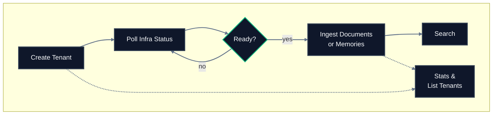

import { Field } from "/snippets/field.jsx";

## Lifecycle



## Endpoint reference

| Endpoint | Method | SDK method | Purpose | Async? |
|---|---|---|---|---|
| [`/tenants`](/api-reference/v2/endpoint/create-tenant) | `POST` | `tenants.create` | Create a new isolated workspace | Yes |
| [`/tenants`](/api-reference/v2/endpoint/list-tenants) | `GET` | `tenants.list` | List all tenants for the organization | No |
| [`/tenants`](/api-reference/v2/endpoint/delete-tenant) | `DELETE` | `tenants.delete` | Permanently remove a tenant | Yes |
| [`/tenants/status`](/api-reference/v2/endpoint/tenant-status) | `GET` | `tenants.status` | Check provisioning readiness | No |
| [`/tenants/sub-tenants`](/api-reference/v2/endpoint/list-sub-tenants) | `GET` | TypeScript: `tenants.subTenants`<br />Python: `tenants.sub_tenants` | List active sub-tenants | No |
| [`/tenants/stats`](/api-reference/v2/endpoint/tenant-stats) | `GET` | `tenants.stats` | Get object counts and vector dimensions | No |

## Typical call sequence

For a new tenant from scratch:

```
1. POST   /tenants             -> returns accepted
2. GET    /tenants/status      -> wait for scheduler, graph, and both vector stores
3. POST   /source/ingest       -> start ingesting data
4. GET    /source/status       -> wait until recent sources are searchable
5. POST   /search              -> query your data
6. GET    /tenants/stats       -> verify storage
```

## Tenant lifecycle checklist

1. Create the tenant.
2. Wait for readiness: `scheduler_status`, `graph_status`, `vectorstore_status[0]`, and `vectorstore_status[1]` must all be `true`.
3. Ingest knowledge or memories.
4. Monitor source processing with the returned `source_id`s.
5. Search, list, fetch, or inspect relations.
6. Delete the tenant when the workspace should be permanently removed.

For routine operations on an existing tenant:

```
GET /tenants             -> list tenants in the org
GET /tenants/sub-tenants -> list active sub-tenants
GET /tenants/stats       -> check storage growth
```

For teardown:

```
DELETE /tenants -> schedule deletion (irreversible)
```

## Key concepts

**Tenant** - Top-level isolated workspace. One per organization in most cases.

**Sub-tenant** - Subdivision inside a tenant. Created automatically the first time ingestion writes data with a `sub_tenant_id`. No explicit creation step, no confirmation.

**Default sub-tenant** - HydraDB assigns an auto-generated default sub-tenant ID for calls that omit `sub_tenant_id`. That default is created once and reused.

**Tenant metadata** - The values you attach to each document at ingestion under the `tenant_metadata` key. They must conform to the tenant metadata schema. Use them for org-wide attributes that stay consistent across documents (department, region, plan, customer tier, product area, compliance framework)  -  fields you want to filter or search by during retrieval. For per-document free-form fields, use `document_metadata` instead. See [Essentials - Metadata](/essentials/v2/metadata) for the full contrast.

**Tenant metadata schema** - Immutable field definitions set at creation. Use this to tell HydraDB which tenant-level metadata fields should be filterable or searchable later. For example, create fields for `department`, `region`, `customer_tier`, `product_area`, or `compliance_framework` if you plan to filter or search by those values during retrieval.

## Tenant metadata schema

| Field | What it controls | Example use |
|---|---|---|
| <Field name="name" /> | The metadata key you will send during ingestion and use in filters. | `department`, `region`, `customer_tier` |
| <Field name="data_type" /> | The value type. Friendly names like `string`, `integer`, `float`, `boolean`, `array`, and `object` are accepted. | Use `string` for categories and labels. |
| <Field name="enable_match" /> | Enables exact filtering on this field. | Filter search to `department = "engineering"`. |
| <Field name="enable_dense_embedding" /> | Enables semantic search over this field. String fields only. | Match meaning across product descriptions. |
| <Field name="enable_sparse_embedding" /> | Enables keyword/BM25 search over this field. String fields only. | Find exact terms in long descriptions. |

Define metadata schema only for fields you expect to reuse across many sources. One-off details belong in source-level metadata during ingestion.

## Related sections

- [Essentials - Multi-Tenant Support](/essentials/v2/multi-tenant) - concepts, isolation guarantees, use cases
- [Essentials - Metadata](/essentials/v2/metadata) - tenant and document metadata
- [API Reference - Sources](/api-reference/v2/endpoint/sources-overview) - after tenant setup, start ingesting
