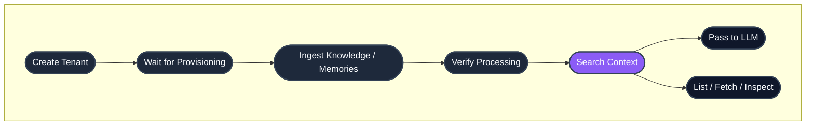

## Quick links

- **New to HydraDB?** Start with the [Quickstart](/quickstart)
- **Prefer SDKs?** See the [Python and TypeScript SDKs](#sdks) below
- **Authentication:** Every endpoint requires `Authorization: Bearer <your_api_key>`
- **Base URL:** `https://api.hydradb.com`
- **Errors:** See [Error Responses](/api-reference/error-responses)

## Endpoint groups

| Group | Purpose | When to reach for it |
|---|---|---|
| [Tenants](/api-reference/v2/endpoint/tenants-overview) (6 endpoints) | Create, monitor, and manage isolated workspaces | First step in any integration  -  and any time you need usage stats, provisioning status, or to tear down a workspace |
| [Sources](/api-reference/v2/endpoint/sources-overview) (6 endpoints) | Ingest, list, fetch, delete, and inspect knowledge or memories | Every time data flows in or out of HydraDB  -  file uploads, app-extracted content, user memories, and lifecycle ops |
| [Search](/api-reference/v2/endpoint/search-overview) (1 endpoint) | Retrieve context with hybrid, text, or vector search | At query time  -  the only endpoint you call to feed an LLM |

## Core concepts

| Concept | What it means | When you use it |
|---|---|---|
| `tenant_id` | Your isolated workspace for data, metadata schema, and search. | Send it on every API call so HydraDB knows which workspace to read or write. |
| `sub_tenant_id` | Optional partition inside a tenant, often a user, team, account, or customer. | Use it when one tenant contains data for multiple users or customers. |
| Knowledge | Shared source material such as PDFs, docs, app pages, tickets, Slack threads, or webpages. | Use `type=knowledge` when many users or agents should search the same content. |
| Memory | User-specific context such as preferences, conversation history, notes, and inferred traits. | Use `type=memory` when the content should personalize answers for a specific user or sub-tenant. |
| `tenant_metadata_schema` | Tenant-level fields you define up front so metadata can be filtered or searched consistently. | Use it for stable fields like department, customer, region, plan, category, or compliance label. |
| `file_metadata` | Per-file metadata sent during file ingestion. | Use it to attach source IDs, titles, filterable metadata, document metadata, or forceful relations to each uploaded file. |
| `source_ids` | IDs returned by ingestion or visible from `/source/list`. | Use them when polling processing status, fetching content, listing a specific subset, deleting sources, or inspecting relations. |

## End-to-end lifecycle



## SDKs

HydraDB publishes official SDKs for Python and TypeScript/Node. They wrap every endpoint in this reference with typed methods and IDE autocomplete.

| Language | Package | Install |
|---|---|---|
| **Python** | [`hydradb-sdk` on PyPI](https://pypi.org/project/hydradb-sdk/) | `pip install hydradb-sdk` |
| **TypeScript / Node** | [`@hydradb/sdk` on npm](https://www.npmjs.com/package/@hydradb/sdk) | `npm install @hydradb/sdk` |

**Quick init:**

<CodeGroup>

```python Python
import os
from hydra_db import HydraDB, AsyncHydraDB

client = HydraDB(token=os.environ["HYDRA_DB_API_KEY"])
async_client = AsyncHydraDB(token=os.environ["HYDRA_DB_API_KEY"])
```

```typescript TypeScript
import { HydraDBClient } from "@hydradb/sdk";

const client = new HydraDBClient({
  token: process.env.HYDRA_DB_API_KEY,
});
```

</CodeGroup>

SDK methods mirror the API: `client.<group>.<method>()` maps to the corresponding endpoint. Operations include Fern SDK fields in [`api-reference/v2/openapi.json`](/api-reference/v2/openapi.json), and the `ts-sdk-v2`, `python-sdk-v2`, and `go-sdk-v2` generators filter to audience `v2` and set `API-Version: 2` automatically.

## Full endpoint inventory

| Endpoint | Method | SDK method | Purpose | Use when |
|---|---|---|---|---|
| [`/tenants`](/api-reference/v2/endpoint/create-tenant) | `POST` | `tenants.create` | Create a tenant | You are setting up a new isolated workspace and optional metadata schema. |
| [`/tenants`](/api-reference/v2/endpoint/list-tenants) | `GET` | `tenants.list` | List tenants | You need to discover tenant IDs available to the current API key. |
| [`/tenants`](/api-reference/v2/endpoint/delete-tenant) | `DELETE` | `tenants.delete` | Delete a tenant | You need to permanently remove a workspace and its data. |
| [`/tenants/status`](/api-reference/v2/endpoint/tenant-status) | `GET` | `tenants.status` | Check provisioning readiness | You just created a tenant and need to wait before ingesting data. |
| [`/tenants/sub-tenants`](/api-reference/v2/endpoint/list-sub-tenants) | `GET` | `tenants.sub_tenants` | List active sub-tenants | You partition data by user, team, customer, or account and need to inspect those partitions. |
| [`/tenants/stats`](/api-reference/v2/endpoint/tenant-stats) | `GET` | `tenants.stats` | Get usage statistics | You want to monitor object counts and vector dimensions for a tenant. |
| [`/source/ingest`](/api-reference/v2/endpoint/ingest-content) | `POST` | `source.ingest` | Ingest knowledge or memories | You are uploading files, app-generated sources, or user memories. |
| [`/source/status`](/api-reference/v2/endpoint/source-status) | `GET` | `source.status` | Check processing status | You have source IDs from ingestion and need to know when they are searchable. |
| [`/source/fetch`](/api-reference/v2/endpoint/fetch-content) | `GET` | `source.fetch` | Retrieve original source content or presigned URL | You need to display or inspect the original ingested content. |
| [`/source/list`](/api-reference/v2/endpoint/list-documents) | `POST` | `source.list` | Browse knowledge or memories | You need pagination, filters, field projection, or a specific subset by `source_ids`. |
| [`/source`](/api-reference/v2/endpoint/delete-source) | `DELETE` | `source.delete` | Delete sources or memories | You need to remove one or more knowledge sources or memories by ID. |
| [`/source/relations`](/api-reference/v2/endpoint/source-relations) | `GET` | `source.relations` | Inspect entity relationships | You need graph relations for a source or sub-tenant. |
| [`/search`](/api-reference/v2/endpoint/search) | `POST` | `search.query` | Unified search over knowledge, memories, or both | You need retrieval with `hybrid`, `text`, or `vector` search across `sources`, `memories`, or `all`. |

## Conventions

**Authentication.** Every endpoint requires `Authorization: Bearer <your_api_key>` in the request header. Get your key at [app.hydradb.com](https://app.hydradb.com).

**Versioning.** Send `API-Version: 2` with every request.

```bash
curl -X POST 'https://api.hydradb.com/search' \
  -H "Authorization: Bearer <your_api_key>" \
  -H "API-Version: 2" \
  -H "Content-Type: application/json" \
  -d '{
    "tenant_id": "my_first_tenant",
    "query": "What are the pricing tiers?",
    "source": "sources",
    "search_by": "hybrid"
  }'
```

**Response envelope.** JSON responses are wrapped in a consistent envelope:

```json
{
  "success": true,
  "data": {},
  "error": null,
  "meta": {
    "request_id": "request-id",
    "latency_ms": 12.3
  }
}
```

Errors use the same envelope with `success: false`, `data: null`, and an `error` object containing `code` and `message`.

**Tenant scoping.** Every endpoint requires a `tenant_id`. Most endpoints also accept an optional `sub_tenant_id` for finer-grained scoping. If omitted, the default sub-tenant is used.

**Async operations.** Tenant creation, deletion, and content ingestion are asynchronous. They return immediately after queuing. Use the relevant status endpoint to confirm completion before downstream operations.

**Pagination.** Listing endpoints (`/source/list`) return pagination fields for browsing large result sets.

**Parameter casing.** The REST API uses snake_case (`tenant_id`). The TypeScript SDK accepts the same snake_case keys; method names are camelCase when generated for TypeScript. The Python SDK uses snake_case throughout.

**Search modes.** `POST /search` supports `search_by: "hybrid"`, `"text"`, or `"vector"` and `source: "sources"`, `"memories"`, or `"all"`.

**Status codes.** Successful responses return `200` (or `202` for async accepts). Errors follow standard HTTP semantics:

| Code | Meaning |
|---|---|
| `200` | Success |
| `202` | Accepted (async operation queued) |
| `400` | Invalid parameters |
| `401` | Authentication required |
| `403` | Forbidden |
| `404` | Resource not found |
| `409` | Conflict (e.g., tenant already exists) |
| `422` | Validation error |
| `429` | Rate limit exceeded |
| `500` | Internal server error |
| `503` | Service unavailable |

See [Error Responses](/api-reference/error-responses) for response shapes and error codes.

## Rate limits

Rate limits apply per API key. For production deployments, build retry logic with exponential backoff against the `429` response. Contact [founders@hydradb.com](mailto:founders@hydradb.com) for current limit values.

## Next steps

Existing v1 endpoints remain available under API Reference `1.0.0`.

- **Build something:** [Quickstart](/quickstart) walks through your first integration in five minutes
- **Understand the model:** [Core Concepts](/core-concepts) explains tenants, memories, recall, and metadata
- **Go deeper:** [Essentials](/essentials) covers each primitive in depth
- **Install an SDK:** [Python](https://pypi.org/project/hydradb-sdk/) · [TypeScript](https://www.npmjs.com/package/@hydradb/sdk)
