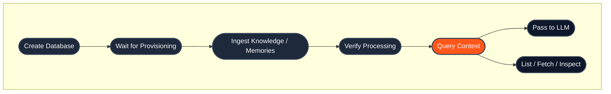

## Quick links

- **New to HydraDB?** Start with the [Quickstart](/get-started/v2/quickstart)
- **Prefer SDKs?** See [SDKs - Node and Python](/api-reference/v2/sdks)
- **Authentication:** Every endpoint requires `Authorization: Bearer <your_api_key>`
- **Base URL:** `https://api.hydradb.com`
- **Errors:** See [Error Responses](/api-reference/v2/error-responses)
- **For AI agents:** See the [Agent Integration Guide](/AGENTS) and [v2 OpenAPI spec](/api-reference/v2/openapi.json)

## Endpoint groups

| Group | Purpose | When to reach for it |
|---|---|---|
| [Databases](/api-reference/v2/endpoint/tenants-overview) | Create, monitor, and manage isolated workspaces | First step in any integration  -  and any time you need usage stats, provisioning status, or to tear down a workspace |
| [Context](/api-reference/v2/endpoint/sources-overview) | Ingest, list, fetch, delete, and inspect knowledge or memories | Every time data flows into HydraDB  -  document uploads, app sources, user memories, and lifecycle ops |
| [Query](/api-reference/v2/endpoint/query-overview) | Retrieve context with hybrid or text query | At query time  -  the only endpoint you call to feed an LLM |

## Core concepts

| Concept | What it means | When you use it |
|---|---|---|
| `database` | Your isolated workspace for data, metadata schema, and query. | Send it on every API call so HydraDB knows which workspace to read or write. Formerly `tenant_id`; the `tenant_id` alias is still accepted (deprecated). |
| `collection` | Optional partition inside a database, often a user, team, account, or customer. | Use it when one database contains data for multiple users or customers. Formerly `sub_tenant_id`; the `sub_tenant_id` alias is still accepted (deprecated). Read more about our [multi-tenant architecture](/essentials/v2/multi-tenant) |
| [Knowledge](/essentials/v2/knowledge) | Shared source material such as PDFs, docs, app pages, tickets, Slack threads, or webpages. | Use `type=knowledge` when many users or agents should query the same content. |
| [Memory](/essentials/v2/memories) | User-specific context such as preferences, conversation history, notes, and inferred traits. | Use `type=memory` when the content should personalize answers for a specific user or collection. |
| `database_metadata_schema` | Database-level fields you define up front so metadata can be filtered or queried consistently. | Use it for stable fields like department, customer, region, plan, category, or compliance label. |
| `document_metadata` | JSON-stringified per-document metadata array sent during file ingestion. | Use it to attach source IDs, titles, schema-backed `metadata`, free-form `additional_metadata`, or forceful relations to each uploaded document. |
| `ids` | IDs returned by ingestion or visible from `/context/list`. | Use them when polling processing status, inspecting content, listing a specific subset, deleting sources, or inspecting relations. |

## End-to-end lifecycle



## SDKs

HydraDB publishes official SDKs for Python and TypeScript/Node. They wrap every endpoint in this reference with typed methods and IDE autocomplete.

| Language | Package | Install |
|---|---|---|
| **Python** | [`hydradb-sdk` on PyPI](https://pypi.org/project/hydradb-sdk/) | `pip install hydradb-sdk` |
| **TypeScript / Node** | [`@hydradb/sdk` on npm](https://www.npmjs.com/package/@hydradb/sdk) | `npm install @hydradb/sdk` |

**Quick init:**

<CodeGroup>

```python Python
import os
from hydra_db import HydraDB, AsyncHydraDB

client = HydraDB(token=os.environ["HYDRA_DB_API_KEY"])
async_client = AsyncHydraDB(token=os.environ["HYDRA_DB_API_KEY"])
```

```typescript TypeScript
import { HydraDBClient } from "@hydradb/sdk";

const client = new HydraDBClient({
  token: process.env.HYDRA_DB_API_KEY,
});
```

</CodeGroup>

SDK methods mirror the API: `client.<group>.<method>()` maps to the corresponding endpoint. The SDKs are generated from the OpenAPI contract and set `API-Version: 2` automatically.

## Full endpoint inventory

| Endpoint | Method | SDK method | Purpose | Use when |
|---|---|---|---|---|
| [`/databases`](/api-reference/v2/endpoint/create-tenant) | `POST` | `databases.create` | Create a database | You are setting up a new isolated workspace and optional metadata schema. |
| [`/databases/{database}/metadata-schema`](/api-reference/v2/endpoint/update-metadata-schema) | `PATCH` | REST | Add metadata schema fields | You need to add filterable metadata fields after database creation. |
| [`/databases`](/api-reference/v2/endpoint/list-tenants) | `GET` | `databases.list` | List databases | You need to discover database IDs available to the current API key. |
| [`/databases`](/api-reference/v2/endpoint/delete-tenant) | `DELETE` | `databases.delete` | Delete a database | You need to permanently remove a workspace and its data. |
| [`/databases/status`](/api-reference/v2/endpoint/tenant-status) | `GET` | `databases.status` | Check provisioning readiness | You just created a database and need to wait before ingesting data. |
| [`/databases/collections`](/api-reference/v2/endpoint/list-sub-tenants) | `GET` | `databases.collections` / `databases.collections` | List active collections | You partition data by user, team, customer, or account and need to inspect those partitions. |
| [`/databases/stats`](/api-reference/v2/endpoint/tenant-stats) | `GET` | `databases.stats` | Get usage statistics | You want to monitor object counts and vector dimensions for a database. |
| [`/context/ingest`](/api-reference/v2/endpoint/ingest-context) | `POST` | `context.ingest` | Ingest knowledge or memories | You are uploading documents, app sources, or user memories. |
| [`/context/status`](/api-reference/v2/endpoint/source-status) | `GET` | `context.status` | Check processing status | You have IDs from ingestion and need to know when they are queryable. |
| [`/context/inspect`](/api-reference/v2/endpoint/fetch-content) | `GET` | `context.inspect` | Inspect original source content or presigned URL | You need to display or inspect the original ingested content. |
| [`/context/list`](/api-reference/v2/endpoint/list-documents) | `POST` | `context.list` | Browse knowledge or memories | You need pagination, filters, field projection, or a specific subset by `ids`. |
| [`/context/sources/{source_id}/metadata`](/api-reference/v2/endpoint/update-source-metadata) | `PATCH` | REST | Update source metadata | You need to merge `metadata` or `additional_metadata` onto one existing source without re-ingesting. |
| [`/context`](/api-reference/v2/endpoint/delete-source) | `DELETE` | `context.delete` | Delete sources or memories | You need to remove one or more knowledge sources or memories by ID. |
| [`/context/relations`](/api-reference/v2/endpoint/source-relations) | `GET` | `context.relations` | Inspect entity relationships | You need graph relations for a source or collection. |
| [`/query`](/api-reference/v2/endpoint/query) | `POST` | `query` | Unified query over knowledge, memories, or both | You need retrieval with `hybrid` or `text` query across `type: "knowledge"`, `type: "memory"`, or `type: "all"`. |

## Conventions

**Authentication:** Every endpoint requires `Authorization: Bearer <your_api_key>` in the request header. Get your key at [app.hydradb.com](https://app.hydradb.com).

**Versioning:** Send `API-Version: 2` with every request.

```bash
curl -X POST 'https://api.hydradb.com/query' \
  -H "Authorization: Bearer <your_api_key>" \
  -H "API-Version: 2" \
  -H "Content-Type: application/json" \
  -d '{
    "database": "my_first_database",
    "query": "What are the pricing tiers?",
    "type": "knowledge",
    "query_by": "hybrid"
  }'
```

**Response envelope:** Core v2 endpoints (`/databases`, `/context/*`, and `/query`) return a consistent envelope. Endpoint pages show the full envelope; the resource-specific payload lives under `data`. Webhook management endpoints (`/webhooks/indexing*`) are the exception: they return their documented response object directly.

```json
{
  "success": true,
  "data": {},
  "error": null,
  "meta": {
    "request_id": "request-id",
    "latency_ms": 12.3
  }
}
```

Errors use the same envelope with `success: false`, `data: null`, and an `error` object containing `code` and `message`.

`meta` may also include a `deprecation` list when a request uses a legacy `/tenants` route or a deprecated field (`tenant_id`/`sub_tenant_id`, or `sub_tenant_ids` on `/query`); each entry carries `deprecated`, a `message`, and `deprecated_since` (field-level notices also add `deprecated_field` and `preferred_field`). It is a non-breaking migration nudge (the status code is unchanged) and is accompanied by a `Deprecation: true` response header. See [Migrating from `tenant_id` and `sub_tenant_id`](/essentials/v2/multi-tenant#7-migrating-from-the-legacy-tenant-and-sub-tenant-fields).

- **Quick reference vs API details.** Each endpoint page starts with a short cheat sheet (what to send, what to save, common gotchas). Later on the page you will see a complete field reference with types, defaults, and examples that is kept in sync with the API. Use the cheat sheet to get moving quickly, and the API details when you need exact request/response shapes (especially for agents and strict validators).

- **Database scoping.** Most database-scoped endpoints require a `database` (formerly `tenant_id`). Many source and query endpoints also accept an optional `collection` (formerly `sub_tenant_id`) for finer-grained scoping. If omitted, the default collection is used. The old `tenant_id`/`sub_tenant_id` names (and the old `/tenants` routes) remain accepted as deprecated aliases; sending a canonical name and its alias with **different** values returns `400`. See [Migrating from `tenant_id` and `sub_tenant_id`](/essentials/v2/multi-tenant#7-migrating-from-the-legacy-tenant-and-sub-tenant-fields).

- **Async operations.** Database creation, deletion, and content ingestion are asynchronous. They return immediately after queuing. Use the relevant status endpoint to confirm completion before downstream operations.

- **Pagination.** Listing endpoints (`/context/list`) return pagination fields for browsing large result sets.

- **Parameter casing.** The REST API uses snake_case (`database`). The TypeScript SDK accepts the same snake_case keys; method names are camelCase when generated for TypeScript. The Python SDK uses snake_case throughout.

- **Query modes.** `POST /query` supports `query_by: "hybrid"` or `"text"` and `type: "knowledge"`, `"memory"`, or `"all"`. The same `type` enum is used across ingestion, listing, deletion, and query; query additionally accepts `"all"`.

**Status codes:** Successful responses return `200` (or `202` for async accepts). Errors follow standard HTTP semantics:

| Code | Meaning |
|---|---|
| `200` | Success |
| `202` | Accepted (async operation queued) |
| `400` | Invalid parameters |
| `401` | Authentication required |
| `403` | Forbidden |
| `404` | Resource not found |
| `409` | Conflict (e.g., database already exists) |
| `422` | Validation error |
| `429` | Rate limit exceeded |
| `500` | Internal server error |
| `503` | Service unavailable |

See [Error Responses](/api-reference/v2/error-responses) for response shapes, error codes, and retry patterns.

## Rate limits

Rate limits apply per API key. For production deployments, build retry logic with exponential backoff against the `429` response. Contact [founders@hydradb.com](mailto:founders@hydradb.com) for current limit values.

## Next steps

Existing v1 endpoints remain available under the v1 API Reference.

- **Build something:** [Quickstart](/get-started/v2/quickstart) walks through your first integration in five minutes
- **Understand the model:** [Core Concepts](/get-started/v2/core-concepts) explains databases, memories, Query, and metadata
- **Go deeper:** [Usage](/essentials/v2/query) covers each primitive in depth
- **Install an SDK:** [Python](https://pypi.org/project/hydradb-sdk/) · [TypeScript](https://www.npmjs.com/package/@hydradb/sdk)
