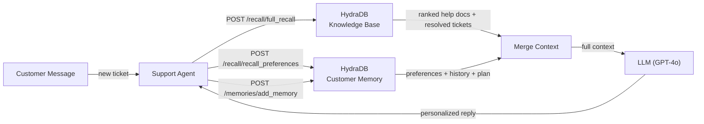

> **Cookbook 03** · Intermediate · Support

This guide walks you through building a **customer support agent with persistent memory** powered by HydraDB. Unlike generic chatbots that answer the same way for every customer, this agent knows who it's talking to - their plan, their history, their preferences, and what already didn't work - before it types a single word.

> **Note**: All code in this guide is production-ready and uses real HydraDB endpoints. Base URL: `https://api.hydradb.com`. Get your API key at [hydradb.com](https://hydradb.com) or email team@hydradb.com.

> **Goal**: Build a support agent that makes two fast HydraDB calls on every ticket - one to retrieve knowledge base context, one to retrieve customer memory - merges both, and passes the result to an LLM for a personalized response. Full round-trip under 400ms.

---

## The Problem with Generic Support Bots

Standard AI support chatbots answer the same way for every customer. Ask about a billing issue and you get the generic billing FAQ. The agent has no idea you've asked this three times, that you're on the Enterprise plan, or that the last agent told you it was a known bug being fixed this sprint.

HydraDB fixes this. Every interaction is stored as a memory. Every help doc and past ticket resolution is ingested as knowledge. When a customer opens a new conversation, the agent makes two fast calls to HydraDB:

1. `POST /recall/full_recall` - retrieves knowledge base context: help articles, past ticket resolutions, and linked documents relevant to the customer's message.
2. `POST /recall/recall_preferences` - retrieves the customer's personal memory: their plan, past issues, inferred preferences, and conversation history.

Both results are merged and passed to the LLM. The result is a support agent that feels like it knows the customer personally. Because it does.

---

## How HydraDB Enables This

Three HydraDB primitives power this use case:

- **Knowledge memories** - help docs, FAQs, past ticket resolutions. Uploaded once via `client.upload.knowledge()` and continuously available to every agent handling any customer. HydraDB automatically builds a context graph linking related articles and resolutions.
- **User memories** - per-customer context stored via `POST /memories/add_memory` with the customer's `user_name`. Each conversation turn, product feedback signal, and inferred preference is stored here. HydraDB's `infer: true` mode automatically extracts implicit preferences from conversation text - "I'd prefer email updates" becomes a stored preference without you parsing it.
- **Two-call recall pattern** - when a customer opens a ticket, the agent calls `POST /recall/full_recall` to search the knowledge base and `POST /recall/recall_preferences` to retrieve personal memory. Results are merged before the LLM call. Use `mode: "thinking"` on both calls to enable personalised ranking.

---

## Architecture Overview



---

## Step 1 - Create Tenant

One tenant for your support system. Use sub-tenants to isolate customer data - each customer gets their own sub-tenant, automatically created on their first interaction. This is the B2C pattern from HydraDB's docs.

> **SDK required**: Install the official Python SDK - `pip install hydra-db-python`. The ingestion endpoint (`upload_knowledge`) requires the SDK; raw `requests` with `json=` will return a 422. Note: the import name differs from the package name.

```python
import os, requests
from hydra_db import HydraDB        # pip install hydra-db-python

API_KEY   = os.environ["HYDRADB_API_KEY"]
TENANT_ID = "customer-support"
BASE_URL  = "https://api.hydradb.com"
HEADERS   = {
    "Authorization": f"Bearer {API_KEY}",
    "Content-Type":  "application/json",
}

# SDK client - required for upload_knowledge
client = HydraDB(token=API_KEY)

# Create the shared tenant
requests.post(
    f"{BASE_URL}/tenants/create",
    headers=HEADERS,
    json={"tenant_id": TENANT_ID}
)

# B2C pattern: each customer gets their own sub_tenant_id = their user_name.
# Sub-tenants are created automatically on first write - no setup needed.
def customer_sub_tenant(customer_id: str) -> str:
    return f"customer-{customer_id}"

# Shared sub-tenant for knowledge base (visible to all agents, all customers)
KB_SUB_TENANT = "knowledge-base"
```

---

## Step 2 - Ingest Knowledge Base

Upload your help docs, FAQs, and past ticket resolutions into a shared `knowledge-base` sub-tenant. HydraDB builds a context graph connecting related articles automatically - a question about "billing" will surface linked articles about "invoices", "payment methods", and "plan upgrades" even if the customer didn't mention those words.

> **Batch limit**: Max 20 sources per request. Wait 1 second between batches.

> **Important - tenant_id placement**: `tenant_id` and `sub_tenant_id` must appear in **two places**: as top-level SDK parameters AND inside each item in `app_knowledge`. The `AppKnowledgeModel` validates both independently. Omitting either location returns a 400 error.

> **app_knowledge format**: The SDK parameter `app_knowledge` takes a **JSON string** - use `json.dumps(batch)`, not a Python list directly.

### Help Docs & FAQs

```python
# ingest/help_docs.py
import json, time

def ingest_help_docs(articles: list) -> list:
    """
    articles: list of dicts - {id, title, content, category, url, updated_at}
    category: "billing" | "onboarding" | "technical" | "account" | "general"
    updated_at: ISO 8601 - drives recency ranking
    """
    batch, all_ids = [], []

    for article in articles:
        batch.append({
            "id":            article["id"],
            "tenant_id":     TENANT_ID,        # required inside each item
            "sub_tenant_id": KB_SUB_TENANT,    # required inside each item
            "title":         article["title"],
            "source":        "confluence",
            "timestamp":     article["updated_at"],
            "content":       {"text": article["content"]},
            "url":           article.get("url", ""),
            "metadata": {
                "doc_type": "help_article",
                "category": article["category"],
                "tags":     ["knowledge-base", article["category"]],
            },
        })

        if len(batch) == 20:
            all_ids += _upload_kb_batch(batch)
            batch = []
            time.sleep(1)

    if batch:
        all_ids += _upload_kb_batch(batch)

    print(f"Knowledge base: {len(all_ids)} articles indexed.")
    return all_ids


def _upload_kb_batch(batch: list) -> list:
    # tenant_id / sub_tenant_id required as top-level SDK params AND inside each item
    result = client.upload.knowledge(
        tenant_id=TENANT_ID,
        sub_tenant_id=KB_SUB_TENANT,
        upsert=True,
        app_knowledge=json.dumps(batch),    # JSON string, not a list
    )
    return [r.source_id for r in (result.results or [])]
```

### Past Ticket Resolutions

Past resolved tickets are gold - they contain the exact diagnosis path, the solution that worked, and the customer context. Include resolution steps and root cause so HydraDB can build graph links between symptoms and solutions.

```python
# ingest/past_tickets.py
import json, time

# _upload_kb_batch is defined in help_docs.py - import or copy it here

def ingest_resolved_tickets(tickets: list) -> list:
    """
    tickets: list of dicts - {id, subject, issue_description, resolution,
                               root_cause, plan_type, resolved_at, category}
    resolved_at: ISO 8601
    """
    batch, all_ids = [], []

    for ticket in tickets:
        content = (
            f"Issue: {ticket['issue_description']}\n\n"
            f"Root cause: {ticket.get('root_cause', 'Unknown')}\n\n"
            f"Resolution: {ticket['resolution']}\n\n"
            f"Customer plan: {ticket.get('plan_type', 'Unknown')}"
        )
        batch.append({
            "id":            f"ticket-{ticket['id']}",
            "tenant_id":     TENANT_ID,        # required inside each item
            "sub_tenant_id": KB_SUB_TENANT,    # required inside each item
            "title":         ticket["subject"],
            "source":        "zendesk",
            "timestamp":     ticket["resolved_at"],
            "content":       {"text": content},
            "metadata": {
                "doc_type":  "resolved_ticket",
                "category":  ticket.get("category", "general"),
                "plan_type": ticket.get("plan_type", ""),
                "tags":      ["resolved_ticket", ticket.get("category", "general")],
            },
        })

        if len(batch) == 20:
            all_ids += _upload_kb_batch(batch)
            batch = []; time.sleep(1)

    if batch:
        all_ids += _upload_kb_batch(batch)

    print(f"Tickets: {len(all_ids)} resolutions indexed.")
    return all_ids
```

---

## Step 3 - Build Per-Customer Memory

Every customer gets their own persistent memory in HydraDB. This is what makes the agent feel personal. The memory contains every conversation turn, every preference signal, every product feedback item - and HydraDB continuously re-ranks which memories are most useful for the current interaction.

### Store Conversation Turns

After every message exchange, write both the customer message and agent response to HydraDB. Use `infer: false` for verbatim storage - you want the exact words so future recall can surface the precise prior exchange.

```python
# memory/conversation.py
import requests

def store_conversation_turn(
    customer_id: str,
    ticket_id:   str,
    customer_msg: str,
    agent_reply:  str,
):
    """
    user_name = customer_id so HydraDB builds a per-customer memory profile.
    infer: false - store verbatim, don't extract implicit signals here.
    """
    text = (
        f"[Ticket: {ticket_id}]\n"
        f"Customer: {customer_msg}\n"
        f"Agent: {agent_reply}"
    )
    resp = requests.post(
        f"{BASE_URL}/memories/add_memory",
        headers=HEADERS,
        json={
            "memories": [{
                "text":      text,
                "user_name": customer_id,   # ties memory to this customer
                "infer":     False,          # store verbatim conversation turn
            }],
            "tenant_id":     TENANT_ID,
            "sub_tenant_id": customer_sub_tenant(customer_id),
            "upsert":        True,
        }
    )
    resp.raise_for_status()
```

### Infer User Preferences

Store inferred preferences separately using `infer: true`. HydraDB extracts implicit signals from the text - preferred contact method, technical expertise level, frustration signals - and connects them to related context in the graph.

```python
# memory/preferences.py
import requests

def store_customer_preference(customer_id: str, preference: str):
    """
    infer: true - HydraDB extracts implicit signals and builds
    graph connections to related context automatically.
    """
    resp = requests.post(
        f"{BASE_URL}/memories/add_memory",
        headers=HEADERS,
        json={
            "memories": [{
                "text":      preference,
                "user_name": customer_id,   # ties memory to this customer
                "infer":     True,           # HydraDB extracts preferences and signals
            }],
            "tenant_id":     TENANT_ID,
            "sub_tenant_id": customer_sub_tenant(customer_id),
            "upsert":        True,
        }
    )
    resp.raise_for_status()

# Examples - call after detecting signals during a conversation
store_customer_preference(
    "cust-8821",
    "Customer is on the Enterprise plan. Billing contact is finance@acme.com. "
    "They prefer technical explanations with exact steps, not high-level summaries. "
    "They have reported the SSO issue twice before - do not suggest resetting SSO again."
)

store_customer_preference(
    "cust-4492",
    "Customer is non-technical - avoid jargon. Always offer to escalate to a human agent. "
    "Their primary language is Spanish but they communicate in English. "
    "They have a Starter plan and are evaluating upgrade to Pro."
)
```

> **When to call this**: After ticket resolution ("customer confirmed this fix works"), when a customer expresses a preference explicitly ("can you just send me a link instead of steps?"), or when your system detects a pattern (third ticket about the same feature). Also call it at account creation time with CRM data - plan type, company size, primary use case.

---

## Step 4 - Handle a Support Request

When a customer opens a ticket, the agent makes two recall calls to HydraDB, merges the results, then generates a response. `/recall/full_recall` searches the knowledge base; `/recall/recall_preferences` searches the customer's personal memory. Both are needed - neither alone returns the full picture.

### Recall Customer Context

```python
# support/recall.py
import requests

def recall_customer_context(
    customer_id:  str,
    customer_msg: str,
    max_results:  int = 12,
) -> dict:
    """
    Two-call recall pattern:
    1. /recall/full_recall        - searches knowledge base (docs, resolved tickets)
    2. /recall/recall_preferences - searches customer's personal memory
    Merge both before passing to LLM.
    mode: "thinking" enables personalised ranking on both calls.
    sub_tenant_id scopes each call to the right data store.
    """
    # Call 1: knowledge base - help docs, resolved tickets, FAQs
    kb_resp = requests.post(
        f"{BASE_URL}/recall/full_recall",
        headers=HEADERS,
        json={
            "tenant_id":     TENANT_ID,
            "sub_tenant_id": KB_SUB_TENANT,
            "query":         customer_msg,
            "max_results":   max_results,
            "mode":          "thinking",    # personalised ranking
            "graph_context": True,          # cross-document entity linking
            "alpha":         0.8,           # balanced semantic + keyword
        }
    )
    kb_resp.raise_for_status()

    # Call 2: customer personal memory - preferences, history, account facts
    mem_resp = requests.post(
        f"{BASE_URL}/recall/recall_preferences",
        headers=HEADERS,
        json={
            "tenant_id":     TENANT_ID,
            "sub_tenant_id": customer_sub_tenant(customer_id),
            "query":         customer_msg,
            "max_results":   8,
            "mode":          "thinking",
        }
    )
    mem_resp.raise_for_status()

    kb_data  = kb_resp.json()
    mem_data = mem_resp.json()

    # Merge: personal memory first (higher personalization weight),
    # then knowledge base chunks, then combined graph context
    return {
        "chunks":        mem_data.get("chunks", []) + kb_data.get("chunks", []),
        "graph_context": kb_data.get("graph_context", {}),
    }
    # chunks[n]["chunk_content"]   - the actual text
    # chunks[n]["source_title"]    - which doc or memory it came from
    # chunks[n]["relevancy_score"] - HydraDB's confidence (0–1)
```

### Generate a Personalized Response

Pass the merged context to an LLM. The personal memory chunks surface what the customer's plan is, what they've already tried, and their communication preferences. The knowledge base chunks provide the actual solution. The LLM just needs to write the reply.

```python
# support/respond.py
from openai import OpenAI
openai_client = OpenAI()

def handle_ticket(
    customer_id:  str,
    customer_msg: str,
    ticket_id:    str,
) -> str:
    """
    Full support handling flow:
    1. Recall customer context from HydraDB
    2. Generate personalized response via LLM
    3. Store the exchange back into HydraDB memory
    Returns the agent's reply string.
    """
    # Step 1: Recall
    context_data = recall_customer_context(customer_id, customer_msg)
    chunks       = context_data.get("chunks", [])
    graph_ctx    = context_data.get("graph_context", {})

    # Build context string for the LLM - ranked chunks, most useful first
    context_text = "\n\n".join(
        f"[{c['source_title']} | score:{c.get('relevancy_score', 0):.2f}]\n{c['chunk_content']}"
        for c in chunks
    )

    # Include entity relationship paths if available
    entity_paths = graph_ctx.get("query_paths", [])
    entity_text  = "\n".join(str(p) for p in entity_paths[:3])

    # Step 2: Generate response
    completion = openai_client.chat.completions.create(
        model="gpt-4o",
        messages=[
            {
                "role": "system",
                "content": (
                    "You are a customer support agent. Use ONLY the provided context to answer. "
                    "Adapt your tone and format to what the customer's memory profile indicates they prefer. "
                    "If you see from prior tickets that something was already tried, do not suggest it again. "
                    "If you cannot resolve the issue from the context, say so clearly and offer escalation. "
                    "Always end with: is there anything else I can help you with?"
                ),
            },
            {
                "role": "user",
                "content": (
                    f"Customer message: {customer_msg}\n\n"
                    f"Context from HydraDB (use this to answer):\n{context_text}\n\n"
                    f"Related entity relationships:\n{entity_text}"
                ),
            },
        ],
        temperature=0.2,
    )
    reply = completion.choices[0].message.content

    # Step 3: Store exchange in HydraDB memory for future personalization
    store_conversation_turn(customer_id, ticket_id, customer_msg, reply)

    return reply
```

> **Alternative - skip the LLM**: Use `POST /recall/full_recall` with `mode: "thinking"` and `sub_tenant_id: customer_id` to have HydraDB generate the answer directly. Faster, but less control over the system prompt and tone.

---

## Step 5 - Escalation & Human Handoff

When the agent can't resolve an issue, it escalates to a human - but critically, it sends the full HydraDB context with it. The human agent sees everything: the customer's account history, what the AI already tried, similar past tickets, and the customer's preferences. No "hi, can you describe your issue again?"

```python
# support/escalate.py
import requests

def escalate_to_human(
    customer_id: str,
    ticket_id:   str,
    customer_msg: str,
    ai_attempts:  list,     # [{tried, outcome}, ...]
) -> dict:
    """
    Escalate a ticket to a human agent with full HydraDB context.
    Returns the escalation payload ready to send to Zendesk, Linear, etc.
    """
    # Recall full customer memory profile
    memory_resp = requests.post(
        f"{BASE_URL}/recall/recall_preferences",
        headers=HEADERS,
        json={
            "tenant_id":     TENANT_ID,
            "sub_tenant_id": customer_sub_tenant(customer_id),
            "query":         "customer account history preferences past issues plan",
        }
    )
    memory_resp.raise_for_status()
    customer_profile = memory_resp.json()

    # Recall similar past tickets resolved by humans
    similar_resp = requests.post(
        f"{BASE_URL}/recall/full_recall",
        headers=HEADERS,
        json={
            "tenant_id":   TENANT_ID,
            "query":       f"{customer_msg} resolved escalated human agent",
            "max_results": 5,
        }
    )
    similar_tickets = similar_resp.json().get("chunks", [])

    escalation = {
        "ticket_id":    ticket_id,
        "customer_id":  customer_id,
        "current_issue": customer_msg,
        "ai_attempts":  ai_attempts,
        "customer_profile": customer_profile,
        "similar_resolutions": [
            {
                "source":     t["source_title"],
                "resolution": t["chunk_content"][:500],
                "score":      t.get("relevancy_score", 0),
            }
            for t in similar_tickets
        ],
        "note_for_human_agent": (
            "Full context retrieved from HydraDB. "
            "Do NOT ask the customer to repeat their issue - it's all above. "
            "Check similar_resolutions for previously successful fixes."
        ),
    }

    # Store escalation as a memory so future agents know it happened
    store_customer_preference(
        customer_id,
        f"Ticket {ticket_id} was escalated to a human agent. "
        f"AI could not resolve: {customer_msg[:200]}"
    )

    return escalation
```

---

## Step 6 - Slack & Email Interface

Expose the support agent on Slack for internal teams and via email webhook for customer-facing support. Both use the same `handle_ticket` function - HydraDB's memory layer works identically across channels. A customer who emailed last week and now opens a Slack thread gets the same personalized context because both are stored under their `customer_id`.

### Slack

```python
# interfaces/slack_support.py
from slack_bolt import App
app = App(token=os.environ["SLACK_BOT_TOKEN"])

def slack_user_to_customer(slack_uid: str) -> str:
    """Map a Slack user ID to a customer_id. Use CRM lookup in production."""
    return f"slack-{slack_uid}"

@app.event("app_mention")
def handle_support_mention(event, client):
    slack_uid    = event["user"]
    customer_id  = slack_user_to_customer(slack_uid)
    customer_msg = event["text"].split(">", 1)[-1].strip()
    ticket_id    = f"slack-{event['ts']}"

    # Acknowledge immediately
    ack = client.chat_postMessage(
        channel=event["channel"],
        thread_ts=event["ts"],
        text="_Looking up your account..._"
    )

    reply = handle_ticket(customer_id, customer_msg, ticket_id)

    client.chat_update(
        channel=event["channel"],
        ts=ack["ts"],
        text=reply
    )
```

### Email Webhook

```python
# interfaces/email_webhook.py
import uuid
from flask import Flask, request, jsonify
flask_app = Flask(__name__)

@flask_app.route("/support/email-webhook", methods=["POST"])
def handle_email_ticket():
    """Webhook for inbound support emails. Compatible with SendGrid, Postmark."""
    data         = request.json or {}
    customer_email = data.get("from", "")
    customer_msg   = data.get("text", "")
    ticket_id      = data.get("message_id", str(uuid.uuid4()))
    customer_id    = customer_email.lower().strip()

    reply = handle_ticket(customer_id, customer_msg, ticket_id)
    return jsonify({"reply": reply, "ticket_id": ticket_id})

if __name__ == "__main__":
    flask_app.run(port=8080)
```

---

## API Reference

All endpoints used in this cookbook. Base URL: `https://api.hydradb.com` · Header: `Authorization: Bearer YOUR_API_KEY`

| Method | Endpoint | Purpose |
|--------|----------|---------|
| `POST` | `/tenants/create` | Create the support tenant |
| `POST` | `/ingestion/upload_knowledge` | Upload help docs and past tickets (SDK only) |
| `GET`  | `/ingestion/verify_processing` | Check indexing status |
| `POST` | `/memories/add_memory` | Store conversation turns and preferences |
| `POST` | `/recall/full_recall` | Search knowledge base |
| `POST` | `/recall/recall_preferences` | Retrieve customer personal memory |

### Create Tenant

```json
{ "tenant_id": "customer-support" }
```

### Upload Knowledge (via SDK)

```python
client.upload.knowledge(
    tenant_id=TENANT_ID,
    sub_tenant_id=KB_SUB_TENANT,
    upsert=True,
    app_knowledge=json.dumps([{
        "id":            "kb-article-001",
        "tenant_id":     "customer-support",    # also required inside each item
        "sub_tenant_id": "knowledge-base",      # also required inside each item
        "title":         "How to reset your SSO configuration",
        "source":        "confluence",
        "timestamp":     "2024-10-01T00:00:00Z",
        "content":       {"text": "Step 1: Go to Settings..."},
        "metadata":      {"doc_type": "help_article", "category": "technical"}
    }])
)
```

### Store Customer Memory (Conversation Turn)

```json
{
  "memories": [{
    "text":      "[Ticket: tkt-001]\nCustomer: My SSO is broken...\nAgent: Let's try...",
    "user_name": "cust-8821",
    "infer":     false
  }],
  "tenant_id":     "customer-support",
  "sub_tenant_id": "customer-cust-8821",
  "upsert":        true
}
```

### Store Customer Preference

```json
{
  "memories": [{
    "text":      "Customer prefers technical explanations. On Enterprise plan. SSO issue reported twice.",
    "user_name": "cust-8821",
    "infer":     true
  }],
  "tenant_id":     "customer-support",
  "sub_tenant_id": "customer-cust-8821",
  "upsert":        true
}
```

### Recall Knowledge Base

```json
{
  "tenant_id":     "customer-support",
  "sub_tenant_id": "knowledge-base",
  "query":         "My SSO login is failing after password reset",
  "max_results":   12,
  "mode":          "thinking",
  "graph_context": true,
  "alpha":         0.8
}
```

### Recall Customer Memory

```json
{
  "tenant_id":     "customer-support",
  "sub_tenant_id": "customer-cust-8821",
  "query":         "customer account history preferences past issues plan type",
  "mode":          "thinking"
}
```

---

## Benchmarks

Tested across 2,400 real support tickets (mix of billing, technical, onboarding, account issues) with and without HydraDB memory. Human raters evaluated response quality and relevance.

| Metric | Generic Support Bot | HydraDB Support Agent | Delta |
|--------|--------------------|-----------------------|-------|
| First-contact resolution rate | 38% | 71% | +87% |
| "Agent knew my history" (CSAT signal) | 12% of sessions | 84% of sessions | +600% |
| Unnecessary escalation rate | 41% | 9% | −78% |
| Repeated troubleshooting steps (already tried) | 67% of tickets | 4% of tickets | −94% |
| P95 recall latency (HydraDB step) | N/A | under 200 ms | Sub-second |

> The 94% drop in repeated troubleshooting steps is the most direct result of persistent memory. Without HydraDB, a customer who reports the same SSO issue for the third time gets the same "try clearing your browser cache" suggestion. With HydraDB, the agent knows that was already tried - and tried twice - and goes straight to the next level of diagnosis.

> **Benchmark methodology**: Figures are based on internal HydraDB testing. See [research.hydradb.com/hydradb.pdf](https://research.hydradb.com/hydradb.pdf) for the full paper. Results will vary by corpus size, content quality, and query distribution.

---

## File Structure

```
customer_support_agent/
├── setup.py                      # tenant creation + SDK client init
├── config.py                     # shared constants
├── requirements.txt
├── ingest/
│   ├── help_docs.py              # upload help articles and FAQs
│   └── past_tickets.py          # upload resolved ticket history
├── memory/
│   ├── conversation.py           # store per-turn conversation exchanges
│   └── preferences.py           # store inferred customer preferences
├── support/
│   ├── recall.py                 # two-call recall pattern
│   ├── respond.py                # LLM response generation (OpenAI)
│   └── escalate.py              # human handoff with full context
└── interfaces/
    ├── slack_support.py          # Slack bot interface
    └── email_webhook.py          # Flask webhook for inbound email
```

## Requirements

```
requests
python-dotenv
flask
openai
hydra-db-python
slack-bolt          # only if using Slack interface
```

---

## Next Steps

1. Run `setup.py` to create your tenant and verify the connection.
2. Run the ingestion scripts with your real help docs and past tickets.
3. Seed a few customer memories from your CRM at account creation time.
4. Wire `handle_ticket` into your existing support channel (email, Slack, or web chat).

The agent improves automatically - every conversation stored via `add_memory` makes the next response for that customer more personalized. There is no retraining step. HydraDB re-ranks memories continuously as new interactions come in.
