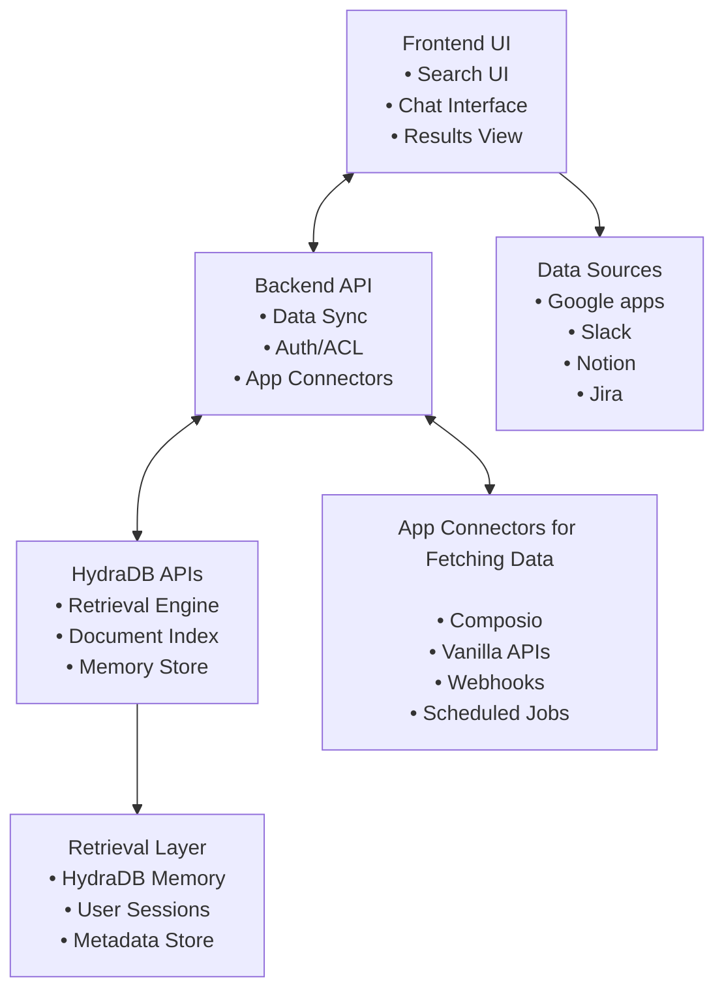

This guide will walk you through building an extremely powerful workplace search and AI assistant platform that rivals Glean using HydraDB APIs. You'll learn how to create a unified retrieval experience across multiple data sources and generate answers in your application layer.

> **Note**: All code examples in this guide are for demonstration purposes. They show the concepts and patterns you can use when building your own Glean-like application with HydraDB APIs. You'll need to adapt these examples to your specific use case, technology stack, and requirements.

## Overview

A Glean-like application typically includes these core features:

- **Universal Search**: Search across multiple data sources (documents, emails, chats, etc.)
- **Retrieval-Assisted Answers**: Generate intelligent answers from retrieved company knowledge
- **AI Memories for User Preferences**: Remember and adapt to individual user preferences, search patterns, and behavioral patterns
- **Data Ingestion**: Connect to various apps and services
- **Knowledge Graph**: Build connections between information
- **Security & Access Control**: Role-based permissions and data isolation

## Architecture Overview




## Step 1: Data Ingestion Strategy

### 1.1 App Connectors Setup

You'll need to connect to various data sources. Here are recommended approaches:

#### Option A: Using Composio

[Composio](https://composio.dev/) provides pre-built connectors for popular apps:


```javascript
// Example: Setting up Composio connector
const composioConfig = {
  connectors: [
    {
      name: 'slack',
      config: {
        token: process.env.SLACK_BOT_TOKEN,
        channels: ['general', 'random', 'project-*']
      }
    },
    {
      name: 'gmail',
      config: {
        credentials: process.env.GMAIL_CREDENTIALS,
        labels: ['INBOX', 'SENT', 'IMPORTANT']
      }
    },
    {
      name: 'notion',
      config: {
        token: process.env.NOTION_TOKEN,
        databases: ['projects', 'docs', 'meetings']
      }
    }
  ]
};
```


#### Option B: Vanilla API Integration

For custom integrations, use the native APIs:


```javascript
// Example: Slack API integration
class SlackConnector {
  constructor(token) {
    this.token = token;
    this.client = new WebClient(token);
  }

  async fetchMessages(channelId, limit = 100) {
    const result = await this.client.conversations.history({
      channel: channelId,
      limit: limit
    });
    
    return result.messages.map(msg => ({
      id: msg.ts,
      text: msg.text,
      user: msg.user,
      timestamp: msg.ts,
      channel: channelId,
      type: 'slack_message'
    }));
  }

  async fetchChannels() {
    const result = await this.client.conversations.list();
    return result.channels;
  }
}

// Example: Gmail API integration
class GmailConnector {
  constructor(credentials) {
    this.gmail = google.gmail({ version: 'v1', auth: credentials });
  }

  async fetchEmails(query = 'in:inbox', maxResults = 100) {
    const response = await this.gmail.users.messages.list({
      userId: 'me',
      q: query,
      maxResults: maxResults
    });

    const emails = [];
    for (const message of response.data.messages) {
      const email = await this.gmail.users.messages.get({
        userId: 'me',
        id: message.id
      });
      
      emails.push({
        id: email.data.id,
        subject: this.getHeader(email.data.payload.headers, 'Subject'),
        from: this.getHeader(email.data.payload.headers, 'From'),
        body: this.getBody(email.data.payload),
        timestamp: email.data.internalDate,
        type: 'gmail'
      });
    }
    
    return emails;
  }
}
```


### 1.2 Data Normalization

Create a unified data format for all sources:

> **Important**: For optimal performance, limit each batch to a maximum of **20 app sources** per request. Send multiple batch requests with an interval of **1 second** between each request.


```javascript
// Unified data structure for HydraDB app upload
const normalizedData = {
  id: 'unique_id',
  tenant_id: 'your_tenant_id',
  sub_tenant_id: 'your_sub_tenant_id',
  title: 'Document/Message Title',
  source: 'slack_message', // Source app: gmail, slack_message, notion_page, document, etc.
  timestamp: '2024-01-01T00:00:00Z', // ISO timestamp
  content: {
    text: 'Main content text',
    html_base64: 'base64_encoded_html',
    markdown: 'markdown_content'
  },
  url: 'https://app.com/item/123', // Optional: source URL
  description: 'Optional description of the source', // Optional
  metadata: {}, // Optional tenant-level metadata
  additional_metadata: {
    author: 'user@company.com',
    id: 'original_id',
    tags: ['project-a', 'urgent', 'meeting-notes'],
    permissions: ['user1@company.com', 'user2@company.com']
  }
};
```


### 1.3 Batch Upload to HydraDB

Use HydraDB's batch upload capabilities for efficient data ingestion:

> **Best Practice**: Always verify processing after upload using the `/ingestion/verify_processing` endpoint to ensure your data is properly indexed.


<CodeGroup>
```typescript TypeScript SDK
import { HydraDBClient } from "@hydradb/sdk";

const client = new HydraDBClient({ token: process.env.HYDRA_DB_API_KEY! });

// Upload a batch of knowledge sources
const uploadBatch = async (sources: any[], tenantId: string, subTenantId?: string) => {
  const appKnowledge = sources.map(source => ({
    ...source,
    tenant_id: tenantId,
    sub_tenant_id: subTenantId || tenantId
  }));

  const result = await client.upload.knowledge({
    tenant_id: tenantId,
    app_knowledge: JSON.stringify(appKnowledge)
  });

  return result;
};

// Upload with verification — confirm each item is indexed before proceeding
const uploadWithVerification = async (sources: any[], tenantId: string, subTenantId?: string) => {
  const uploadResult = await uploadBatch(sources, tenantId, subTenantId);

  if (uploadResult.ids) {
    for (const sourceId of uploadResult.ids) {
      const status = await client.upload.verifyProcessing({
        tenant_id: tenantId,
        file_ids: [sourceId]
      });
      if (status.indexing_status === "errored") {
        throw new Error(`Processing failed for source ${sourceId}`);
      }
    }
  }

  return uploadResult;
};
```
```python Python SDK
import os
import json
from hydra_db import HydraDB

client = HydraDB(token=os.environ["HYDRA_DB_API_KEY"])

# Upload a batch of knowledge sources
def upload_batch(sources: list, tenant_id: str, sub_tenant_id: str = None):
    app_knowledge = [
        {**source, "tenant_id": tenant_id, "sub_tenant_id": sub_tenant_id or tenant_id}
        for source in sources
    ]

    result = client.upload.knowledge(
        tenant_id=tenant_id,
        app_knowledge=json.dumps(app_knowledge)
    )
    return result

# Upload with verification — confirm each item is indexed before proceeding
def upload_with_verification(sources: list, tenant_id: str, sub_tenant_id: str = None):
    upload_result = upload_batch(sources, tenant_id, sub_tenant_id)

    if upload_result.get("ids"):
        for source_id in upload_result["ids"]:
            status = client.upload.verify_processing(
                tenant_id=tenant_id,
                file_ids=[source_id]
            )
            if status.get("indexing_status") == "errored":
                raise Exception(f"Processing failed for source {source_id}")

    return upload_result
```
</CodeGroup>


## Step 2: Search and Answer Generation

### 2.1 Universal Search Interface

Create a search interface that queries across all data sources:

> **Note**: HydraDB supports filtering by `source_title` and `source_type` using the `metadata` parameter. Use these for targeted searches across specific data sources.


<CodeGroup>
```typescript TypeScript SDK
import { HydraDBClient } from "@hydradb/sdk";

const client = new HydraDBClient({ token: process.env.HYDRA_DB_API_KEY! });

interface SearchOptions {
  sub_tenant_id?: string;
  max_results?: number;
  mode?: string;
  metadata?: Record<string, any>;
  additional_context?: string;
}

const search = async (query: string, tenantId: string, options: SearchOptions = {}) => {
  const {
    sub_tenant_id,
    max_results = 10,
    mode = "fast",
    metadata,
    additional_context
  } = options;

  return await client.recall.fullRecall({
    query,
    tenant_id: tenantId,
    sub_tenant_id,
    max_results,
    mode,
    alpha: 0.5,         // Balance semantic vs keyword search (0.0 to 1.0)
    recency_bias: 0.3,  // Recency preference (0.0 to 1.0)
    ...(metadata && { metadata }),
    ...(additional_context && { additional_context })
  });
};

// Filter search by source type
const searchBySourceType = (query: string, tenantId: string, sourceType: string) =>
  search(query, tenantId, { metadata: { source_type: sourceType } });

// Filter search by source title
const searchBySourceTitle = (query: string, tenantId: string, sourceTitle: string) =>
  search(query, tenantId, { metadata: { source_title: sourceTitle } });
```
```python Python SDK
import os
from hydra_db import HydraDB

client = HydraDB(token=os.environ["HYDRA_DB_API_KEY"])

def search(query: str, tenant_id: str, sub_tenant_id: str = None,
           max_results: int = 10, mode: str = "fast",
           metadata: dict = None, additional_context: str = None):
    return client.recall.full_recall(
        query=query,
        tenant_id=tenant_id,
        sub_tenant_id=sub_tenant_id,
        max_results=max_results,
        mode=mode,
        alpha=0.5,        # Balance semantic vs keyword search (0.0 to 1.0)
        recency_bias=0.3, # Recency preference (0.0 to 1.0)
        **({"metadata": metadata} if metadata else {}),
        **({"additional_context": additional_context} if additional_context else {})
    )

# Filter search by source type
def search_by_source_type(query: str, tenant_id: str, source_type: str):
    return search(query, tenant_id, metadata={"source_type": source_type})

# Filter search by source title
def search_by_source_title(query: str, tenant_id: str, source_title: str):
    return search(query, tenant_id, metadata={"source_title": source_title})
```
</CodeGroup>


### 2.2 Advanced Search Features

Implement advanced search capabilities:

> **Advanced Features**:
>
> - `mode`: Use `"thinking"` for multi-query retrieval with reranking, or `"fast"` for single-query retrieval
> - `alpha`: Controls semantic vs keyword matching (0.0-1.0, or `"auto"`)
> - `recency_bias`: Prioritizes recent content (0.0-1.0)
> - `additional_context`: Provide extra context to guide retrieval


<CodeGroup>
```typescript TypeScript SDK
import { HydraDBClient } from "@hydradb/sdk";

const client = new HydraDBClient({ token: process.env.HYDRA_DB_API_KEY! });

// Search with optional source type / title metadata filters
const searchWithFilters = async (
  query: string,
  tenantId: string,
  filters: { sourceTypes?: string; sourceTitles?: string } = {}
) => {
  const metadata: Record<string, any> = {};
  if (filters.sourceTypes) metadata.source_type = filters.sourceTypes;
  if (filters.sourceTitles) metadata.source_title = filters.sourceTitles;

  return await client.recall.fullRecall({
    query,
    tenant_id: tenantId,
    max_results: 10,
    mode: "fast",
    alpha: 0.5,
    recency_bias: 0.3,
    ...(Object.keys(metadata).length > 0 && { metadata })
  });
};

// Guide retrieval with additional context
const searchWithContext = async (query: string, tenantId: string, additional_context: string) =>
  client.recall.fullRecall({
    query,
    tenant_id: tenantId,
    max_results: 10,
    mode: "fast",
    alpha: 0.5,
    recency_bias: 0.3,
    additional_context
  });

// Conversational search — include prior conversation turns as additional context
const conversationalSearch = async (
  query: string,
  tenantId: string,
  conversationHistory: object[] = []
) =>
  client.recall.fullRecall({
    query,
    tenant_id: tenantId,
    max_results: 10,
    mode: "fast",
    alpha: 0.5,
    recency_bias: 0.3,
    additional_context: `Previous conversation context: ${JSON.stringify(conversationHistory)}`
  });
```
```python Python SDK
import os
import json
from hydra_db import HydraDB

client = HydraDB(token=os.environ["HYDRA_DB_API_KEY"])

# Search with optional source type / title metadata filters
def search_with_filters(query: str, tenant_id: str, source_types: str = None, source_titles: str = None):
    metadata = {}
    if source_types:
        metadata["source_type"] = source_types
    if source_titles:
        metadata["source_title"] = source_titles

    return client.recall.full_recall(
        query=query,
        tenant_id=tenant_id,
        max_results=10,
        mode="fast",
        alpha=0.5,
        recency_bias=0.3,
        **({"metadata": metadata} if metadata else {})
    )

# Guide retrieval with additional context
def search_with_context(query: str, tenant_id: str, additional_context: str):
    return client.recall.full_recall(
        query=query,
        tenant_id=tenant_id,
        max_results=10,
        mode="fast",
        alpha=0.5,
        recency_bias=0.3,
        additional_context=additional_context
    )

# Conversational search — include prior conversation turns as additional context
def conversational_search(query: str, tenant_id: str, conversation_history: list = None):
    return client.recall.full_recall(
        query=query,
        tenant_id=tenant_id,
        max_results=10,
        mode="fast",
        alpha=0.5,
        recency_bias=0.3,
        additional_context=f"Previous conversation context: {json.dumps(conversation_history or [])}"
    )
```
</CodeGroup>


### 2.3 AI Memories and User Preferences

One of the most powerful features of building a Glean-like application with HydraDB is leveraging **AI Memories** to create truly personalized experiences. HydraDB automatically manages AI memories using `sub_tenant_id` for user-level isolation. This allows your application to remember user preferences, past interactions, and behavioral patterns, making every search and interaction more relevant and efficient.

#### Understanding AI Memories

HydraDB's AI memories are dynamic, user-specific profiles that evolve over time. They capture not just what users say, but their intentions, preferences, and unique behaviors. HydraDB automatically manages these memories using `sub_tenant_id` for user-level isolation. This enables your Glean clone to:

- **Remember User Preferences**: Format preferences, source preferences, search patterns
- **Understand Intent**: Learn what types of information users typically seek
- **Adapt Responses**: Tailor answers based on past interactions
- **Anticipate Needs**: Suggest relevant information before users ask

#### Implementing AI Memories in Your Search


<CodeGroup>
```typescript TypeScript SDK
import { HydraDBClient } from "@hydradb/sdk";

const client = new HydraDBClient({ token: process.env.HYDRA_DB_API_KEY! });

// In-memory profile store — replace with your own database in production
const userProfiles = new Map<string, any>();

const getUserProfile = (userId: string) => {
  if (!userProfiles.has(userId)) {
    userProfiles.set(userId, {
      userId,
      preferredMode: "fast",
      preferredSourceTypes: [] as string[],
      frequentQueries: [] as string[],
      preferredFormats: ["bullet_points"],
      responseStyle: "concise",
      favoriteSources: [] as string[],
      searchHistory: [] as object[],
      lastInteraction: null as string | null
    });
  }
  return userProfiles.get(userId)!;
};

const buildPersonalizedInstructions = (userProfile: any, query: string): string => {
  let instructions = "User preferences: ";
  if (userProfile.preferredFormats.includes("bullet_points")) instructions += "Prefer bullet point responses. ";
  if (userProfile.responseStyle === "concise") instructions += "Keep responses concise and to the point. ";
  if (userProfile.favoriteSources.length > 0) instructions += `User frequently uses sources: ${userProfile.favoriteSources.join(", ")}. `;
  if (userProfile.frequentQueries.length > 0) instructions += `User often searches for: ${userProfile.frequentQueries.slice(0, 3).join(", ")}. `;
  instructions += `Current query: ${query}`;
  return instructions;
};

const saveUserProfile = async (userId: string, profile: any) => {
  // Persist to your backend database
  console.log(`Saving profile for user ${userId}:`, profile);
};

// Search using personalized additional_context derived from the user's local profile
const searchWithMemory = async (query: string, tenantId: string, userId: string) => {
  const userProfile = getUserProfile(userId);

  const searchResults = await client.recall.fullRecall({
    query,
    tenant_id: tenantId,
    sub_tenant_id: userId,
    max_results: 10,
    mode: userProfile.preferredMode || "fast",
    alpha: 0.5,
    recency_bias: 0.3,
    additional_context: buildPersonalizedInstructions(userProfile, query),
    ...(userProfile.preferredSourceTypes?.length > 0 && {
      metadata: { source_type: userProfile.preferredSourceTypes }
    })
  });

  // Update local profile history
  userProfile.searchHistory.push({ query, timestamp: new Date().toISOString(), resultCount: searchResults.chunks?.length || 0 });
  if (userProfile.searchHistory.length > 50) userProfile.searchHistory = userProfile.searchHistory.slice(-50);

  const queryLower = query.toLowerCase();
  if (!userProfile.frequentQueries.some((q: string) => q.toLowerCase().includes(queryLower))) {
    userProfile.frequentQueries = [query, ...userProfile.frequentQueries].slice(0, 10);
  }

  if (searchResults.chunks) {
    for (const chunk of searchResults.chunks) {
      if (chunk.source && !userProfile.favoriteSources.includes(chunk.source)) {
        userProfile.favoriteSources.push(chunk.source);
      }
    }
    userProfile.favoriteSources = userProfile.favoriteSources.slice(0, 5);
  }

  userProfile.lastInteraction = new Date().toISOString();
  await saveUserProfile(userId, userProfile);

  return searchResults;
};
```
```python Python SDK
import os
from datetime import datetime
from hydra_db import HydraDB

client = HydraDB(token=os.environ["HYDRA_DB_API_KEY"])

# In-memory profile store — replace with your own database in production
user_profiles: dict = {}

def get_user_profile(user_id: str) -> dict:
    if user_id not in user_profiles:
        user_profiles[user_id] = {
            "user_id": user_id,
            "preferred_mode": "fast",
            "preferred_source_types": [],
            "frequent_queries": [],
            "preferred_formats": ["bullet_points"],
            "response_style": "concise",
            "favorite_sources": [],
            "search_history": [],
            "last_interaction": None
        }
    return user_profiles[user_id]

def build_personalized_instructions(profile: dict, query: str) -> str:
    instructions = "User preferences: "
    if "bullet_points" in profile["preferred_formats"]:
        instructions += "Prefer bullet point responses. "
    if profile["response_style"] == "concise":
        instructions += "Keep responses concise and to the point. "
    if profile["favorite_sources"]:
        instructions += f"User frequently uses sources: {', '.join(profile['favorite_sources'])}. "
    if profile["frequent_queries"]:
        instructions += f"User often searches for: {', '.join(profile['frequent_queries'][:3])}. "
    instructions += f"Current query: {query}"
    return instructions

def save_user_profile(user_id: str, profile: dict):
    # Persist to your backend database
    print(f"Saving profile for user {user_id}:", profile)

# Search using personalized additional_context derived from the user's local profile
def search_with_memory(query: str, tenant_id: str, user_id: str):
    profile = get_user_profile(user_id)

    kwargs = dict(
        query=query,
        tenant_id=tenant_id,
        sub_tenant_id=user_id,
        max_results=10,
        mode=profile["preferred_mode"] or "fast",
        alpha=0.5,
        recency_bias=0.3,
        additional_context=build_personalized_instructions(profile, query)
    )
    if profile["preferred_source_types"]:
        kwargs["metadata"] = {"source_type": profile["preferred_source_types"]}

    search_results = client.recall.full_recall(**kwargs)

    # Update local profile history
    profile["search_history"].append({
        "query": query,
        "timestamp": datetime.utcnow().isoformat(),
        "result_count": len(search_results.get("chunks", []))
    })
    profile["search_history"] = profile["search_history"][-50:]

    if not any(query.lower() in q.lower() for q in profile["frequent_queries"]):
        profile["frequent_queries"] = ([query] + profile["frequent_queries"])[:10]

    for chunk in search_results.get("chunks", []):
        if chunk.get("source") and chunk["source"] not in profile["favorite_sources"]:
            profile["favorite_sources"].append(chunk["source"])
    profile["favorite_sources"] = profile["favorite_sources"][:5]

    profile["last_interaction"] = datetime.utcnow().isoformat()
    save_user_profile(user_id, profile)

    return search_results
```
</CodeGroup>


#### User Preference Learning


```javascript
class PreferenceLearner {
  constructor() {
    this.preferencePatterns = new Map();
  }

  async learnFromInteraction(userId, interaction) {
    const {
      query,
      selectedResults,
      responseFormat,
      searchFilters,
      timeSpent,
      followUpQueries
    } = interaction;

    const patterns = this.preferencePatterns.get(userId) || {
      queryPatterns: [],
      formatPreferences: {},
      sourcePreferences: {},
      timePatterns: [],
      filterPreferences: {}
    };

    // Learn query patterns
    this.learnQueryPatterns(patterns, query, followUpQueries);
    
    // Learn format preferences
    this.learnFormatPreferences(patterns, responseFormat, selectedResults);
    
    // Learn source preferences
    this.learnSourcePreferences(patterns, selectedResults);
    
    // Learn time patterns
    this.learnTimePatterns(patterns, timeSpent);
    
    // Learn filter preferences
    this.learnFilterPreferences(patterns, searchFilters);

    this.preferencePatterns.set(userId, patterns);
  }

  learnQueryPatterns(patterns, query, followUpQueries) {
    // Analyze query complexity, length, and type
    const queryAnalysis = {
      length: query.length,
      complexity: this.analyzeComplexity(query),
      type: this.classifyQueryType(query),
      hasFilters: query.includes('in:') || query.includes('from:'),
      timestamp: new Date().toISOString()
    };

    patterns.queryPatterns.push(queryAnalysis);
    
    // Keep only recent patterns
    if (patterns.queryPatterns.length > 100) {
      patterns.queryPatterns = patterns.queryPatterns.slice(-100);
    }
  }

  learnFormatPreferences(patterns, format, selectedResults) {
    if (!patterns.formatPreferences[format]) {
      patterns.formatPreferences[format] = 0;
    }
    patterns.formatPreferences[format]++;
  }

  learnSourcePreferences(patterns, selectedResults) {
    selectedResults.forEach(result => {
      const sourceType = result.source;
      if (!patterns.sourcePreferences[sourceType]) {
        patterns.sourcePreferences[sourceType] = 0;
      }
      patterns.sourcePreferences[sourceType]++;
    });
  }

  analyzeComplexity(query) {
    const words = query.split(' ').length;
    const hasQuotes = query.includes('"');
    const hasOperators = /AND|OR|NOT|in:|from:|to:/.test(query);
    
    let complexity = 'simple';
    if (words > 5 || hasQuotes || hasOperators) complexity = 'complex';
    if (words > 10 || (hasQuotes && hasOperators)) complexity = 'advanced';
    
    return complexity;
  }

  classifyQueryType(query) {
    if (query.includes('how to') || query.includes('steps')) return 'how-to';
    if (query.includes('what is') || query.includes('define')) return 'definition';
    if (query.includes('when') || query.includes('schedule')) return 'temporal';
    if (query.includes('who') || query.includes('contact')) return 'person';
    if (query.includes('where') || query.includes('location')) return 'location';
    return 'general';
  }
}
```


#### Memory-Enhanced Search Interface


```javascript
const MemoryEnhancedSearch = ({ userId }) => {
  const [query, setQuery] = useState('');
  const [results, setResults] = useState(null);
  const [userPreferences, setUserPreferences] = useState(null);
  const [suggestions, setSuggestions] = useState([]);

  const searchClient = new PersonalizedSearch(API_KEY, TENANT_ID);
  const preferenceLearner = new PreferenceLearner();

  useEffect(() => {
    // Load user preferences on component mount
    loadUserPreferences();
  }, [userId]);

  const loadUserPreferences = async () => {
    const profile = await searchClient.getUserProfile(userId);
    setUserPreferences(profile);
    
    // Generate search suggestions based on user's history
    const suggestions = generateSuggestions(profile);
    setSuggestions(suggestions);
  };

  const generateSuggestions = (profile) => {
    const suggestions = [];
    
    // Suggest based on frequent queries
    if (profile.frequentQueries.length > 0) {
      suggestions.push({
        type: 'frequent',
        text: profile.frequentQueries[0],
        label: 'Frequently searched'
      });
    }
    
    // Suggest based on recent searches
    if (profile.searchHistory.length > 0) {
      const recentSearches = profile.searchHistory
        .slice(-3)
        .map(h => h.query);
      
      recentSearches.forEach(query => {
        suggestions.push({
          type: 'recent',
          text: query,
          label: 'Recent search'
        });
      });
    }
    
    return suggestions;
  };

  const handleSearch = async () => {
    const startTime = Date.now();
    
    try {
      const searchResults = await searchClient.searchWithMemory(query, userId);
      setResults(searchResults);
      
      // Learn from this interaction
      const interaction = {
        query,
        selectedResults: [], // Will be populated when user clicks results
        responseFormat: searchResults.format || 'default',
        searchFilters: {},
        timeSpent: Date.now() - startTime,
        followUpQueries: []
      };
      
      await preferenceLearner.learnFromInteraction(userId, interaction);
      
    } catch (error) {
      console.error('Search failed:', error);
    }
  };

  const handleResultClick = async (result) => {
    // Update user preferences when they click on results
    const profile = await searchClient.getUserProfile(userId);
    
    // Mark this source type as preferred
    if (result.source && !profile.preferredSourceTypes.includes(result.source)) {
      profile.preferredSourceTypes.push(result.source);
      await searchClient.saveUserProfile(userId, profile);
    }
  };

  return (
    <div className="memory-enhanced-search">
      <div className="search-header">
        <input
          type="text"
          value={query}
          onChange={(e) => setQuery(e.target.value)}
          placeholder="Search with your preferences in mind..."
          className="search-input"
        />
        <button onClick={handleSearch}>Search</button>
      </div>

      {/* Show personalized suggestions */}
      {suggestions.length > 0 && (
        <div className="search-suggestions">
          <h4>Based on your preferences:</h4>
          {suggestions.map((suggestion, index) => (
            <button
              key={index}
              className="suggestion-chip"
              onClick={() => setQuery(suggestion.text)}
            >
              {suggestion.text}
              <span className="suggestion-label">{suggestion.label}</span>
            </button>
          ))}
        </div>
      )}

      {/* Show user preferences summary */}
      {userPreferences && (
        <div className="user-preferences">
          <details>
            <summary>Your Search Preferences</summary>
            <div className="preferences-content">
              <p><strong>Preferred sources:</strong> {userPreferences.preferredSourceTypes.join(', ') || 'None set'}</p>
              <p><strong>Response style:</strong> {userPreferences.responseStyle}</p>
              <p><strong>Frequent searches:</strong> {userPreferences.frequentQueries.slice(0, 3).join(', ')}</p>
            </div>
          </details>
        </div>
      )}

      {results && (
        <SearchResults 
          results={results} 
          onResultClick={handleResultClick}
          userPreferences={userPreferences}
        />
      )}
    </div>
  );
};
```


#### Benefits of AI Memories in Your Glean Clone

1. **Personalized Search Results**: Users get results tailored to their preferences and past behavior
2. **Faster Information Discovery**: The system learns what sources and formats users prefer
3. **Improved User Experience**: Every interaction feels more personal and relevant
4. **Reduced Cognitive Load**: Users don't need to repeat their preferences or search patterns
5. **Adaptive Learning**: The system continuously improves based on user interactions
6. **Automatic Management**: HydraDB handles memory updates automatically - no manual implementation required

#### Best Practices for AI Memories

- **Respect Privacy**: Always give users control over their data and preferences
- **Transparency**: Show users what preferences are being used and allow them to modify them
- **Graceful Degradation**: Ensure the system works well even without user history
- **Sub-Tenant Isolation**: Use `sub_tenant_id` to isolate user data for personalized experiences
- **Performance**: Cache user profiles to avoid repeated API calls


## Step 3: Frontend Implementation

### 3.1 Search Interface


```javascript
// React component example
import React, { useState, useEffect } from 'react';

const GleanSearchInterface = () => {
  const [query, setQuery] = useState('');
  const [results, setResults] = useState(null);
  const [loading, setLoading] = useState(false);
  const [filters, setFilters] = useState({
    sourceTypes: [],
    dateRange: null,
    authors: []
  });

  const searchClient = new AdvancedSearch(API_KEY, TENANT_ID);

  const handleSearch = async () => {
    setLoading(true);
    try {
      const searchResults = await searchClient.searchWithFilters(query, filters);
      setResults(searchResults);
    } catch (error) {
      console.error('Search failed:', error);
    } finally {
      setLoading(false);
    }
  };

  return (
    <div className="glean-search">
      <div className="search-header">
        <input
          type="text"
          value={query}
          onChange={(e) => setQuery(e.target.value)}
          placeholder="Search across all your work..."
          className="search-input"
        />
        <button onClick={handleSearch} disabled={loading}>
          {loading ? 'Searching...' : 'Search'}
        </button>
      </div>

      <div className="search-filters">
        <SourceTypeFilter
          value={filters.sourceTypes}
          onChange={(types) => setFilters({...filters, sourceTypes: types})}
        />
        <DateRangeFilter
          value={filters.dateRange}
          onChange={(range) => setFilters({...filters, dateRange: range})}
        />
      </div>

      {results && (
        <SearchResults results={results} />
      )}
    </div>
  );
};
```


### 3.2 Results Display


```javascript
const SearchResults = ({ results }) => {
  const { chunks, graph_context } = results;

  return (
    <div className="search-results">
      {chunks && chunks.length > 0 && (
        <div className="source-results">
          <h3>Results ({chunks.length})</h3>
          {chunks.map((chunk, index) => (
            <ChunkCard key={index} chunk={chunk} />
          ))}
        </div>
      )}

      {graph_context && graph_context.query_paths && (
        <div className="graph-context">
          <h3>Related Knowledge Graph Paths</h3>
          <pre>{JSON.stringify(graph_context.query_paths, null, 2)}</pre>
        </div>
      )}
    </div>
  );
};

const ChunkCard = ({ chunk }) => {
  return (
    <div className="source-card">
      <div className="source-header">
        <span className="source-type">{chunk.source}</span>
        <span className="source-title">{chunk.source_title}</span>
        <span className="source-date">{formatDate(chunk.timestamp)}</span>
      </div>

      <div className="source-chunk">
        <p>{chunk.chunk_content}</p>
        {chunk.bounding_box && (
          <div className="chunk-highlight">
            Position: {chunk.bounding_box.x}, {chunk.bounding_box.y}
          </div>
        )}
      </div>
    </div>
  );
};
```


## Step 4: Data Synchronization

### 4.1 Scheduled Sync Jobs


```javascript
class DataSyncManager {
  constructor(connectors, cortexIngestion) {
    this.connectors = connectors;
    this.cortexIngestion = cortexIngestion;
    this.syncIntervals = {
      slack: 5 * 60 * 1000, // 5 minutes
      gmail: 10 * 60 * 1000, // 10 minutes
      notion: 30 * 60 * 1000, // 30 minutes
      documents: 60 * 60 * 1000 // 1 hour
    };
  }

  async startSync() {
    // Start sync jobs for each connector
    Object.entries(this.syncIntervals).forEach(([connector, interval]) => {
      setInterval(() => {
        this.syncConnector(connector);
      }, interval);
    });
  }

  async syncConnector(connectorName) {
    try {
      const connector = this.connectors[connectorName];
      const newData = await connector.fetchNewData();
      
      if (newData.length > 0) {
        const normalizedData = newData.map(item => 
          this.normalizeData(item, connectorName)
        );
        
        // Use batch upload with verification
        await this.cortexIngestion.uploadWithVerification(normalizedData);
        console.log(`Synced ${newData.length} items from ${connectorName}`);
      }
    } catch (error) {
      console.error(`Sync failed for ${connectorName}:`, error);
      // Implement retry logic with exponential backoff
      await this.retrySync(connectorName, error);
    }
  }

  async retrySync(connectorName, error, attempt = 1) {
    const maxAttempts = 3;
    const delay = Math.pow(2, attempt) * 1000; // Exponential backoff
    
    if (attempt < maxAttempts) {
      console.log(`Retrying sync for ${connectorName} in ${delay}ms (attempt ${attempt + 1})`);
      setTimeout(() => {
        this.syncConnector(connectorName);
      }, delay);
    } else {
      console.error(`Max retry attempts reached for ${connectorName}:`, error);
    }
  }

  normalizeData(item, sourceType) {
    return {
      id: `${sourceType}_${item.id}`,
      title: item.title || item.subject || item.text?.substring(0, 100),
      source: sourceType,
      timestamp: item.timestamp || item.created_at || new Date().toISOString(),
      content: {
        text: item.text || item.body || item.content,
        html_base64: item.html ? btoa(item.html) : '',
        markdown: item.markdown || ''
      },
      url: item.url,
      description: item.description,
      metadata: {},
      additional_metadata: {
        id: item.id,
        author: item.author || item.user,
        tags: item.tags || [],
        created_at: item.created_at,
        updated_at: item.updated_at
      }
    };
  }
}
```


### 4.2 Webhook Integration


<CodeGroup>
```typescript TypeScript SDK
import { HydraDBClient } from "@hydradb/sdk";

const client = new HydraDBClient({ token: process.env.HYDRA_DB_API_KEY! });

// Express.js webhook handler
app.post("/webhooks/slack", async (req, res) => {
  const { event } = req.body;

  if (event.type === "message") {
    const normalizedData = {
      id: `slack_${event.ts}`,
      tenant_id: process.env.TENANT_ID!,
      sub_tenant_id: process.env.SUB_TENANT_ID!,
      title: `Message in ${event.channel}`,
      source: "slack_message",
      content: { text: event.text },
      metadata: {},
      additional_metadata: {
        id: event.ts,
        author: event.user,
        created_at: new Date(event.ts * 1000).toISOString(),
        channel: event.channel
      }
    };

    await client.upload.knowledge({
      tenant_id: process.env.TENANT_ID!,
      app_knowledge: JSON.stringify([normalizedData])
    });
  }

  res.status(200).send("OK");
});
```
```python Python SDK
import os
import json
from hydra_db import HydraDB
from flask import Flask, request

app = Flask(__name__)
client = HydraDB(token=os.environ["HYDRA_DB_API_KEY"])

@app.post("/webhooks/slack")
def slack_webhook():
    event = request.json.get("event", {})

    if event.get("type") == "message":
        from datetime import datetime
        normalized_data = {
            "id": f"slack_{event['ts']}",
            "tenant_id": os.environ["TENANT_ID"],
            "sub_tenant_id": os.environ["SUB_TENANT_ID"],
            "title": f"Message in {event['channel']}",
            "source": "slack_message",
            "content": {"text": event["text"]},
            "metadata": {},
            "additional_metadata": {
                "id": event["ts"],
                "author": event["user"],
                "created_at": datetime.utcfromtimestamp(float(event["ts"])).isoformat(),
                "channel": event["channel"]
            }
        }

        client.upload.knowledge(
            tenant_id=os.environ["TENANT_ID"],
            app_knowledge=json.dumps([normalized_data])
        )

    return "OK", 200
```
</CodeGroup>


## Step 5: Security and Access Control

### 5.1 Multi-Tenant Architecture


```javascript
class TenantManager {
  constructor() {
    this.tenants = new Map();
  }

  async createTenant(tenantId, config) {
    const tenant = {
      id: tenantId,
      subTenants: new Map(),
      permissions: config.permissions || {},
      dataSources: config.dataSources || []
    };
    
    this.tenants.set(tenantId, tenant);
    return tenant;
  }

  async createSubTenant(tenantId, subTenantId, config) {
    const tenant = this.tenants.get(tenantId);
    if (!tenant) throw new Error('Tenant not found');

    const subTenant = {
      id: subTenantId,
      parentTenant: tenantId,
      permissions: config.permissions || {},
      dataSources: config.dataSources || []
    };

    tenant.subTenants.set(subTenantId, subTenant);
    return subTenant;
  }

  async searchWithTenantContext(query, tenantId, subTenantId = null, userId = null) {
    const tenant = this.tenants.get(tenantId);
    if (!tenant) throw new Error('Tenant not found');

    // Check user permissions
    if (userId && !this.hasPermission(tenant, subTenantId, userId)) {
      throw new Error('Access denied');
    }

    const searchOptions = {
      tenantId,
      subTenantId,
      metadata: {
        tenant_id: tenantId
      }
    };

    if (subTenantId) {
      searchOptions.metadata.sub_tenant_id = subTenantId;
    }

    return await searchClient.search(query, searchOptions);
  }

  hasPermission(tenant, subTenantId, userId) {
    // Implement your permission logic here
    return true; // Simplified for example
  }
}
```


### 5.2 Data Privacy and Compliance


```javascript
class DataPrivacyManager {
  constructor() {
    this.retentionPolicies = new Map();
  }

  async applyRetentionPolicy(tenantId, policy) {
    const { retentionDays, dataTypes, autoDelete } = policy;
    
    if (autoDelete) {
      const cutoffDate = new Date();
      cutoffDate.setDate(cutoffDate.getDate() - retentionDays);
      
      // Delete old data from HydraDB
      await this.deleteOldData(tenantId, cutoffDate);
    }
  }

  async deleteOldData(tenantId, memoryId, subTenantId = null) {
    // Use HydraDB's delete-memory endpoint for data deletion
    let url = `https://api.hydradb.com/memories/delete_memory?tenant_id=${tenantId}&memory_id=${memoryId}`;
    if (subTenantId) {
      url += `&sub_tenant_id=${subTenantId}`;
    }

    const response = await fetch(url, {
      method: 'DELETE',
      headers: {
        'Authorization': `Bearer ${API_KEY}`
      }
    });

    return response.json();
  }

  async anonymizeData(data, anonymizationRules) {
    // Implement data anonymization based on rules
    let anonymizedData = { ...data };
    
    anonymizationRules.forEach(rule => {
      if (rule.field && anonymizedData[rule.field]) {
        anonymizedData[rule.field] = this.anonymizeValue(
          anonymizedData[rule.field], 
          rule.method
        );
      }
    });
    
    return anonymizedData;
  }

  anonymizeValue(value, method) {
    switch (method) {
      case 'hash':
        return crypto.createHash('sha256').update(value).digest('hex');
      case 'mask':
        return value.replace(/./g, '*');
      case 'redact':
        return '[REDACTED]';
      default:
        return value;
    }
  }
}
```


## Step 6: Performance Optimization

### 6.1 Caching Strategy


```javascript
class SearchCache {
  constructor() {
    this.cache = new Map();
    this.ttl = 5 * 60 * 1000; // 5 minutes
  }

  async getCachedResults(query, filters) {
    const key = this.generateCacheKey(query, filters);
    const cached = this.cache.get(key);
    
    if (cached && Date.now() - cached.timestamp < this.ttl) {
      return cached.results;
    }
    
    return null;
  }

  async setCachedResults(query, filters, results) {
    const key = this.generateCacheKey(query, filters);
    this.cache.set(key, {
      results,
      timestamp: Date.now()
    });
  }

  generateCacheKey(query, filters) {
    return `${query}_${JSON.stringify(filters)}`;
  }

  clearExpired() {
    const now = Date.now();
    for (const [key, value] of this.cache.entries()) {
      if (now - value.timestamp > this.ttl) {
        this.cache.delete(key);
      }
    }
  }
}
```


### 6.2 Rate Limiting


```javascript
class RateLimiter {
  constructor(limit, windowMs) {
    this.limit = limit;
    this.windowMs = windowMs;
    this.requests = new Map();
  }

  async checkLimit(userId) {
    const now = Date.now();
    const userRequests = this.requests.get(userId) || [];
    
    // Remove old requests outside the window
    const validRequests = userRequests.filter(
      timestamp => now - timestamp < this.windowMs
    );
    
    if (validRequests.length >= this.limit) {
      return false; // Rate limit exceeded
    }
    
    // Add current request
    validRequests.push(now);
    this.requests.set(userId, validRequests);
    
    return true; // Request allowed
  }
}
```


## Step 7: Monitoring and Analytics

### 7.1 Search Analytics


```javascript
class SearchAnalytics {
  constructor() {
    this.metrics = {
      searches: 0,
      successfulSearches: 0,
      failedSearches: 0,
      averageResponseTime: 0,
      popularQueries: new Map(),
      sourceTypeUsage: new Map()
    };
  }

  async trackSearch(query, filters, results, responseTime) {
    this.metrics.searches++;
    
    if (results && results.answer) {
      this.metrics.successfulSearches++;
    } else {
      this.metrics.failedSearches++;
    }

    // Track popular queries
    const queryKey = query.toLowerCase().trim();
    this.metrics.popularQueries.set(
      queryKey, 
      (this.metrics.popularQueries.get(queryKey) || 0) + 1
    );

    // Track source type usage
    if (results && results.chunks) {
      results.chunks.forEach(chunk => {
        const sourceType = chunk.source;
        this.metrics.sourceTypeUsage.set(
          sourceType,
          (this.metrics.sourceTypeUsage.get(sourceType) || 0) + 1
        );
      });
    }

    // Update average response time
    this.updateAverageResponseTime(responseTime);
  }

  updateAverageResponseTime(newTime) {
    const currentAvg = this.metrics.averageResponseTime;
    const totalSearches = this.metrics.searches;
    
    this.metrics.averageResponseTime = 
      (currentAvg * (totalSearches - 1) + newTime) / totalSearches;
  }

  getMetrics() {
    return {
      ...this.metrics,
      popularQueries: Array.from(this.metrics.popularQueries.entries())
        .sort((a, b) => b[1] - a[1])
        .slice(0, 10),
      sourceTypeUsage: Array.from(this.metrics.sourceTypeUsage.entries())
        .sort((a, b) => b[1] - a[1])
    };
  }
}
```


## Best Practices and Recommendations

### 1. Data Ingestion Best Practices

- **Batch Processing**: Use HydraDB's batch upload endpoints for efficiency
- **Batch Limits**: Limit to 20 app sources per request with 1-second intervals between batches
- **Incremental Sync**: Only sync new/changed data to minimize API calls
- **Error Handling**: Implement retry logic with exponential backoff
- **Processing Verification**: Always verify upload processing using `/ingestion/verify_processing`
- **Rate Limiting**: Respect API rate limits and implement queuing

### 2. Search Optimization

- **Query Preprocessing**: Clean and normalize user queries
- **Result Ranking**: Use `alpha` and `recency_bias` for fine-tuning
- **Metadata Filtering**: Use `source_title` and `source_type` for targeted searches
- **Thinking Mode**: Use `mode: "thinking"` for complex queries that benefit from multi-query retrieval with reranking
- **Caching**: Cache frequent queries and results

### 3. Security Considerations

- **Data Encryption**: Encrypt sensitive data at rest and in transit
- **Access Control**: Implement role-based access control (RBAC)
- **Audit Logging**: Log all search queries and data access
- **Data Retention**: Implement automatic data deletion policies

### 4. Performance Tips

- **Connection Pooling**: Reuse HTTP connections
- **Async Processing**: Use async/await for non-blocking operations
- **Memory Management**: Implement proper cleanup for large datasets
- **Batch Optimization**: Respect 20-source batch limits and 1-second intervals
- **Processing Verification**: Verify uploads to ensure data is properly indexed
- **Monitoring**: Track response times and error rates

### 5. User Experience

- **Autocomplete**: Implement search suggestions
- **Faceted Search**: Allow filtering by source type, date, author
- **Saved Searches**: Let users save and share search queries
- **Export Results**: Allow users to export search results

## Deployment Checklist

- Set up authentication and authorization
- Configure data connectors and sync schedules
- Implement error handling and monitoring
- Set up caching and rate limiting
- Configure backup and disaster recovery
- Test with production data volumes
- Set up analytics and reporting
- Document API usage and troubleshooting

## Conclusion

Building a Glean-like application with HydraDB APIs provides you with a powerful, scalable foundation for workplace search and AI assistance. By following this guide and implementing the best practices outlined, you can create a comprehensive solution that rivals commercial offerings while maintaining full control over your data and user experience.

The key to success is starting with a solid architecture, implementing proper data synchronization, and gradually adding advanced features like multi-step reasoning, conversation memory, and personalized responses. HydraDB's APIs provide the AI capabilities you need, while your application handles the data ingestion, user interface, and business logic.

Remember to monitor performance, gather user feedback, and continuously iterate on your implementation to create the best possible user experience.

## Change Log

| Date | Change |
|------|--------|
| 2026-05-14 | Replaced raw `fetch()`-based `HydraDBDataIngestion` class with official SDK calls (`client.upload.knowledge`, `client.upload.verifyProcessing`) |
| 2026-05-14 | Replaced raw `fetch()`-based `GleanSearch` class with `client.recall.fullRecall` SDK call |
| 2026-05-14 | Replaced `AdvancedSearch` class with standalone SDK helper functions (`searchWithFilters`, `searchWithContext`, `conversationalSearch`) |
| 2026-05-14 | Replaced `PersonalizedSearch` class with flat SDK-based `searchWithMemory` function |
| 2026-05-14 | Replaced webhook `cortexIngestion.uploadBatch()` call with `client.upload.knowledge()` SDK call |
| 2026-05-14 | Added Python SDK equivalents in `<CodeGroup>` tabs for all replaced code blocks |
| 2026-05-14 | Removed "Status: In progress" notice |