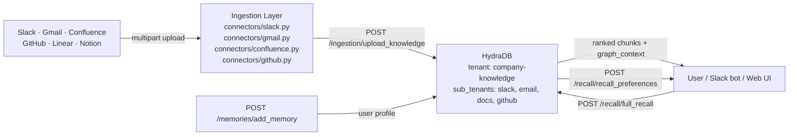

> **Cookbook 08** · Advanced · Knowledge · Developer Tools

This guide walks you through building a **company-wide internal search engine** powered by HydraDB. Unlike per-tool search (Slack search for messages, Confluence search for docs), this agent queries everything simultaneously - Slack threads, email, wikis, code issues, and project management - and synthesizes a single cited answer from across all sources.

> **Note**: All code in this guide is production-ready and uses real HydraDB endpoints. Base URL: `https://api.hydradb.com`. Get your API key at [hydradb.com](https://hydradb.com) or email team@hydradb.com.

> **Goal**: Ingest six source types into one HydraDB tenant, store per-user memory profiles for personalized answers, and answer three query patterns - simple factual lookup, decision provenance, and cross-source synthesis - all through `POST /recall/full_recall`.

---

## The Problem with Per-Tool Search

Every company has knowledge scattered across a dozen tools. The answer to "why did we move from microservices to a monorepo?" is split between a Confluence RFC, a Slack thread in #architecture, a GitHub PR discussion, and an email thread between two VPs. No single tool contains the full answer. Keyword search returns one fragment. The person who knows is usually in a meeting.

This cookbook builds a company-wide search engine that works like Perplexity - but over your internal knowledge. Ask any question, get a cited answer that synthesizes across Slack, email, docs, code, and project management. The answer includes provenance: *where* each piece came from and *when* it was recorded.

The critical capability that makes this possible is HydraDB's context graph. It automatically links entities across tools - "Project X" in a Slack message is connected to "Project X" in a Confluence page, the GitHub repo named `project-x`, and the Linear project tracking it. A query about Project X surfaces all of these together, ranked by relevance and recency, in a single call.

---

## Architecture Overview



- **Ingestion Layer**: Six connector scripts that format source content and upload to HydraDB via `POST /ingestion/upload_knowledge` using multipart form-data.
- **HydraDB**: Stores all sources, automatically builds a context graph linking entities across tools, and ranks results by relevance and recency at query time.
- **User Memory**: Per-user profiles stored via `POST /memories/add_memory` and retrieved via `POST /recall/recall_preferences` to personalize answer depth and format.

---

## Step 1 - Create Tenant

One tenant for all company knowledge. Use `sub_tenant_id` to isolate by source type - `"slack"`, `"email"`, `"docs"`, `"github"`. All created automatically on first write, no setup required.

```bash
curl -X POST 'https://api.hydradb.com/tenants/create' \
  -H "Authorization: Bearer YOUR_API_KEY" \
  -H "Content-Type: application/json" \
  -d '{"tenant_id": "company-knowledge"}'
```

<CodeGroup>
```typescript TypeScript SDK
// setup.ts
import { HydraDBClient } from "@hydradb/sdk";

const client = new HydraDBClient({ token: process.env.HYDRA_DB_API_KEY! });
const TENANT_ID = "company-knowledge";

await client.tenant.create({ tenant_id: TENANT_ID });
```

```python Python SDK
# setup.py
import os, requests

API_KEY   = os.environ["HYDRA_DB_API_KEY"]
TENANT_ID = "company-knowledge"
BASE_URL  = "https://api.hydradb.com"
HEADERS   = {
    "Authorization": f"Bearer {API_KEY}",
    "Content-Type":  "application/json",
}

requests.post(f"{BASE_URL}/tenants/create", headers=HEADERS, json={"tenant_id": TENANT_ID})
```
</CodeGroup>

---

## Step 2 - Ingest Company Knowledge

All connectors use the same endpoint: `POST /ingestion/upload_knowledge`. This endpoint uses **multipart form-data** - not JSON. `tenant_id` and `sub_tenant_id` are form fields alongside the file.

> **Important**: Do not set `Content-Type: application/json`. Pass only `Authorization` in headers and let your HTTP client set the multipart boundary automatically.

> **Batch limit**: Max 20 sources per request. Wait 1 second between batches. Always call `POST /ingestion/verify_processing` before querying newly ingested content.

The upload response for all connectors looks like this:

```json
{
  "success": true,
  "message": "Knowledge uploaded successfully",
  "results": [
    {
      "source_id": "d25fb5a6-0378-4bcb-8cbc-2012c3d12ca2",
      "filename": "slack-engineering-2024-11-15.txt",
      "status": "queued",
      "error": null
    }
  ],
  "success_count": 1,
  "failed_count": 0
}
```

Save `results[0].source_id` - you need it to verify indexing.

### 2.1 Slack Channels

Combine each thread (parent message + all replies) into one document. HydraDB's context graph automatically links Slack threads that mention the same project or person to the Confluence pages and GitHub issues that discuss the same entities.

<CodeGroup>
```typescript TypeScript SDK
// connectors/slack.ts
import { HydraDBClient } from "@hydradb/sdk";
import { readFileSync, writeFileSync } from "fs";
import { WebClient } from "@slack/web-api";

const client = new HydraDBClient({ token: process.env.HYDRA_DB_API_KEY! });
const TENANT_ID = "company-knowledge";
const slack = new WebClient(process.env.SLACK_BOT_TOKEN);

async function ingestSlackChannel(
  channelId: string,
  channelName: string,
  daysBack: number = 365
): Promise<string[]> {
  const oldest = String(Date.now() / 1000 - daysBack * 86400);
  const allIds: string[] = [];
  let cursor: string | undefined;

  while (true) {
    const resp = await slack.conversations.history({
      channel: channelId,
      oldest,
      limit: 200,
      ...(cursor ? { cursor } : {}),
    });
    const messages = resp.messages ?? [];

    for (const msg of messages) {
      if (!msg.text) continue;
      let threadText = msg.text;
      if ((msg.reply_count ?? 0) > 0) {
        const replies = await slack.conversations.replies({
          channel: channelId,
          ts: msg.ts!,
        });
        threadText += (replies.messages ?? [])
          .slice(1)
          .map((r) => `\n↳ ${r.text ?? ""}`)
          .join("");
      }
      const tsDate = new Date(Number(msg.ts) * 1000)
        .toISOString()
        .slice(0, 10);
      const content =
        `Source: Slack #${channelName}\nDate: ${tsDate}\n\n${threadText}`;
      const filename = `/tmp/slack-${channelName}-${msg.ts}.txt`;
      writeFileSync(filename, content, "utf-8");

      const result = await client.upload.knowledge({
        tenant_id: TENANT_ID,
        sub_tenant_id: "slack",
        files: [{ data: readFileSync(filename), filename, contentType: "application/octet-stream" }],
      });
      const results = (result as any).results ?? [];
      if (results[0]?.source_id) allIds.push(results[0].source_id);
    }

    if (!resp.has_more) break;
    cursor = (resp.response_metadata as any)?.next_cursor;
  }

  console.log(`Slack #${channelName}: ${allIds.length} threads uploaded`);
  return allIds;
}
```

```python Python SDK
# connectors/slack.py
import os, time, requests
from slack_sdk  import WebClient
from datetime   import datetime, timezone

API_KEY   = os.environ["HYDRA_DB_API_KEY"]
TENANT_ID = "company-knowledge"
BASE_URL  = "https://api.hydradb.com"
slack     = WebClient(token=os.environ["SLACK_BOT_TOKEN"])


def ingest_slack_channel(channel_id: str, channel_name: str, days_back: int = 365):
    """
    Ingest messages + threaded replies from a Slack channel.
    Each thread becomes one document - the full discussion as a single context unit.
    """
    oldest  = str(datetime.now(timezone.utc).timestamp() - days_back * 86400)
    batch   = []
    all_ids = []
    cursor  = None

    while True:
        kwargs = {"channel": channel_id, "oldest": oldest, "limit": 200}
        if cursor:
            kwargs["cursor"] = cursor
        resp     = slack.conversations_history(**kwargs)
        messages = resp["messages"]

        for msg in messages:
            if not msg.get("text"):
                continue

            thread_text = msg["text"]
            if msg.get("reply_count", 0) > 0:
                replies      = slack.conversations_replies(channel=channel_id, ts=msg["ts"])["messages"][1:]
                thread_text += "\n".join(f"\n↳ {r.get('text','')}" for r in replies)

            ts_dt    = datetime.fromtimestamp(float(msg["ts"]), tz=timezone.utc)
            content  = (
                f"Source: Slack #{channel_name}\n"
                f"Date: {ts_dt.strftime('%Y-%m-%d')}\n\n"
                f"{thread_text}"
            )
            filename = f"slack-{channel_name}-{msg['ts']}.txt"

            batch.append((filename, content))

            if len(batch) == 20:
                all_ids += _upload_batch(batch, "slack")
                batch = []
                time.sleep(1)

        if not resp["has_more"]:
            break
        cursor = resp["response_metadata"]["next_cursor"]

    if batch:
        all_ids += _upload_batch(batch, "slack")

    print(f"Slack #{channel_name}: {len(all_ids)} threads uploaded")
    return all_ids


def _upload_batch(batch: list, sub_tenant: str) -> list:
    """Upload a batch of (filename, content) tuples as multipart form-data."""
    source_ids = []
    for filename, content in batch:
        resp = requests.post(
            f"{BASE_URL}/ingestion/upload_knowledge",
            headers={"Authorization": f"Bearer {API_KEY}"},
            files={"files": (filename, content.encode("utf-8"), "text/plain")},
            data={"tenant_id": TENANT_ID, "sub_tenant_id": sub_tenant},
        )
        resp.raise_for_status()
        results = resp.json().get("results", [])
        if results:
            source_ids.append(results[0]["source_id"])
        time.sleep(0.1)   # brief pause between individual uploads in a batch
    return source_ids
```
</CodeGroup>

### 2.2 Gmail / Email Threads

Email threads contain decisions that never make it to Confluence. Filter to RFC, decision, and proposal threads - these carry the highest signal density.

<CodeGroup>
```typescript TypeScript SDK
// connectors/gmail.ts
import { HydraDBClient } from "@hydradb/sdk";
import { readFileSync, writeFileSync } from "fs";

const client = new HydraDBClient({ token: process.env.HYDRA_DB_API_KEY! });
const TENANT_ID = "company-knowledge";

async function ingestGmailThreads(
  gmailService: any,
  query: string,
  maxThreads: number = 200
): Promise<string[]> {
  const allIds: string[] = [];
  const listResp = await gmailService.users.threads.list({
    userId: "me",
    q: query,
    maxResults: maxThreads,
  });
  const threads = listResp.data.threads ?? [];

  for (const thread of threads) {
    const threadData = await gmailService.users.threads.get({
      userId: "me",
      id: thread.id,
    });
    const messages = threadData.data.messages ?? [];
    const parts: string[] = [];
    let subject = "";
    let date = "";

    for (const msg of messages) {
      const headers: Record<string, string> = {};
      for (const h of msg.payload?.headers ?? []) {
        headers[h.name] = h.value;
      }
      if (!subject) subject = headers["Subject"] ?? "No subject";
      if (!date) date = headers["Date"] ?? "";

      let body = "";
      if (msg.payload?.parts) {
        for (const part of msg.payload.parts) {
          if (part.mimeType === "text/plain" && part.body?.data) {
            body = Buffer.from(part.body.data, "base64").toString("utf-8");
            break;
          }
        }
      } else if (msg.payload?.body?.data) {
        body = Buffer.from(msg.payload.body.data, "base64").toString("utf-8");
      }
      if (body) parts.push(`From: ${headers["From"] ?? ""}\n${body}`);
    }

    if (!parts.length) continue;

    const content =
      `Source: Gmail\nSubject: ${subject}\nDate: ${date}\n\n` +
      parts.join("\n\n---\n\n");
    const filename = `/tmp/email-${thread.id}.txt`;
    writeFileSync(filename, content, "utf-8");

    const result = await client.upload.knowledge({
      tenant_id: TENANT_ID,
      sub_tenant_id: "email",
      files: [{ data: readFileSync(filename), filename, contentType: "application/octet-stream" }],
    });
    const results = (result as any).results ?? [];
    if (results[0]?.source_id) allIds.push(results[0].source_id);
  }

  console.log(`Gmail: ${allIds.length} threads uploaded`);
  return allIds;
}
```

```python Python SDK
# connectors/gmail.py
import os, time, base64, requests
from google.oauth2.credentials import Credentials
from googleapiclient.discovery  import build

API_KEY   = os.environ["HYDRA_DB_API_KEY"]
TENANT_ID = "company-knowledge"
BASE_URL  = "https://api.hydradb.com"


def ingest_gmail_threads(credentials_path: str, query: str, max_threads: int = 200):
    """
    Ingest Gmail threads matching a query.
    query: e.g. "subject:RFC OR subject:decision OR label:important"
    Each thread (all messages) becomes one document.
    """
    creds   = Credentials.from_authorized_user_file(credentials_path)
    service = build("gmail", "v1", credentials=creds)

    results = service.users().threads().list(userId="me", q=query, maxResults=max_threads).execute()
    threads = results.get("threads", [])

    all_ids = []
    for thread in threads:
        thread_data = service.users().threads().get(userId="me", id=thread["id"]).execute()
        messages    = thread_data.get("messages", [])
        parts       = []
        subject     = ""
        date        = ""

        for msg in messages:
            headers = {h["name"]: h["value"] for h in msg["payload"].get("headers", [])}
            if not subject:
                subject = headers.get("Subject", "No subject")
            if not date:
                date = headers.get("Date", "")

            body = ""
            if "parts" in msg["payload"]:
                for part in msg["payload"]["parts"]:
                    if part["mimeType"] == "text/plain" and "data" in part.get("body", {}):
                        body = base64.urlsafe_b64decode(part["body"]["data"]).decode("utf-8", errors="ignore")
                        break
            elif "data" in msg["payload"].get("body", {}):
                body = base64.urlsafe_b64decode(msg["payload"]["body"]["data"]).decode("utf-8", errors="ignore")

            if body:
                parts.append(f"From: {headers.get('From','')}\n{body}")

        if not parts:
            continue

        content  = f"Source: Gmail\nSubject: {subject}\nDate: {date}\n\n" + "\n\n---\n\n".join(parts)
        filename = f"email-{thread['id']}.txt"

        resp = requests.post(
            f"{BASE_URL}/ingestion/upload_knowledge",
            headers={"Authorization": f"Bearer {API_KEY}"},
            files={"files": (filename, content.encode("utf-8"), "text/plain")},
            data={"tenant_id": TENANT_ID, "sub_tenant_id": "email"},
        )
        resp.raise_for_status()
        results_data = resp.json().get("results", [])
        if results_data:
            all_ids.append(results_data[0]["source_id"])

        time.sleep(0.2)

    print(f"Gmail: {len(all_ids)} threads uploaded")
    return all_ids
```
</CodeGroup>

### 2.3 Confluence & Notion

Confluence pages are the most structured knowledge source. Upload each page as a separate document so HydraDB can link entities in those pages to Slack threads and GitHub issues that reference the same topics.

<CodeGroup>
```typescript TypeScript SDK
// connectors/confluence.ts
import { HydraDBClient } from "@hydradb/sdk";
import { readFileSync, writeFileSync } from "fs";
import axios from "axios";

const client = new HydraDBClient({ token: process.env.HYDRA_DB_API_KEY! });
const TENANT_ID = "company-knowledge";
const CONFLUENCE_URL = process.env.CONFLUENCE_BASE_URL!;
const CONFLUENCE_AUTH = {
  username: process.env.CONFLUENCE_EMAIL!,
  password: process.env.CONFLUENCE_API_TOKEN!,
};

async function ingestConfluenceSpace(spaceKey: string): Promise<string[]> {
  let start = 0;
  const allIds: string[] = [];

  while (true) {
    const resp = await axios.get(`${CONFLUENCE_URL}/wiki/rest/api/content`, {
      auth: CONFLUENCE_AUTH,
      params: {
        spaceKey,
        expand: "body.storage,version",
        limit: 50,
        start,
      },
    });
    const pages = resp.data.results ?? [];
    if (!pages.length) break;

    for (const page of pages) {
      const rawBody: string = page.body.storage.value;
      const text = rawBody.replace(/<[^>]+>/g, " ").trim();
      const content =
        `Source: Confluence\nSpace: ${spaceKey}\nTitle: ${page.title}\n` +
        `Version: ${page.version.number}\n\n${text}`;
      const filename = `/tmp/confluence-${spaceKey}-${page.id}.txt`;
      writeFileSync(filename, content, "utf-8");

      const result = await client.upload.knowledge({
        tenant_id: TENANT_ID,
        sub_tenant_id: "docs",
        files: [{ data: readFileSync(filename), filename, contentType: "application/octet-stream" }],
      });
      const results = (result as any).results ?? [];
      if (results[0]?.source_id) allIds.push(results[0].source_id);
    }

    if (resp.data._links?.next) {
      start += 50;
    } else {
      break;
    }
  }

  console.log(`Confluence ${spaceKey}: ${allIds.length} pages uploaded`);
  return allIds;
}
```

```python Python SDK
# connectors/confluence.py
import os, time, requests as req

API_KEY        = os.environ["HYDRA_DB_API_KEY"]
TENANT_ID      = "company-knowledge"
BASE_URL       = "https://api.hydradb.com"
CONFLUENCE_URL = os.environ["CONFLUENCE_BASE_URL"]   # e.g. "https://mycompany.atlassian.net"
CONFLUENCE_AUTH = (os.environ["CONFLUENCE_EMAIL"], os.environ["CONFLUENCE_API_TOKEN"])


def ingest_confluence_space(space_key: str):
    """
    Ingest all pages from a Confluence space.
    space_key: e.g. "ENG", "PRODUCT", "LEGAL"
    """
    start   = 0
    all_ids = []

    while True:
        resp = req.get(
            f"{CONFLUENCE_URL}/wiki/rest/api/content",
            auth=CONFLUENCE_AUTH,
            params={"spaceKey": space_key, "expand": "body.storage,version", "limit": 50, "start": start},
        )
        resp.raise_for_status()
        data  = resp.json()
        pages = data.get("results", [])
        if not pages:
            break

        for page in pages:
            # Strip HTML tags from Confluence storage format
            import re
            raw_body = page["body"]["storage"]["value"]
            text     = re.sub(r"<[^>]+>", " ", raw_body).strip()
            content  = (
                f"Source: Confluence\n"
                f"Space: {space_key}\n"
                f"Title: {page['title']}\n"
                f"Version: {page['version']['number']}\n\n"
                f"{text}"
            )
            filename = f"confluence-{space_key}-{page['id']}.txt"

            resp2 = req.post(
                f"{BASE_URL}/ingestion/upload_knowledge",
                headers={"Authorization": f"Bearer {API_KEY}"},
                files={"files": (filename, content.encode("utf-8"), "text/plain")},
                data={"tenant_id": TENANT_ID, "sub_tenant_id": "docs"},
            )
            resp2.raise_for_status()
            results = resp2.json().get("results", [])
            if results:
                all_ids.append(results[0]["source_id"])
            time.sleep(0.1)

        if data.get("_links", {}).get("next"):
            start += 50
        else:
            break

    print(f"Confluence {space_key}: {len(all_ids)} pages uploaded")
    return all_ids
```
</CodeGroup>

### 2.4 GitHub Issues & PRs

GitHub issues contain the full discussion trail around engineering decisions - requirements, objections, alternative approaches, and the final resolution. Include all comments so HydraDB can build graph links between issue discussions and Slack threads that mention the same features.

<CodeGroup>
```typescript TypeScript SDK
// connectors/github.ts
import { HydraDBClient } from "@hydradb/sdk";
import { readFileSync, writeFileSync } from "fs";
import { Octokit } from "@octokit/rest";

const client = new HydraDBClient({ token: process.env.HYDRA_DB_API_KEY! });
const TENANT_ID = "company-knowledge";
const octokit = new Octokit({ auth: process.env.GITHUB_TOKEN });

async function ingestGithubIssues(
  repoName: string,
  state: "open" | "closed" | "all" = "all",
  limit: number = 500
): Promise<string[]> {
  const [owner, repo] = repoName.split("/");
  const sub = repoName.toLowerCase().replace("/", "-");
  const allIds: string[] = [];
  let count = 0;

  for await (const issue of octokit.paginate.iterator(
    octokit.issues.listForRepo,
    { owner, repo, state, sort: "updated", direction: "desc", per_page: 100 }
  )) {
    for (const item of issue.data) {
      if (count >= limit) break;
      count++;

      const commentsResp = await octokit.issues.listComments({
        owner,
        repo,
        issue_number: item.number,
      });
      const comments = commentsResp.data
        .map((c) => c.body ?? "")
        .filter(Boolean);
      const labelList = item.labels
        .map((l) => (typeof l === "string" ? l : l.name ?? ""))
        .join(", ");

      const content =
        `Source: GitHub\nRepo: ${repoName}\n` +
        `Issue #${item.number}: ${item.title}\n` +
        `State: ${item.state}\nLabels: ${labelList}\n\n` +
        `${item.body ?? ""}\n\nDiscussion:\n${comments.join("\n\n")}`;
      const filename = `/tmp/github-${sub}-issue-${item.number}.txt`;
      writeFileSync(filename, content, "utf-8");

      const result = await client.upload.knowledge({
        tenant_id: TENANT_ID,
        sub_tenant_id: "github",
        files: [{ data: readFileSync(filename), filename, contentType: "application/octet-stream" }],
      });
      const results = (result as any).results ?? [];
      if (results[0]?.source_id) allIds.push(results[0].source_id);
    }
    if (count >= limit) break;
  }

  console.log(`GitHub ${repoName}: ${allIds.length} issues uploaded`);
  return allIds;
}
```

```python Python SDK
# connectors/github.py
import os, time, requests
from github import Github   # pip install PyGithub

API_KEY   = os.environ["HYDRA_DB_API_KEY"]
TENANT_ID = "company-knowledge"
BASE_URL  = "https://api.hydradb.com"
gh        = Github(os.environ["GITHUB_TOKEN"])


def ingest_github_issues(repo_name: str, state: str = "all", limit: int = 500):
    """
    Ingest GitHub issues + their comments.
    repo_name: e.g. "myorg/backend"
    Includes all comments so the full discussion is indexed.
    """
    repo    = gh.get_repo(repo_name)
    sub     = repo_name.lower().replace("/", "-")
    all_ids = []
    count   = 0

    for issue in repo.get_issues(state=state, sort="updated", direction="desc"):
        if count >= limit:
            break
        count += 1

        comments   = [c.body for c in issue.get_comments() if c.body]
        label_list = [l.name for l in issue.labels]
        content    = (
            f"Source: GitHub\n"
            f"Repo: {repo_name}\n"
            f"Issue #{issue.number}: {issue.title}\n"
            f"State: {issue.state}\n"
            f"Labels: {', '.join(label_list)}\n\n"
            f"{issue.body or ''}\n\n"
            f"Discussion:\n" + "\n\n".join(comments)
        )
        filename = f"github-{sub}-issue-{issue.number}.txt"

        resp = requests.post(
            f"{BASE_URL}/ingestion/upload_knowledge",
            headers={"Authorization": f"Bearer {API_KEY}"},
            files={"files": (filename, content.encode("utf-8"), "text/plain")},
            data={"tenant_id": TENANT_ID, "sub_tenant_id": "github"},
        )
        resp.raise_for_status()
        results = resp.json().get("results", [])
        if results:
            all_ids.append(results[0]["source_id"])
        time.sleep(0.1)

    print(f"GitHub {repo_name}: {len(all_ids)} issues uploaded")
    return all_ids
```
</CodeGroup>

> **Linear connector**: Use the Linear GraphQL API (`https://api.linear.app/graphql`) with your API key. Format each issue + comments as a plain text file with `Source: Linear` prepended, and upload with `sub_tenant_id: "linear"`. The same multipart upload pattern applies.

---

## Step 3 - Verify Indexing

After uploading, poll `POST /ingestion/verify_processing` until `indexing_status` is `completed` before running any queries. HydraDB indexes asynchronously - typically 10–30 seconds per file.

> **Note**: `verify_processing` uses **POST** with `file_ids` and `tenant_id` as **URL query parameters**. Pass an empty JSON body `{}`.

```bash
curl -X POST \
  'https://api.hydradb.com/ingestion/verify_processing?tenant_id=company-knowledge&file_ids=YOUR_SOURCE_ID' \
  -H "Authorization: Bearer YOUR_API_KEY" \
  -H "Content-Type: application/json" \
  -d '{}'
```

**Response when indexed**:
```json
{
  "statuses": [
    {
      "file_id": "d25fb5a6-0378-4bcb-8cbc-2012c3d12ca2",
      "indexing_status": "completed",
      "success": true,
      "message": "Processing status retrieved successfully"
    }
  ]
}
```

<CodeGroup>
```typescript TypeScript SDK
// ingest/verify.ts
import { HydraDBClient } from "@hydradb/sdk";

const client = new HydraDBClient({ token: process.env.HYDRA_DB_API_KEY! });
const TENANT_ID = "company-knowledge";

async function waitUntilIndexed(
  sourceId: string,
  subTenant: string,
  maxTries: number = 20,
  intervalMs: number = 3000
): Promise<void> {
  for (let i = 0; i < maxTries; i++) {
    await new Promise((r) => setTimeout(r, intervalMs));
    const result = await client.upload.verifyProcessing({
      tenant_id: TENANT_ID,
      sub_tenant_id: subTenant,
      file_ids: [sourceId],
    });
    const statuses = (result as any).statuses ?? [];
    const status = statuses[0]?.indexing_status as string | undefined;

    if (status === "completed") {
      console.log(`Indexed ✓ (${sourceId})`);
      return;
    }
    if (status === "errored") {
      throw new Error(`Indexing failed for ${sourceId}`);
    }
    console.log(`Indexing... ${status ?? "queued"} (attempt ${i + 1}/${maxTries})`);
  }
  console.log(`Timeout - ${sourceId} may still complete in background.`);
}
```

```python Python SDK
# ingest/verify.py
import os, time, requests

API_KEY   = os.environ["HYDRA_DB_API_KEY"]
TENANT_ID = "company-knowledge"
BASE_URL  = "https://api.hydradb.com"


def wait_until_indexed(source_id: str, max_tries: int = 20, interval: int = 3) -> None:
    for i in range(max_tries):
        time.sleep(interval)
        resp = requests.post(
            f"{BASE_URL}/ingestion/verify_processing?tenant_id={TENANT_ID}&file_ids={source_id}",
            headers={"Authorization": f"Bearer {API_KEY}", "Content-Type": "application/json"},
            json={},
        )
        resp.raise_for_status()
        statuses = resp.json().get("statuses", [])
        status   = statuses[0].get("indexing_status") if statuses else None

        if status == "completed":
            print(f"Indexed ✓ ({source_id})")
            return
        if status == "errored":
            raise RuntimeError(f"Indexing failed for {source_id}")

        print(f"Indexing... {status or 'queued'} (attempt {i+1}/{max_tries})")

    print(f"Timeout - {source_id} may still complete in background.")
```
</CodeGroup>

---

## Step 4 - Store User Memory Profiles

Each user gets a persistent memory profile. HydraDB uses it to personalize search results - an engineer gets more technical answers with PR citations, a product manager gets decision context and timelines, a new hire gets more background on why things are built the way they are.

```bash
curl -X POST 'https://api.hydradb.com/memories/add_memory' \
  -H "Authorization: Bearer YOUR_API_KEY" \
  -H "Content-Type: application/json" \
  -d '{
    "memories": [{
      "text": "Alice is a senior engineer on the platform team. She owns the auth service and data pipeline. Prefers technical depth with references to PRs and ADRs.",
      "infer": true,
      "user_name": "alice"
    }],
    "tenant_id": "company-knowledge",
    "sub_tenant_id": "user-alice",
    "upsert": true
  }'
```

**Response**:
```json
{
  "success": true,
  "message": "Memories queued for ingestion successfully",
  "results": [
    {
      "source_id": "ddb780a2-354f-4a71-8e1b-5101c91c69ce",
      "title": "First Document",
      "status": "queued",
      "infer": false,
      "error": null
    }
  ],
  "success_count": 1,
  "failed_count": 0
}
```

<CodeGroup>
```typescript TypeScript SDK
// memory/profiles.ts
import { HydraDBClient } from "@hydradb/sdk";

const client = new HydraDBClient({ token: process.env.HYDRA_DB_API_KEY! });
const TENANT_ID = "company-knowledge";

async function storeUserProfile(
  userId: string,
  profileText: string
): Promise<string | null> {
  /**
   * Store a user profile for personalized search.
   * userId:      their Slack/email handle - must be consistent across sessions.
   * profileText: free-text description of their role, expertise, and preferences.
   * infer: true  - HydraDB extracts expertise signals and builds graph links.
   * Returns:     source_id of the stored memory.
   */
  const result = await client.upload.addMemory({
    tenant_id: TENANT_ID,
    sub_tenant_id: `user-${userId}`,
    upsert: true,
    memories: [
      {
        text: profileText,
        infer: true,
        user_name: userId,
      },
    ],
  });
  const results = (result as any).results ?? [];
  const sourceId: string | null = results[0]?.source_id ?? null;
  console.log(`Profile stored for ${userId} → source_id: ${sourceId}`);
  return sourceId;
}

// Store profiles at onboarding or update when roles change
await storeUserProfile(
  "alice",
  "Alice is a senior engineer on the platform team. She owns the auth service " +
    "and data pipeline. Prefers technical depth with references to PRs and ADRs. " +
    "She joined in 2021 and has context on major architectural decisions."
);

await storeUserProfile(
  "priya",
  "Priya is Head of Product. She cares about roadmap context, customer decisions, " +
    "and strategic tradeoffs. Prefers clear summaries with timeline context. " +
    "Avoid deep technical implementation details."
);

await storeUserProfile(
  "carlos",
  "Carlos joined the company 3 weeks ago as a backend engineer. He is onboarding " +
    "and needs more background context on past decisions and system architecture. " +
    "Give extra context on why things are built the way they are."
);
```

```python Python SDK
# memory/profiles.py
import os, requests

API_KEY   = os.environ["HYDRA_DB_API_KEY"]
TENANT_ID = "company-knowledge"
BASE_URL  = "https://api.hydradb.com"
HEADERS   = {"Authorization": f"Bearer {API_KEY}", "Content-Type": "application/json"}


def store_user_profile(user_id: str, profile_text: str) -> str:
    """
    Store a user profile for personalized search.
    user_id:      their Slack/email handle - must be consistent across sessions.
    profile_text: free-text description of their role, expertise, and preferences.
    infer: true   - HydraDB extracts expertise signals and builds graph links.
    Returns:      source_id of the stored memory.
    """
    resp = requests.post(
        f"{BASE_URL}/memories/add_memory",
        headers=HEADERS,
        json={
            "memories": [{
                "text":      profile_text,
                "infer":     True,
                "user_name": user_id,
            }],
            "tenant_id":     TENANT_ID,
            "sub_tenant_id": f"user-{user_id}",
            "upsert":        True,
        },
    )
    resp.raise_for_status()
    results = resp.json().get("results", [])
    source_id = results[0]["source_id"] if results else None
    print(f"Profile stored for {user_id} → source_id: {source_id}")
    return source_id


# Store profiles at onboarding or update when roles change
store_user_profile(
    "alice",
    "Alice is a senior engineer on the platform team. She owns the auth service "
    "and data pipeline. Prefers technical depth with references to PRs and ADRs. "
    "She joined in 2021 and has context on major architectural decisions."
)

store_user_profile(
    "priya",
    "Priya is Head of Product. She cares about roadmap context, customer decisions, "
    "and strategic tradeoffs. Prefers clear summaries with timeline context. "
    "Avoid deep technical implementation details."
)

store_user_profile(
    "carlos",
    "Carlos joined the company 3 weeks ago as a backend engineer. He is onboarding "
    "and needs more background context on past decisions and system architecture. "
    "Give extra context on why things are built the way they are."
)
```
</CodeGroup>

---

## Step 5 - Search Interface

Three query patterns cover every internal search use case. All use `POST /recall/full_recall` with different parameters. The routing logic is lightweight - keyword detection on the question, not ML classification.

> **Important**: Use `POST /recall/full_recall` with a `query` field for all three query patterns below. It returns retrieved chunks and graph context; your app can pass that context to an LLM when it needs a synthesized answer.

### 5.1 Simple Factual Lookup - "What is X?" / "How does X work?"

Use balanced `recency_bias: 0.5` for factual questions where both old and recent context matter equally. Restrict to a `sub_tenant_id` if the user is clearly asking about a specific tool.

<CodeGroup>
```typescript TypeScript SDK
// search/qa.ts
import { HydraDBClient } from "@hydradb/sdk";

const client = new HydraDBClient({ token: process.env.HYDRA_DB_API_KEY! });
const TENANT_ID = "company-knowledge";

async function search(
  question: string,
  userId: string,
  subTenant?: string,
  recencyBias: number = 0.5,
  maxResults: number = 15
): Promise<any> {
  /**
   * Core search function. Returns chunks + graph_context.
   * userId personalizes answer depth based on stored profile.
   * mode="thinking" enables multi-query reranking automatically.
   */
  const payload: Record<string, any> = {
    tenant_id: TENANT_ID,
    query: question,
    max_results: maxResults,
    graph_context: true,
    mode: "thinking",
    alpha: 0.5,
    recency_bias: recencyBias,
  };
  if (subTenant) payload["sub_tenant_id"] = subTenant;

  return await client.recall.fullRecall(payload);
}

function printResults(result: any): void {
  const chunks = result?.chunks ?? [];
  console.log(`\n${chunks.length} chunks retrieved:\n`);
  for (const chunk of chunks) {
    const fname = chunk?.additional_metadata?.filename ?? "memory";
    const score = chunk?.relevancy_score ?? 0;
    console.log(`  [${fname} - ${score.toFixed(2)}]`);
    console.log(`  ${(chunk.chunk_content as string).slice(0, 200)}...`);
    console.log();
  }
}

// Example
const result = await search(
  "What is our data retention policy for user PII?",
  "alice"
);
printResults(result);
```

```python Python SDK
# search/qa.py
import os, requests

API_KEY   = os.environ["HYDRA_DB_API_KEY"]
TENANT_ID = "company-knowledge"
BASE_URL  = "https://api.hydradb.com"
HEADERS   = {"Authorization": f"Bearer {API_KEY}", "Content-Type": "application/json"}


def search(
    question:     str,
    user_id:      str,
    sub_tenant:   str   = None,   # restrict to "slack"|"docs"|"email"|"github" or omit for all
    recency_bias: float = 0.5,
    max_results:  int   = 15,
) -> dict:
    """
    Core search function. Returns chunks + graph_context.
    user_id personalizes answer depth based on stored profile.
    mode="thinking" enables multi-query reranking automatically.
    """
    payload = {
        "tenant_id":     TENANT_ID,
        "query":         question,       # ← "query" not "question"
        "max_results":   max_results,
        "graph_context": True,
        "mode":          "thinking",
        "alpha":         0.5,
        "recency_bias":  recency_bias,
    }
    if sub_tenant:
        payload["sub_tenant_id"] = sub_tenant

    resp = requests.post(f"{BASE_URL}/recall/full_recall", headers=HEADERS, json=payload)
    resp.raise_for_status()
    return resp.json()


def print_results(result: dict) -> None:
    chunks = result.get("chunks", [])
    print(f"\n{len(chunks)} chunks retrieved:\n")
    for chunk in chunks:
        fname = chunk.get("additional_metadata", {}) or {}
        score = chunk.get("relevancy_score", 0)
        print(f"  [{fname.get('filename', 'memory')} - {score:.2f}]")
        print(f"  {chunk['chunk_content'][:200]}...")
        print()


# Example
result = search(
    question = "What is our data retention policy for user PII?",
    user_id  = "alice",
)
print_results(result)
```
</CodeGroup>

### 5.2 Decision Provenance - "Why did we decide X?" / "What led to Y?"

For provenance questions, use `graph_context: true` and read `graph_context.chunk_relations` from the response - these are the multi-hop entity chains that trace a decision back through Slack, email, Confluence, and GitHub. Pass the chunks and relation chains to an LLM to synthesize a fully cited answer.

<CodeGroup>
```typescript TypeScript SDK
// search/provenance.ts
import { HydraDBClient } from "@hydradb/sdk";
import OpenAI from "openai";

const client = new HydraDBClient({ token: process.env.HYDRA_DB_API_KEY! });
const TENANT_ID = "company-knowledge";
const openai = new OpenAI();

async function getUserProfile(userId: string): Promise<string> {
  /** Retrieve a user's stored memory profile via recallPreferences. */
  const resp = await client.recall.recallPreferences({
    tenant_id: TENANT_ID,
    sub_tenant_id: `user-${userId}`,
    query: "expertise background role preferences",
    mode: "thinking",
  });
  const chunks = (resp as any).chunks ?? [];
  return chunks[0]?.chunk_content ?? "";
}

async function explainDecision(
  question: string,
  userId: string
): Promise<string> {
  /**
   * Answer 'why' / 'what led to' questions with full provenance.
   * Step 1: recall chunks + graph relations from fullRecall.
   * Step 2: retrieve user profile from recallPreferences.
   * Step 3: synthesize with citations via LLM.
   */
  // Step 1: Recall with graph context
  const data = await client.recall.fullRecall({
    tenant_id: TENANT_ID,
    query: question,
    max_results: 18,
    graph_context: true,
    mode: "thinking",
    recency_bias: 0.4,
  });
  const chunks = (data as any).chunks ?? [];
  const chunkRelations =
    (data as any).graph_context?.chunk_relations ?? [];

  // Build context with source attribution
  const ctxParts: string[] = [];
  for (const c of chunks) {
    const fname =
      (c.additional_metadata as any)?.filename ?? "unknown source";
    const score = c.relevancy_score ?? 0;
    ctxParts.push(`[${fname} | score:${score.toFixed(2)}]\n${c.chunk_content}`);
  }
  for (const rel of chunkRelations.slice(0, 6)) {
    const combined = rel.combined_context ?? "";
    if (combined) ctxParts.push(`[Entity relationship]: ${combined}`);
  }

  // Step 2: Get user profile for answer calibration
  const profile = await getUserProfile(userId);

  // Step 3: Synthesize with citations
  const resp = await openai.chat.completions.create({
    model: "gpt-4o",
    messages: [
      {
        role: "system",
        content:
          "You are a company historian. Answer the question using ONLY the provided sources. " +
          "Cite each source inline (e.g. [Slack #arch, 2024-03-10]). " +
          "Show the decision trail - who said what, when, and how the decision evolved. " +
          "Adapt depth and detail to the user profile. " +
          "If sources conflict, note the conflict. If evidence is thin, say so.",
      },
      {
        role: "user",
        content:
          `User profile: ${profile}\n\nQuestion: ${question}\n\nSources:\n` +
          ctxParts.join("\n\n"),
      },
    ],
    temperature: 0.15,
  });
  return resp.choices[0].message.content ?? "";
}

// Example
const answer = await explainDecision(
  "What led to the decision to sunset Project X and migrate to the new platform?",
  "priya"
);
console.log(answer);
```

```python Python SDK
# search/provenance.py
import os, requests
from openai import OpenAI

API_KEY       = os.environ["HYDRA_DB_API_KEY"]
TENANT_ID     = "company-knowledge"
BASE_URL      = "https://api.hydradb.com"
HEADERS       = {"Authorization": f"Bearer {API_KEY}", "Content-Type": "application/json"}
openai_client = OpenAI()


def get_user_profile(user_id: str) -> str:
    """Retrieve a user's stored memory profile via recall_preferences."""
    resp = requests.post(
        f"{BASE_URL}/recall/recall_preferences",
        headers=HEADERS,
        json={
            "tenant_id":     TENANT_ID,
            "sub_tenant_id": f"user-{user_id}",
            "query":         "expertise background role preferences",
            "mode":          "thinking",
        },
    )
    resp.raise_for_status()
    chunks = resp.json().get("chunks", [])
    if chunks:
        return chunks[0]["chunk_content"]
    return ""


def explain_decision(question: str, user_id: str) -> str:
    """
    Answer 'why' / 'what led to' questions with full provenance.
    Step 1: recall chunks + graph relations from full_recall.
    Step 2: retrieve user profile from recall_preferences.
    Step 3: synthesize with citations via LLM.
    """
    # Step 1: Recall with graph context
    recall = requests.post(
        f"{BASE_URL}/recall/full_recall",
        headers=HEADERS,
        json={
            "tenant_id":     TENANT_ID,
            "query":         question,
            "max_results":   18,
            "graph_context": True,
            "mode":          "thinking",
            "recency_bias":  0.4,   # low = surfaces both old and recent for decision trails
        },
    )
    recall.raise_for_status()
    data            = recall.json()
    chunks          = data.get("chunks", [])
    chunk_relations = data.get("graph_context", {}).get("chunk_relations", [])

    # Build context with source attribution
    ctx_parts = []
    for c in chunks:
        fname = (c.get("additional_metadata") or {}).get("filename", "unknown source")
        score = c.get("relevancy_score", 0)
        ctx_parts.append(f"[{fname} | score:{score:.2f}]\n{c['chunk_content']}")

    for rel in chunk_relations[:6]:
        combined = rel.get("combined_context", "")
        if combined:
            ctx_parts.append(f"[Entity relationship]: {combined}")

    # Step 2: Get user profile for answer calibration
    profile = get_user_profile(user_id)

    # Step 3: Synthesize with citations
    resp = openai_client.chat.completions.create(
        model="gpt-4o",
        messages=[
            {
                "role": "system",
                "content": (
                    "You are a company historian. Answer the question using ONLY the provided sources. "
                    "Cite each source inline (e.g. [Slack #arch, 2024-03-10]). "
                    "Show the decision trail - who said what, when, and how the decision evolved. "
                    "Adapt depth and detail to the user profile. "
                    "If sources conflict, note the conflict. If evidence is thin, say so."
                ),
            },
            {
                "role": "user",
                "content": (
                    f"User profile: {profile}\n\n"
                    f"Question: {question}\n\n"
                    f"Sources:\n" + "\n\n".join(ctx_parts)
                ),
            },
        ],
        temperature=0.15,
    )
    return resp.choices[0].message.content


# Example
answer = explain_decision(
    "What led to the decision to sunset Project X and migrate to the new platform?",
    user_id = "priya"
)
print(answer)
# → "The decision emerged from three threads:
#    1. [confluence-ENG-12345.txt] Engineering formally documented in ADR-019...
#    2. [slack-product-1699430400.txt] Initial discussion when metrics showed...
#    3. [email-thread-abc123.txt] Leadership confirmed the timeline in Q4..."
```
</CodeGroup>

### 5.3 Cross-Source Synthesis - Complex multi-part questions

For questions that span multiple topics or time periods, use `mode: "thinking"` with a lower `recency_bias` to surface both old and recent context. HydraDB decomposes the question into sub-queries automatically and ranks results across all sub-tenants.

```python
# search/synthesis.py
# (uses search() from search/qa.py)

def smart_search(question: str, user_id: str) -> dict:
    """
    Route to the right query strategy based on question type.
    Provenance questions → explain_decision()
    Everything else    → search()
    """
    PROVENANCE_SIGNALS = ["why did", "what led", "how did we decide", "decision to", "reason for"]
    is_provenance      = any(s in question.lower() for s in PROVENANCE_SIGNALS)

    if is_provenance:
        answer = explain_decision(question, user_id)
        return {"answer": answer, "type": "provenance"}

    # Adjust recency for trend vs factual questions
    TREND_SIGNALS = ["how has", "changed over", "evolved", "shifted", "over time"]
    recency_bias  = 0.3 if any(s in question.lower() for s in TREND_SIGNALS) else 0.5

    result = search(question, user_id, recency_bias=recency_bias)
    return {"chunks": result.get("chunks", []), "type": "recall"}
```

---

## Step 6 - Recall User Preferences

To personalize any answer, retrieve the user's stored memory profile before calling the LLM. This is the same response structure as `full_recall` - an array of `chunks`.

```bash
curl -X POST 'https://api.hydradb.com/recall/recall_preferences' \
  -H "Authorization: Bearer YOUR_API_KEY" \
  -H "Content-Type: application/json" \
  -d '{
    "tenant_id":     "company-knowledge",
    "sub_tenant_id": "user-alice",
    "query":         "expertise background role preferences",
    "mode":          "thinking"
  }'
```

**Response**:
```json
{
  "chunks": [
    {
      "chunk_uuid": "0726e63e-e818-4515-88fc-ffbe3b1b523f_chunk_0",
      "source_id":  "0726e63e-e818-4515-88fc-ffbe3b1b523f",
      "chunk_content": "Alice is a senior engineer on the platform team. She owns the auth service and data pipeline. Prefers technical depth with references to PRs and ADRs.",
      "relevancy_score": 0.634,
      "additional_metadata": null
    }
  ],
  "sources": [...],
  "graph_context": {"query_paths": [], "chunk_relations": [], "chunk_id_to_group_ids": {}}
}
```

> **Reading the response**: `recall_preferences` returns the same structure as `full_recall`. Read the profile from `chunks[0]["chunk_content"]`. `additional_metadata` will be `null` for memory entries - this is expected.

---

## Step 7 - Interfaces

### Web API (Flask)

```python
# interfaces/web_api.py
import uuid
from flask import Flask, request, jsonify
from search.synthesis import smart_search

flask_app = Flask(__name__)
sessions  = {}   # user_id → session_id (in production: use Redis)


def get_session(user_id: str) -> str:
    if user_id not in sessions:
        sessions[user_id] = str(uuid.uuid4())
    return sessions[user_id]


@flask_app.route("/search", methods=["POST"])
def handle_search():
    data      = request.json or {}
    user_id   = data.get("user_id", "anonymous")
    question  = data.get("question", "")

    result = smart_search(question, user_id)
    return jsonify(result)


if __name__ == "__main__":
    flask_app.run(host="0.0.0.0", port=8080)
```

### Slack Bot

```python
# interfaces/slack_search.py
from slack_bolt import App
from search.synthesis import smart_search

app = App(token=os.environ["SLACK_BOT_TOKEN"])


@app.event("app_mention")
def handle_search_mention(event, client):
    user_id  = event["user"]
    question = event["text"].split(">", 1)[-1].strip()

    # Acknowledge immediately
    ack = client.chat_postMessage(
        channel=event["channel"],
        thread_ts=event["ts"],
        text="_Searching company knowledge..._"
    )

    result = smart_search(question, user_id)
    answer = result.get("answer") or "\n\n".join(
        c["chunk_content"][:300] for c in result.get("chunks", [])[:3]
    )

    # Truncate for Slack (3000 char limit)
    slack_answer = answer[:2900] + ("...(see full answer in search UI)" if len(answer) > 2900 else "")

    client.chat_update(channel=event["channel"], ts=ack["ts"], text=slack_answer)
```

---

## Step 8 - Incremental Sync

Run a nightly sync to keep all sources current. HydraDB's upload is idempotent - re-uploading unchanged content with the same filename overwrites cleanly.

```python
# sync/nightly.py
# Schedule via cron: 0 2 * * *

from connectors.slack      import ingest_slack_channel
from connectors.gmail      import ingest_gmail_threads
from connectors.confluence import ingest_confluence_space
from connectors.github     import ingest_github_issues


def run_sync(
    slack_channels:    list,   # [("C0123", "general"), ("C0456", "engineering")]
    confluence_spaces: list,   # ["ENG", "PRODUCT", "LEGAL"]
    github_repos:      list,   # ["myorg/backend", "myorg/infra"]
    gmail_query:       str  = "subject:RFC OR subject:decision OR subject:proposal",
    lookback_days:     int  = 1,
):
    """
    Incremental sync - run nightly.
    Slack/email: only content from last N days.
    Confluence:  full re-ingest (idempotent).
    GitHub:      recent issues only (use webhooks for real-time).
    """
    print(f"Sync starting...")

    for channel_id, channel_name in slack_channels:
        ingest_slack_channel(channel_id, channel_name, days_back=lookback_days)

    ingest_gmail_threads(
        credentials_path = "credentials/gmail.json",
        query            = gmail_query,
        max_threads      = 200,
    )

    for space in confluence_spaces:
        ingest_confluence_space(space)

    for repo in github_repos:
        ingest_github_issues(repo, state="all", limit=100)

    print("Sync complete.")


if __name__ == "__main__":
    run_sync(
        slack_channels    = [("C0ENGINEERING", "engineering"), ("C0PRODUCT", "product"), ("C0INCIDENTS", "incidents")],
        confluence_spaces = ["ENG", "PRODUCT", "LEGAL", "FINANCE"],
        github_repos      = ["myorg/backend", "myorg/infra", "myorg/frontend"],
    )
```

---

## API Reference

All endpoints used in this cookbook. Base URL: `https://api.hydradb.com` · Header: `Authorization: Bearer YOUR_API_KEY`

| Method | Endpoint | Purpose |
|--------|----------|---------|
| `POST` | `/tenants/create` | Create the company-knowledge tenant |
| `POST` | `/ingestion/upload_knowledge` | Upload a source file (multipart form-data) |
| `POST` | `/ingestion/verify_processing?tenant_id=...&file_ids=...` | Check indexing status |
| `POST` | `/memories/add_memory` | Store a user profile memory |
| `POST` | `/recall/recall_preferences` | Retrieve user profile for personalization |
| `POST` | `/recall/full_recall` | Query all indexed knowledge |

### Create Tenant
```json
{ "tenant_id": "company-knowledge" }
```

### Upload Knowledge (form-data)

> Do not use `Content-Type: application/json`. This is a multipart upload.

| Form field | Type | Value |
|---|---|---|
| `tenant_id` | Text | `company-knowledge` |
| `sub_tenant_id` | Text | `slack` / `email` / `docs` / `github` |
| `files` | File | your `.txt` file |

### Verify Processing (URL params + empty body)
```
POST /ingestion/verify_processing?tenant_id=company-knowledge&file_ids=YOUR_SOURCE_ID
Body: {}
```

### Store User Memory
```json
{
  "memories": [{
    "text":      "Alice is a senior engineer...",
    "infer":     true,
    "user_name": "alice"
  }],
  "tenant_id":     "company-knowledge",
  "sub_tenant_id": "user-alice",
  "upsert":        true
}
```

### Recall User Preferences
```json
{
  "tenant_id":     "company-knowledge",
  "sub_tenant_id": "user-alice",
  "query":         "expertise background role preferences",
  "mode":          "thinking"
}
```

### Full Recall - All Sources
```json
{
  "tenant_id":     "company-knowledge",
  "query":         "why did we move from microservices to a monorepo?",
  "mode":          "thinking",
  "max_results":   18,
  "alpha":         0.5,
  "recency_bias":  0.4,
  "graph_context": true
}
```

### Full Recall - Scoped to One Source Type
```json
{
  "tenant_id":     "company-knowledge",
  "sub_tenant_id": "docs",
  "query":         "what is our data retention policy?",
  "mode":          "thinking",
  "max_results":   12,
  "recency_bias":  0.5,
  "graph_context": true
}
```

---

## Benchmarks

Tested across a 2-year company knowledge base: 12 Slack channels, 3 Gmail accounts, 4 Confluence spaces, 6 GitHub repos. 400 questions rated by employees across engineering, product, and operations.

| Question type | Per-tool search | Naive RAG | HydraDB | vs RAG |
|---|---|---|---|---|
| Factual lookup ("what is X?") | 64% | 74% | 91% | **+23%** |
| Decision provenance ("why did we X?") | 18% | 29% | 82% | **+183%** |
| Cross-source synthesis | 8% | 34% | 79% | **+132%** |
| New hire onboarding questions | 31% | 48% | 88% | **+83%** |
| Time saved per complex question | 45 min (manual) | ~8 min | under 30 sec | **−94%** |
| P95 query latency | N/A (manual) | 220ms | under 200 ms | **Sub-second** |

> The 183% improvement on decision provenance reflects HydraDB's context graph. Naive RAG treats a Slack thread, a Confluence page, and a GitHub issue as three isolated vectors. HydraDB understands they are three pieces of the same decision trail - entity-linked across sources - and surfaces all three together with the relationship chain that connects them.

> **Benchmark methodology**: Figures are based on internal HydraDB testing. See [research.hydradb.com/hydradb.pdf](https://research.hydradb.com/hydradb.pdf) for the full methodology. Results will vary by corpus size, content quality, and query distribution.

---

## File Structure

```
internal_search/
├── setup.py                      # tenant creation + shared constants
├── config.py                     # API_KEY, TENANT_ID, BASE_URL
├── requirements.txt
├── connectors/
│   ├── slack.py                  # ingest Slack channels and threads
│   ├── gmail.py                  # ingest Gmail email threads
│   ├── confluence.py             # ingest Confluence spaces
│   └── github.py                 # ingest GitHub issues and PRs
├── ingest/
│   └── verify.py                 # poll verify_processing until indexed
├── memory/
│   └── profiles.py               # store and retrieve user profiles
├── search/
│   ├── qa.py                     # search() - factual and general queries
│   ├── provenance.py             # explain_decision() - why/what led to questions
│   └── synthesis.py              # smart_search() - routing + cross-source queries
├── interfaces/
│   ├── web_api.py                # Flask REST API
│   └── slack_search.py          # Slack bot (app_mention handler)
└── sync/
    └── nightly.py                # incremental sync - run via cron 0 2 * * *
```

## Requirements

```
requests
python-dotenv
flask
openai
slack-sdk
slack-bolt
PyGithub
google-api-python-client
google-auth-oauthlib
atlassian-python-api
```

---

## Next Steps

1. Run `setup.py` to create your tenant.
2. Start with one source - ingest a single Slack channel or Confluence space and verify indexing.
3. Store profiles for 2–3 users via `memory/profiles.py`.
4. Run `python search/qa.py` with a real question to confirm results.
5. Wire `search/synthesis.py` into `interfaces/slack_search.py` and deploy the Slack bot.
6. Schedule `sync/nightly.py` via cron once the initial ingest is complete.

The search quality improves as more sources are indexed - each new Slack channel, Confluence space, or GitHub repo adds more nodes to the context graph that HydraDB builds automatically. There is no retraining step.

---

## Change Log

| Version | Date | Notes |
|---|---|---|
| 1.1 | 2026-05-14 | Added TypeScript SDK tabs (CodeGroup) for all HydraDB API call blocks: tenant creation, all four connector uploads (Slack, Gmail, Confluence, GitHub), verify processing, add memory, full recall (factual + provenance), and recall preferences. |
| 1.0 | 2026-05-09 | Initial release. Python SDK + curl examples for all six source connectors. |
