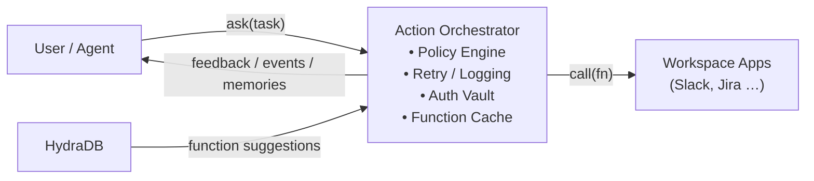
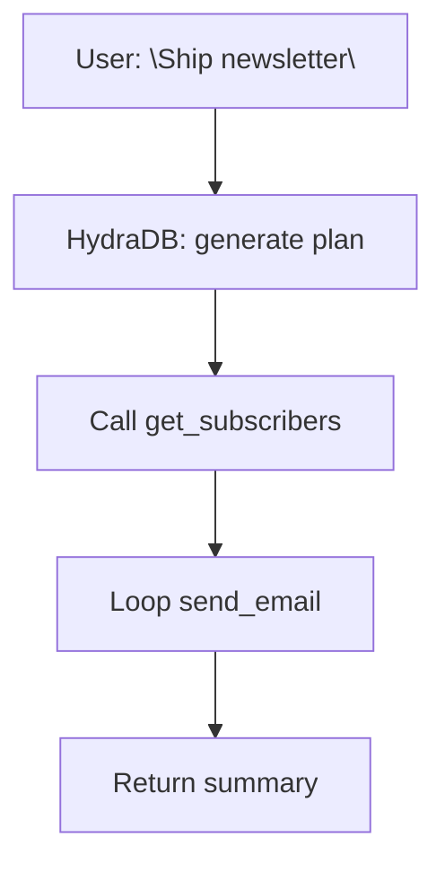

>This page covers the core concepts and TypeScript patterns in 20 minutes. For the full production implementation - Python SDK, multi-step planning, policy engine, approval workflows, observability, and benchmarks - see the [complete AI Chief of Staff cookbook](/cookbooks/hydradb-cookbook-06).

This guide walks you through the key building blocks of an **AI Chief of Staff** - an _AI version of n8n_ - powered by HydraDB. Instead of only _answering_ questions, this assistant can **_take actions_** across every app in your workspace by selecting and executing the correct function at the right time.

> **Note**: All code in this guide uses the official HydraDB TypeScript SDK (`@hydradb/sdk`). Base URL: `https://api.hydradb.com`. Get your API key at [app.hydradb.com](https://app.hydradb.com).

> **Goal**: Let any agent ask HydraDB _”What should I do next?”_ and receive a structured function call (plus parameters) that your execution layer can run.

## Prerequisites

**Required knowledge**: TypeScript/JavaScript basics, REST APIs, environment variables  
**Required tools**:
- HydraDB API key
- Node.js 18+ (`node --version`)
- `npm install @hydradb/sdk`

## What You'll Build

By the end of this quick start, you'll be able to:
- Register workspace functions (Slack, Calendar, Jira) as HydraDB knowledge objects
- Ask HydraDB “What should I do for this task?” and receive the right function and parameters
- Feed execution results back as memory so HydraDB improves suggestions over time

## The “Second Brain” Concept

Think of HydraDB as your AI agent's **second brain** - a reasoning layer that transforms natural language requests into precise function calls. Your primary AI agent handles conversation and context, while HydraDB becomes the **function selection oracle** that knows:

- **Which** function to call for any given task
- **When** multiple functions need to be chained together
- **How** to adapt based on user preferences and historical patterns
- **Why** certain approaches work better for specific users or scenarios

This separation of concerns means your AI agent doesn't need to maintain complex decision trees or hardcoded workflows. Instead, it can focus on understanding user intent while delegating the “how to execute” decisions to HydraDB's reasoning engine.

### The Power of Intelligent Function Routing

Unlike traditional automation platforms where you build rigid if-then workflows, HydraDB enables **dynamic function routing**. Your AI agent can say:

> _“The user wants to 'prepare for tomorrow's client meeting' - what should I do?”_

HydraDB responds with context-aware suggestions:

- Check calendar for meeting details
- Pull recent communication threads with that client
- Generate briefing notes from CRM data
- Set up the meeting room technology
- Send agenda reminders to participants

The same request from different users might yield different function sequences based on their roles, preferences, and historical patterns - all automatically determined by HydraDB's reasoning layer.

## Why an AI Chief of Staff?

1. **Unified Automation**: Replace brittle manual workflows with a single reasoning layer.
2. **Context-Aware**: Decisions include user preferences, company policies, and real-time data.
3. **Incremental Roll-Out**: Start with read-only automations, graduate to high-impact write actions.
4. **Agent Enhancement**: Transform any AI agent into an action-capable assistant without rebuilding core logic.

---

## Architecture Overview




- **Action Orchestrator**: Your runtime that receives function suggestions from HydraDB and executes them.
- **HydraDB**: Stores **function definitions** & performs reasoning to decide _which_ function (if any) solves the task.
- **Workspace Apps**: Anything with an API - CRM, calendar, ticketing, HRIS.

---

## How HydraDB Essential Features Enable This

### AI Memories for Function Learning

HydraDB's **AI Memories** don't just remember user preferences - they learn **function effectiveness patterns**. When a user frequently chooses certain functions for specific types of tasks, HydraDB builds a personalized “function preference profile.” This means your AI agent gets smarter suggestions over time without any manual training.

**Example**: If Sarah always prefers Slack notifications over email for urgent updates, HydraDB learns this pattern and automatically suggests `send_slack_message` instead of `send_email` for her urgent notifications.

### Multi-Step Reasoning for Complex Workflows

Simple tasks require one function call. Complex business processes require **orchestrated sequences**. HydraDB's multi-step reasoning automatically decomposes requests like _“Onboard the new hire”_ into:

1. Create accounts across systems
2. Send welcome materials
3. Schedule orientation meetings
4. Assign equipment requests
5. Notify team members

Your AI agent makes one request to HydraDB and receives a complete execution plan with dependency management built-in.

### Self-Improving Function Selection

As your function library grows and usage patterns emerge, HydraDB's **self-improving** capabilities automatically optimize function selection. It learns which functions tend to succeed together, which ones cause errors in certain contexts, and how to adapt suggestions based on real-world outcomes.

This means your AI Chief of Staff becomes more reliable over time without manual tuning - it develops institutional knowledge about what works in your specific environment.

### Multi-Tenant Function Isolation

Different teams, departments, or customers need access to different function sets. HydraDB's **multi-tenant** architecture ensures that your sales team's AI agent only sees sales-related functions, while the engineering team's agent has access to deployment and monitoring functions.

This isn't just about security - it's about **cognitive focus**. By limiting function scope per context, HydraDB can make more precise recommendations without being overwhelmed by irrelevant options.

---

## Step 1 - Define & Register Functions

### 1.1 Function Schema

HydraDB treats each callable as a **knowledge object**. The minimal schema:


```jsonc
{
  "id": "send_slack_message",
  "name": "Send a Slack message",
  "description": "Posts a message to a Slack channel on behalf of the user.",
  "parameters": {
    "type": "object",
    "properties": {
      "channel": {"type": "string", "description": "#channel or userId"},
      "text":    {"type": "string", "description": "Message body"},
      "thread_ts": {"type": "string", "description": "Optional thread"}
    },
    "required": ["channel", "text"]
  },
  "auth": {
    "oauth_provider": "slack",
    "scopes": ["chat:write"]
  }
}
```


### 1.2 Upload to HydraDB

Use the `/context/ingest` endpoint with `app_knowledge` to register each function as a knowledge object.


```ts
import { HydraDBClient } from "@hydradb/sdk";

const client = new HydraDBClient({ token: process.env.HYDRA_DB_API_KEY });

await client.context.ingest({
  tenantId: "your_tenant_id",
  subTenantId: "your_sub_tenant_id",
  appKnowledge: JSON.stringify([
    {
      id: "send_slack_message",
      title: "Send a Slack message",
      type: "slack",
      timestamp: new Date().toISOString(),
      content: { text: JSON.stringify(schema) },
      additional_metadata: { permissions: ["workspace_admins"], tags: ["automation", "slack"] }
    }
  ])
});
```


> **Tip**: Keep function **descriptions** natural-language and goal-oriented - HydraDB uses them during reasoning.

### 1.3 Versioning & Deprecation

Store new versions with `id: functionName_v2`. Mark old versions' `hydradb_metadata.deprecated = true` so HydraDB avoids suggesting them.

---

## Step 2 - Build the Action Orchestrator

The orchestrator bridges HydraDB ↔ real APIs.


```ts
import { HydraDBClient } from "@hydradb/sdk";

class Orchestrator {
  private client: HydraDBClient;
  private registry: Map<string, Function>;

  constructor(client: HydraDBClient, registry: Map<string, Function>) {
    this.client = client;
    this.registry = registry;
  }

  async handleTask(task: string, userContext: { tenantId: string; subTenantId: string }) {
    // 1️⃣ Ask HydraDB which function best matches the task
    const result = await this.client.query({
      tenantId: userContext.tenantId,
      subTenantId: userContext.subTenantId,
      query: task,
      mode: "thinking",
      maxResults: 5
    });

    if (!result.data?.chunks || result.data.chunks.length === 0) return { status: "noop" };

    // 2️⃣ Use the top-ranked chunk to identify and execute the function
    const topChunk = result.data.chunks[0];
    const functionId = topChunk.id;
    const exec = this.registry.get(functionId);
    if (!exec) return { status: "noop" };
    const execResult = await exec(topChunk);

    // 3️⃣ Optional: feed result back to HydraDB as a user memory
    await this.client.context.ingest({
      type: 'memory',
      tenantId: userContext.tenantId,
      subTenantId: userContext.subTenantId,
      upsert: true,
      memories: [
        {
          id: `exec_${functionId}_${Date.now()}`,
          text: `Executed function "${functionId}" for task: "${task}". Result: ${summarize(execResult)}`,
          infer: true
        }
      ]
    });

    return { status: "done", result: execResult };
  }
}
```


> **Notable Flags**
>
> - `auto_agent_routing`: Lets HydraDB choose between _answering_ vs _acting_.
> - `multi_step_reasoning`: Enables plans like _“create Zoom, then email invite”_.

---

## Real-World Applications

### Customer Success Automation

**Scenario**: A customer submits a support ticket asking for a feature demo.

**Traditional Approach**: Support agent manually coordinates with sales, schedules demo, updates CRM, sends confirmations.

**AI Chief of Staff Approach**: Your AI agent tells HydraDB _“Customer Jane from Acme Corp wants a demo of our new reporting feature.”_

HydraDB suggests:

1. `check_customer_tier` → Determines appropriate demo level
2. `find_available_demo_slots` → Checks AE calendar availability
3. `create_demo_meeting` → Books calendar event with zoom link
4. `update_crm_opportunity` → Logs demo request and scheduled date
5. `send_confirmation_email` → Notifies customer with details

All triggered by one natural language request, all personalized to Jane's account context.

### Executive Assistant Workflows

**Scenario**: CEO says _“Prepare for board meeting next Tuesday”_

Without hardcoding what “prepare” means, HydraDB can suggest:

- `compile_kpi_dashboard` → Gather latest metrics
- `review_action_items` → Check previous meeting follow-ups
- `book_catering` → Arrange refreshments based on attendee count
- `send_agenda_reminder` → Notify board members 24 hours prior
- `prepare_presentation_materials` → Compile slide deck from templates

The beauty is that **each executive's “preparation” style is different** - HydraDB learns these patterns through AI Memories and adapts accordingly.

### DevOps Incident Response

**Scenario**: Monitoring alert triggers: _“Database response time degraded”_

Your AI agent asks HydraDB for the appropriate response. Based on severity, time of day, and historical patterns, HydraDB might suggest:

**During business hours**:

1. `create_incident_ticket` → Log in tracking system
2. `notify_oncall_engineer` → Alert via PagerDuty
3. `scale_database_resources` → Auto-remediation attempt
4. `post_status_update` → Inform stakeholders

**During off-hours for minor issues**:

1. `log_incident_details` → Document for morning review
2. `monitor_for_escalation` → Set up enhanced alerting
3. `schedule_followup_review` → Add to next team standup

Same trigger, different responses based on learned patterns and context.

---

## Step 3 - Event & Trigger Model

Your Chief of Staff should react to:

1. **Direct Commands** - “Book me a 30-min call with Alice next week.”
2. **Scheduled Jobs** - Daily stand-up summary at 9 AM.
3. **System Events** - New ticket in Jira → triage.

Create a thin wrapper per event source that forwards the _natural-language_ description to the orchestrator.


```bash
# Slack slash-command → cloud-function
/ai book meeting with @alice next tuesday
```


---

## Step 4 - Planning & Multi-Step Execution

Sometimes the task requires **multiple** calls.





1. **Plan Generation**: Ask HydraDB “return a JSON array of functions to execute sequentially.”
2. **Dependency Resolution**: Inject outputs of earlier steps into later ones.
3. **Rollback / Compensation**: If step n fails, undo steps ≤ n-1.

---

## Leveraging HydraDB's Retrieval Capabilities

Your function library becomes part of HydraDB's **knowledge base**. This means function selection isn't just based on keywords - it's **semantic understanding**.

When a user says _“I need to tell the team about the delay,”_ HydraDB understands this could map to:

- `send_slack_announcement` for immediate updates
- `update_project_timeline` for formal documentation
- `schedule_team_meeting` for complex discussions
- `send_client_notification` if external communication is needed

The **retrieval engine** finds semantically similar past requests and suggests functions that worked well in those contexts, even if the exact wording was different.

### Context-Aware Function Metadata

Use HydraDB's **metadata filtering** to make function suggestions context-aware:


```jsonc
{
  "id": "approve_expense",
  "meta": {
    "department": "finance",
    "permission_level": "manager",
    "cost_threshold": 1000,
    "business_hours_only": true
  }
}
```


When a finance manager requests expense approval during business hours, HydraDB automatically considers these constraints in its function selection logic.

---

## Step 5 - Security, Auth & Governance

- **OAuth Vault**: Store per-user tokens; Orchestrator injects correct token at runtime.
- **Policy Engine**: Prevent _“delete all records”_ unless requester ∈ `admins`.
- **Approval Workflow**: For risky actions, route through Slack message “Approve / Reject”.
- **Audit Log**: Persist `task → function → result` for compliance.

---

## Step 6 - Observability & Self-Improvement

| Metric                     | Why it matters                        |
| -------------------------- | ------------------------------------- |
| Suggested → Executed ratio | High ratio = HydraDB understands tasks |
| Average time-to-completion | Spot slow external APIs               |
| Rollback frequency         | Detect unstable functions             |

Auto-tune by feeding metrics back to HydraDB's memory:


```ts
await client.context.ingest({
  type: 'memory',
  tenantId: "your_tenant_id",
  subTenantId: "your_sub_tenant_id",
  upsert: true,
  memories: [
    {
      id: "metrics_calendar_event",
      text: 'Function "create_calendar_event" had slow_response signal with p95 of 2500ms.',
      infer: true
    }
  ]
});
```


---

## The Compound Effect of AI Memories \+ Function Selection

As your AI Chief of Staff runs more tasks, something powerful happens: **HydraDB builds institutional knowledge** about how work gets done in your organization.

It learns that:

- Marketing requests usually need design review before execution
- Engineering deployments require specific approval chains
- Customer success follows different escalation paths per account tier
- Executive requests often have implicit urgency requirements

This knowledge gets encoded in AI Memories and influences future function suggestions. Your AI agent becomes not just capable of executing tasks, but **wise about how to execute them well** in your specific context.

### Function Composition Patterns

Over time, HydraDB identifies **function composition patterns** - sequences of functions that frequently work well together. These emerge organically from usage data rather than manual programming:

- `gather_data` → `generate_report` → `schedule_review_meeting`
- `detect_anomaly` → `investigate_root_cause` → `implement_fix` → `verify_resolution`
- `receive_lead` → `qualify_prospect` → `assign_sales_rep` → `schedule_discovery_call`

Your AI agent can reference these learned patterns when planning complex workflows, making it more effective at orchestrating sophisticated business processes.

---

## Best Practices Checklist

- Write **precise descriptions**; mention side-effects.
- Group functions into **collections** (`billing`, `hr`, `sales`).
- Start **read-only** (analytics) before enabling write.
- Use **idempotent** APIs or implement retries with back-off.
- Maintain **simulated staging** workspace for testing.
- Leverage **AI Memories** to personalize function selection over time.
- Use **multi-step reasoning** for complex business processes.
- Implement **metadata filtering** for context-aware suggestions.
- Feed execution results back to HydraDB for **self-improvement**.

---

## Next Steps

1. Pick one app (e.g., Slack) and register 3–5 high-value actions.
2. Build a CLI wrapper around the orchestrator for local experiments.
3. Roll out to a friendly internal team, gather feedback, iterate.

Your AI Chief of Staff will evolve organically - each new function expands its capabilities, and HydraDB's reasoning ensures the _right action_ is chosen at the _right moment_. The result is an AI agent that doesn't just follow scripts, but **thinks intelligently** about how to help users accomplish their goals.
