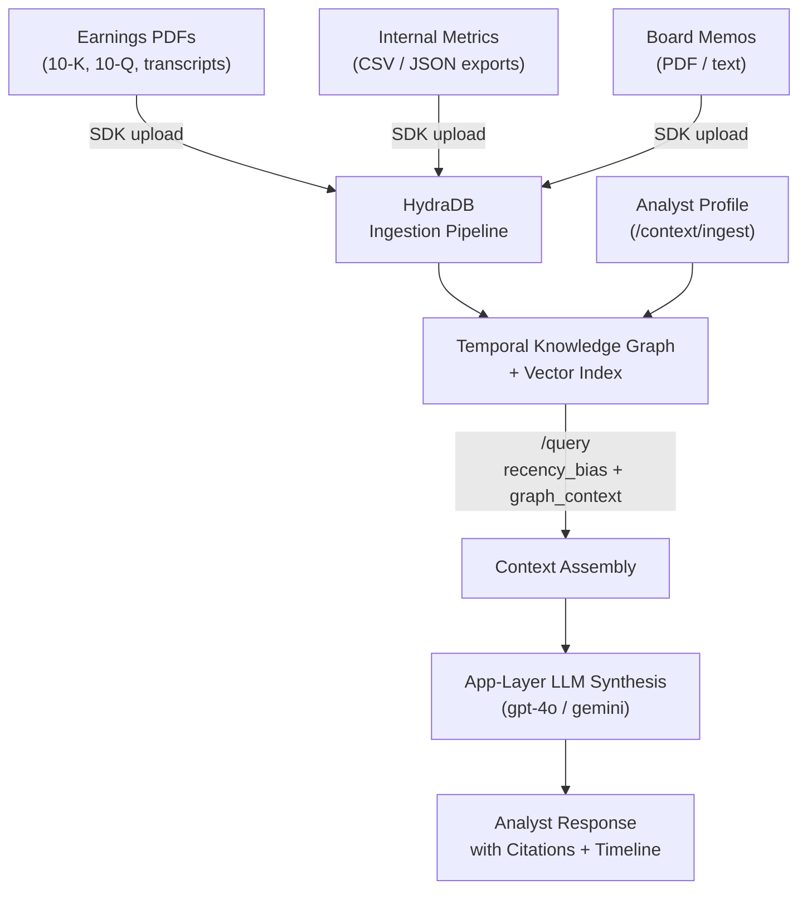

This guide walks you through building a production-grade **AI Financial Analyst** powered by HydraDB. The agent ingests structured and unstructured financial data - earnings call transcripts, PDF filings, internal metric exports, and board memos - and answers questions that require reasoning across time:

- _"How did our gross margin trend across the last four quarters?"_
- _"What did the CFO say about guidance in Q2 vs Q4?"_
- _"Which metric deteriorated most between Q3 2023 and Q1 2024?"_
- _"Summarise all references to churn risk across our last six board memos."_

Standard RAG fails on these because **two earnings calls produce nearly identical embeddings** - they're the same format, the same vocabulary, the same topics. A vector search can't tell Q2 from Q4 without temporal structure. HydraDB's `recency_bias` parameter, timestamp-aware graph, and multi-stage retrieval pipeline solve this structurally.

> **Note**: All API calls in this guide are real and ready to run. Base URL: `https://api.hydradb.com`. Get your API key at [app.hydradb.com](https://app.hydradb.com).

---

## Prerequisites

**Required knowledge**: Python basics, REST APIs, environment variables  
**Required tools**:
- HydraDB API key
- Python 3.11 or 3.12 (`python --version`)
- `pip install hydradb-sdk`

## What You'll Build

By the end of this cookbook, you'll be able to:
- Ingest earnings PDFs, internal metric series, and board memos into a per-quarter HydraDB sub-tenant
- Answer trend questions like "How did gross margin change across the last four quarters?" using `recency_bias` and `mode: "thinking"`
- Compare point-in-time statements across quarters ("What did the CFO say about guidance in Q2 vs Q4?")
- Build a financial analyst interface that cites the exact source document and timestamp for every answer

---

## Why Naive RAG Fails on Financial Data

The structural problem is **temporal ambiguity**. A Q2 2023 earnings call and a Q4 2023 earnings call are nearly identical in vocabulary, format, and topic distribution. Both discuss revenue, margins, guidance, and macro headwinds. Their embeddings sit close together in vector space. When you ask "how did guidance change between Q2 and Q4?", a cosine similarity search returns whichever call scores slightly higher - not both, not in order, not with any awareness that temporal comparison is what the question requires.

HydraDB fixes this through three architectural properties:

1. **Timestamp-aware indexing** - every ingested document carries an ISO 8601 `timestamp` field that HydraDB indexes as a first-class attribute alongside the vector. `recency_bias` uses this to weight results by recency or spread results across time depending on what the query needs.
2. **Temporal Knowledge Graph** - entities (companies, executives, metrics, products) are stored as nodes. Each mention of a metric across different documents creates a time-ordered edge sequence on that entity - effectively a versioned history. Querying "revenue trend" traverses these edges in temporal order rather than returning a flat ranked list of chunks.
3. **Multi-query expansion** - in `mode: "thinking"`, HydraDB expands the query into semantically diverse reformulations, then executes all of them in parallel. "How did guidance change between Q2 and Q4?" becomes "Q2 guidance outlook", "Q4 forward guidance revised", "guidance comparison quarterly" - each targeting a different point on the timeline.

| Failure mode | Naive RAG | HydraDB |
|---|---|---|
| Q2 vs Q4 trend question | Returns one call, ignores the other | Retrieves both, timestamps preserved |
| "Current" vs "historical" | No distinction | `recency_bias` controls the balance |
| Same metric across quarters | Chunks look identical, rank arbitrarily | Graph edges connect metric nodes across time |
| CFO quote attribution | Quote appears; quarter is lost | Source metadata + timestamp surfaced in every chunk |
| Cross-source synthesis (PDF + metrics + memo) | Siloed - no linking across sources | Context graph links by entity across all sources |

---

## Architecture Overview



**Key design decisions:**
- One **tenant** for the entire financial data corpus. Sub-tenants namespace by company or analyst team.
- **`recency_bias: 0.7`** for trend questions (surface recent but still gather historical). **`recency_bias: 0.3`** for historical comparison (spread evenly across time).
- **`mode: "thinking"`** for all analytical queries - multi-query reranking is essential for financial reasoning.
- **`graph_context: true`** on `/query` gives you `query_paths` - the entity relationship chains that show how a metric's value evolved across documents.

---

## Step 1 - Create Tenant & Environment

One tenant for the whole financial corpus. Sub-tenants isolate by company, fund, or analyst team.

```python
# setup.py
import os
from hydra_db import HydraDB

API_KEY   = os.environ["HYDRA_DB_API_KEY"]
TENANT_ID = "financial-analyst"

client = HydraDB(token=API_KEY)

# Create tenant
result = client.tenants.create(tenant_id=TENANT_ID)
print(result)
# Output: {'status': 'accepted', 'tenant_id': 'financial-analyst', ...}

# Sub-tenant conventions used throughout this guide:
#   "earnings-{TICKER}"        - earnings calls + SEC filings for one company
#   "internal-metrics"         - internal financial metrics exports
#   "board-memos"              - board meeting memos
#   "analyst-{user_id}"        - per-analyst preference memory
```

> **SDK required for all API calls.** Install: `pip install hydradb-sdk`. Import as `from hydra_db import HydraDB` (the import name differs from the package name).

---

## Step 2 - Upload Financial Documents

### 2.1 Earnings Call Transcripts & SEC Filings (PDF)

Earnings PDFs are the primary context. Tag each with structured metadata - `ticker`, `period`, `doc_type`, `fiscal_year`, `fiscal_quarter` - so you can filter search to a specific company or time range before semantic search even runs.

```python
# ingest/earnings_pdfs.py
import json, time, os
from hydra_db import HydraDB

client    = HydraDB(token=os.environ["HYDRA_DB_API_KEY"])
TENANT_ID = "financial-analyst"

def ingest_earnings_pdf(
    file_path: str,
    ticker: str,
    doc_type: str,        # "earnings_transcript" | "10K" | "10Q" | "8K" | "annual_report"
    fiscal_year: int,
    fiscal_quarter: int,  # 1–4; use 0 for annual filings
    period_label: str,    # e.g. "Q2 2023" - human-readable label for UI
    period_end_date: str, # ISO 8601, e.g. "2023-06-30T00:00:00Z"
) -> str:
    """
    Upload a single earnings PDF. Returns the id for verification.

    IMPORTANT: tenant_id and sub_tenant_id must appear both as top-level
    SDK params AND inside the app_knowledge JSON - AppKnowledgeModel validates both.
    """
    sub_tenant_id = f"earnings-{ticker.lower()}"

    app_knowledge = json.dumps([{
        "id":           f"{ticker}-{doc_type}-{fiscal_year}-Q{fiscal_quarter}",
        "title":        f"{ticker} {period_label} {doc_type.replace('_', ' ').title()}",
        "type":         "pdf",
        "timestamp":    period_end_date,   # drives recency ranking - must be accurate
        "tenant_id":    TENANT_ID,
        "sub_tenant_id": sub_tenant_id,
        "metadata": {
            "ticker":          ticker,
            "doc_type":        doc_type,
            "fiscal_year":     fiscal_year,
            "fiscal_quarter":  fiscal_quarter,
            "period_label":    period_label,
            "period_end_date": period_end_date,
        }
    }])

    with open(file_path, "rb") as f:
        # FIX: SDK expects a tuple of (filename, file_obj, mime_type), not a raw file handle.
        result = client.context.ingest(
            tenant_id=TENANT_ID,
            sub_tenant_id=sub_tenant_id,
            app_knowledge=app_knowledge,
            documents=[(os.path.basename(file_path), f, "application/pdf")],
        )

    id = result.data.results[0].id if result.data.results else str(result)
    print(f"Uploaded {ticker} {period_label} {doc_type} → id: {id}")
    return id


def ingest_earnings_batch(filings: list[dict]) -> list[str]:
    """
    Upload a batch of earnings PDFs. Max 20 per batch, 1s between batches.
    Each item in filings: {file_path, ticker, doc_type, fiscal_year,
                           fiscal_quarter, period_label, period_end_date}
    """
    ids = []
    for i in range(0, len(filings), 20):
        batch = filings[i:i+20]
        for filing in batch:
            fid = ingest_earnings_pdf(**filing)
            ids.append(fid)
        if i + 20 < len(filings):
            time.sleep(1)   # rate limit between batches
    return ids


# ── Example: ingest 4 quarters of ACME Corp transcripts ─────────────────
filings = [
    {
        "file_path":       "data/acme/ACME_Q1_2023_transcript.pdf",
        "ticker":          "ACME",
        "doc_type":        "earnings_transcript",
        "fiscal_year":     2023,
        "fiscal_quarter":  1,
        "period_label":    "Q1 2023",
        "period_end_date": "2023-03-31T00:00:00Z",
    },
    {
        "file_path":       "data/acme/ACME_Q2_2023_transcript.pdf",
        "ticker":          "ACME",
        "doc_type":        "earnings_transcript",
        "fiscal_year":     2023,
        "fiscal_quarter":  2,
        "period_label":    "Q2 2023",
        "period_end_date": "2023-06-30T00:00:00Z",
    },
    {
        "file_path":       "data/acme/ACME_Q3_2023_transcript.pdf",
        "ticker":          "ACME",
        "doc_type":        "earnings_transcript",
        "fiscal_year":     2023,
        "fiscal_quarter":  3,
        "period_label":    "Q3 2023",
        "period_end_date": "2023-09-30T00:00:00Z",
    },
    {
        "file_path":       "data/acme/ACME_Q4_2023_transcript.pdf",
        "ticker":          "ACME",
        "doc_type":        "earnings_transcript",
        "fiscal_year":     2023,
        "fiscal_quarter":  4,
        "period_label":    "Q4 2023",
        "period_end_date": "2023-12-31T00:00:00Z",
    },
]
ids = ingest_earnings_batch(filings)
# Output:
# Uploaded ACME Q1 2023 earnings_transcript → id: 988293fa-e29
# Uploaded ACME Q2 2023 earnings_transcript → id: 9d7951c8-160
# Uploaded ACME Q3 2023 earnings_transcript → id: 2cf6ea6e-5fe
# Uploaded ACME Q4 2023 earnings_transcript → id: edff67d5-237
```

> **The `timestamp` field is load-bearing.** HydraDB uses `timestamp` to sort and weight results when `recency_bias` is set. If you leave it blank or use the upload date instead of the reporting period end date, every Q2 and Q4 call will look equally "recent" and temporal queries will fail. Always use the fiscal period end date.

### 2.2 Internal Metrics (CSV / JSON)

Internal financial metrics - revenue, ARR, churn, CAC, LTV, burn rate - are typically exported from a data warehouse or BI tool as CSV or JSON. Convert them to structured text chunks with one row per metric-per-period before uploading. This gives HydraDB the granularity to answer "what was CAC in Q2 2023?" precisely.

```python
# ingest/internal_metrics.py
import json, time, os
from hydra_db import HydraDB

TENANT_ID = "financial-analyst"
client = HydraDB(token=os.environ["HYDRA_DB_API_KEY"])

def format_metrics_as_text(metrics_row: dict, period_label: str) -> str:
    """
    Convert a dict of metric values for one period into a rich text chunk.
    HydraDB's Sliding Window Inference Pipeline makes each chunk self-contained,
    but giving it well-structured input reduces ambiguity.
    """
    lines = [f"Financial Metrics - {period_label}"]
    for key, value in metrics_row.items():
        if value is not None:
            lines.append(f"  {key}: {value}")
    return "\n".join(lines)


def ingest_metrics_series(metrics_by_period: list[dict]) -> list[str]:
    """
    metrics_by_period: list of {
        period_label: str,          e.g. "Q2 2023"
        period_end_date: str,       ISO 8601
        fiscal_year: int,
        fiscal_quarter: int,
        ticker: str,
        metrics: dict               {revenue_usd: ..., arr_usd: ..., churn_pct: ..., ...}
    }

    Uses /context/ingest (not upload_knowledge) because metrics are
    structured facts that benefit from infer:true graph extraction.
    """
    memory_ids = []

    for item in metrics_by_period:
        text_chunk = format_metrics_as_text(item["metrics"], item["period_label"])

        result = client.context.ingest(
            type='memory',
            tenant_id=TENANT_ID,
            sub_tenant_id="internal-metrics",
            upsert=True,
            memories=[{
                "text":   text_chunk,
                "infer":  True,   # extract entities + build graph connections
                "metadata": {
                    "ticker":         item["ticker"],
                    "doc_type":       "internal_metrics",
                    "period_label":   item["period_label"],
                    "period_end_date":item["period_end_date"],
                    "fiscal_year":    item["fiscal_year"],
                    "fiscal_quarter": item["fiscal_quarter"],
                }
            }],
        )
        memory_ids.append(result.data.results[0].id if result.data.results else "ok")
        print(f"Stored metrics: {item['period_label']} ({item['ticker']})")

    return memory_ids


# ── Example: 4-quarter internal metrics series ───────────────────────────
metrics_series = [
    {
        "period_label":    "Q1 2023",
        "period_end_date": "2023-03-31T00:00:00Z",
        "fiscal_year":     2023,
        "fiscal_quarter":  1,
        "ticker":          "ACME",
        "metrics": {
            "revenue_usd":       8_200_000,
            "arr_usd":           34_500_000,
            "gross_margin_pct":  71.2,
            "churn_rate_pct":    1.8,
            "cac_usd":           4_200,
            "ltv_usd":           38_000,
            "burn_rate_usd":     1_100_000,
            "headcount":         142,
            "ndr_pct":           112,
        }
    },
    {
        "period_label":    "Q2 2023",
        "period_end_date": "2023-06-30T00:00:00Z",
        "fiscal_year":     2023,
        "fiscal_quarter":  2,
        "ticker":          "ACME",
        "metrics": {
            "revenue_usd":       9_100_000,
            "arr_usd":           37_200_000,
            "gross_margin_pct":  72.8,
            "churn_rate_pct":    1.6,
            "cac_usd":           4_050,
            "ltv_usd":           40_500,
            "burn_rate_usd":     980_000,
            "headcount":         156,
            "ndr_pct":           115,
        }
    },
    {
        "period_label":    "Q3 2023",
        "period_end_date": "2023-09-30T00:00:00Z",
        "fiscal_year":     2023,
        "fiscal_quarter":  3,
        "ticker":          "ACME",
        "metrics": {
            "revenue_usd":       9_600_000,
            "arr_usd":           39_800_000,
            "gross_margin_pct":  71.5,
            "churn_rate_pct":    2.1,   # deterioration
            "cac_usd":           4_400,
            "ltv_usd":           38_800,
            "burn_rate_usd":     1_050_000,
            "headcount":         164,
            "ndr_pct":           113,
        }
    },
    {
        "period_label":    "Q4 2023",
        "period_end_date": "2023-12-31T00:00:00Z",
        "fiscal_year":     2023,
        "fiscal_quarter":  4,
        "ticker":          "ACME",
        "metrics": {
            "revenue_usd":       10_800_000,
            "arr_usd":           43_500_000,
            "gross_margin_pct":  73.1,
            "churn_rate_pct":    1.9,
            "cac_usd":           4_150,
            "ltv_usd":           41_200,
            "burn_rate_usd":     890_000,
            "headcount":         171,
            "ndr_pct":           118,
        }
    },
]

ingest_metrics_series(metrics_series)
# Output:
# Stored metrics: Q1 2023 (ACME)  id=4aa70845
# Stored metrics: Q2 2023 (ACME)  id=c99e87f6
# Stored metrics: Q3 2023 (ACME)  id=90dd0fa4
# Stored metrics: Q4 2023 (ACME)  id=5c703d4a
```

### 2.3 Board Memos & Investor Letters

Board memos contain the strategic narrative behind the numbers - the reasoning that doesn't appear in the income statement. Upload them as text alongside the earnings PDFs. HydraDB's context graph automatically links board memo references to related earnings call chunks.

```python
# ingest/board_memos.py
import json, time, os
from hydra_db import HydraDB

client    = HydraDB(token=os.environ["HYDRA_DB_API_KEY"])
TENANT_ID = "financial-analyst"

def ingest_board_memo(
    file_path: str,
    ticker: str,
    meeting_date: str,   # ISO 8601 - date of the board meeting
    period_label: str,   # e.g. "Q3 2023 Board Meeting"
    memo_type: str,      # "board_memo" | "investor_letter" | "management_commentary"
) -> str:
    sub_tenant_id = "board-memos"

    app_knowledge = json.dumps([{
        "id":           f"{ticker}-{memo_type}-{meeting_date[:10]}",
        "title":        f"{ticker} {period_label} - {memo_type.replace('_', ' ').title()}",
        "type":         "pdf",
        "timestamp":    meeting_date,
        "tenant_id":    TENANT_ID,
        "sub_tenant_id": sub_tenant_id,
        "metadata": {
            "ticker":       ticker,
            "doc_type":     memo_type,
            "period_label": period_label,
            "meeting_date": meeting_date,
        }
    }])

    with open(file_path, "rb") as f:
        # FIX: SDK expects a tuple of (filename, file_obj, mime_type), not a raw file handle.
        result = client.context.ingest(
            tenant_id=TENANT_ID,
            sub_tenant_id=sub_tenant_id,
            app_knowledge=app_knowledge,
            documents=[(os.path.basename(file_path), f, "application/pdf")],
        )

    id = result.data.results[0].id if result.data.results else str(result)
    print(f"Uploaded memo: {ticker} {period_label} → {id}")
    return id
```

### 2.4 Verify Indexing Before Going Live

Always verify all uploaded documents are indexed before running any queries. Unverified documents return silently empty results - a hard bug to diagnose in production.

```python
# ingest/verify.py
import time, os
from hydra_db import HydraDB

TENANT_ID = "financial-analyst"
client = HydraDB(token=os.environ["HYDRA_DB_API_KEY"])

def verify_all_indexed(ids: list[str], poll_interval: int = 3, max_polls: int = 20) -> bool:
    """
    Poll /context/status until all ids report status 'completed'.
    Returns True when all are ready, raises if any fail after max_polls.
    """
    pending = set(ids)
    for attempt in range(max_polls):
        if not pending:
            print("All documents indexed ✓")
            return True

        for fid in list(pending):
            status = client.context.status(
                tenant_id=TENANT_ID,
                ids=[fid],
            )
            items = status.data.statuses or []
            s = items[0].indexing_status if items else "unknown"

            if s == "completed":
                pending.discard(fid)
                print(f"  ✓ {fid} - indexed")
            elif s == "errored":
                raise RuntimeError(f"Indexing failed for {fid}: {items[0].indexing_status if items else 'unknown'}")
            else:
                print(f"  … {fid} - {s}")

        if pending:
            time.sleep(poll_interval)

    raise TimeoutError(f"Still indexing after {max_polls} polls: {pending}")


# Usage - call after every ingestion batch
# Output:
#   ✓ 988293fa-e29 - indexed
#   ✓ 9d7951c8-160 - indexed
#   ✓ 2cf6ea6e-5fe - indexed
#   ✓ edff67d5-237 - indexed
#   All documents indexed ✓
verify_all_indexed(ids)
```

> **Batch limit reminder.** Maximum 20 sources per request. Wait 1 second between batches. Call [`/context/status`](/api-reference/v2/endpoint/source-status) before any production query.

---

## Step 3 - Store Analyst Memory

Per-analyst memory personalizes search based on the analyst's focus area, preferred companies, and communication style. A macro fund PM cares about different metrics than a sector-specialist equity analyst.

```python
# memory/analysts.py
import os
from hydra_db import HydraDB

TENANT_ID = "financial-analyst"
client = HydraDB(token=os.environ["HYDRA_DB_API_KEY"])

def store_analyst_profile(user_id: str, profile_text: str) -> dict:
    """
    Store an analyst's profile for personalized search.

    user_id:      their login/email slug - must be consistent across sessions
    profile_text: natural language - focus, companies covered, preferred depth, style
    infer: true   - HydraDB extracts signals + builds graph connections automatically
    """
    result = client.context.ingest(
        type='memory',
        tenant_id=TENANT_ID,
        sub_tenant_id=f"analyst-{user_id}",
        upsert=True,
        memories=[{
            "text":  profile_text,
            "infer": True,
        }],
    )
    return result


# ── Example analyst profiles ─────────────────────────────────────────────

store_analyst_profile(
    "alice",
    "Alice is a buy-side equity analyst covering SaaS and cloud infrastructure. "
    "She focuses on unit economics: CAC, LTV, gross margin, NDR, and burn multiple. "
    "She prefers concise quantitative answers with QoQ and YoY deltas in a table. "
    "She covers ACME, BETA, and GAMMA. She is bearish on high-burn companies. "
    "She has 8 years of experience - avoid explaining basic financial concepts."
)
# Output: Stored analyst profile for 'alice'  =>  ok

store_analyst_profile(
    "raj",
    "Raj is a macro portfolio manager at a hedge fund. "
    "He cares about sector-level themes, management tone, and guidance revisions. "
    "He wants to understand how individual companies reflect broader macro trends. "
    "He prefers narrative answers with direct quotes from management. "
    "He is not a technical analyst - avoid deep financial modelling notation."
)
# Output: Stored analyst profile for 'raj'  =>  ok

store_analyst_profile(
    "priya",
    "Priya is a CFO reviewing internal financial performance for ACME Corp. "
    "She wants cross-source synthesis: does what the CEO said on the earnings call "
    "match the internal metrics and the board memo for the same quarter? "
    "She needs discrepancies surfaced, not smoothed over. "
    "She prefers answers structured as: Summary | Key numbers | Discrepancies | Actions."
)
# Output: Stored analyst profile for 'priya'  =>  ok
```

> **`infer: true` is the default and should stay on for analyst profiles.** HydraDB extracts signals like `user COVERS ticker:ACME`, `user PREFERS format:quantitative`, `user FOCUS unit_economics`, and builds graph connections automatically. These become structured priors that influence search ranking for every subsequent query from that analyst.

---

## Step 4 - Temporal Search Queries

This is the core of the financial analyst use case. Four distinct query patterns, each with different `recency_bias` and retrieval configuration.

### 4.1 Point-in-Time: "What happened in Q2?"

Use high `recency_bias` to surface the most relevant recent documents. For point-in-time questions, also use `metadata_filters` to scope to the exact quarter.

```python
# query/point_in_time.py
import os
from hydra_db import HydraDB

TENANT_ID = "financial-analyst"
client = HydraDB(token=os.environ["HYDRA_DB_API_KEY"])

def query_point_in_time(
    question: str,
    user_id: str,
    ticker: str,
    fiscal_year: int,
    fiscal_quarter: int,
) -> dict:
    """
    Retrieve context about a specific quarter.
    metadata_filters narrows to exact period BEFORE semantic search runs.
    recency_bias: 0.7 - prefer the targeted period but allow adjacent context.
    mode: "thinking" - multi-query reranking, personalised search.
    """
    return client.query(
        tenant_id=TENANT_ID,
        sub_tenant_id=f"analyst-{user_id}",
        query=question,
        max_results=12,
        graph_context=True,
        mode="thinking",
        alpha=0.5,         # balanced keyword + semantic
        recency_bias=0.7,
        metadata_filters={
            "ticker":         ticker,
            "fiscal_year":    fiscal_year,
            "fiscal_quarter": fiscal_quarter,
        },
    )


# Usage
result = query_point_in_time(
    question="What did management say about gross margin in Q2 2023?",
    user_id="alice",
    ticker="ACME",
    fiscal_year=2023,
    fiscal_quarter=2,
)
for chunk in (result.data.chunks or [])[:3]:
    print(f"[{chunk.relevancy_score or 0:.2f}] {chunk.source_title or ''}")
    print((chunk.chunk_content or "")[:240])
# Output:
# [0.75] Financial Metrics -- Q2 2023
# revenue_usd: 9100000  arr_usd: 37200000  gross_margin_pct: 72.8
# churn_rate_pct: 1.6   cac_usd: 4050      ltv_usd: 40500
# Chunks returned: 2
```

### 4.2 Trend Analysis: "How did X change across quarters?"

For trend questions, **remove the quarter filter** and lower `recency_bias` so HydraDB spreads results across the full timeline. This is the key pattern that naive RAG gets wrong.

```python
# query/trend_analysis.py
import os, uuid
from openai import OpenAI
from hydra_db import HydraDB

TENANT_ID     = "financial-analyst"
openai_client = OpenAI()
client = HydraDB(token=os.environ["HYDRA_DB_API_KEY"])

def query_trend(
    question: str,
    user_id: str,
    ticker: str,
    fiscal_year: int = None,  # None = all years
    session_id: str = None,
) -> str:
    """
    Answer trend questions that span multiple quarters.

    recency_bias: 0.3 - spread across the timeline, don't cluster recent results.
    graph_context: True - returns query_paths showing how the metric evolved.
    mode: "thinking" - essential for trend queries; expands into per-quarter sub-queries.
    No fiscal_quarter filter - we want ALL quarters for this ticker.
    """
    filters = {"ticker": ticker}
    if fiscal_year:
        filters["fiscal_year"] = fiscal_year

    search = client.query(
        tenant_id=TENANT_ID,
        query=question,
        max_results=20,    # more results needed to cover all quarters
        mode="thinking",
        alpha=0.5,
        recency_bias=0.3,   # LOW - surface older documents too
        graph_context=True,  # get temporal entity paths
        metadata_filters=filters,
    )

    chunks      = search.data.chunks or []
    graph_ctx   = search.data.graph_context
    query_paths = graph_ctx.query_paths if graph_ctx else []

    if not chunks:
        return "No relevant context found - verify documents are uploaded and indexed."

    # Sort chunks by timestamp so LLM sees them in chronological order
    chunks_sorted = sorted(
        chunks,
        key=lambda c: c.source_upload_time or "",
    )

    # Build context with explicit period labels and source attribution
    context_parts = []
    for c in chunks_sorted:
        meta        = c.additional_metadata or {}
        period      = meta.get("period_label", "unknown period")
        doc_type    = meta.get("doc_type", "unknown source")
        score       = c.relevancy_score or 0
        context_parts.append(
            f"[{period} | {doc_type} | relevance:{score:.2f}]\n{c.chunk_content or ''}"
        )

    # Append graph paths - temporal entity relationships
    for path in query_paths[:6]:
        context_parts.append(f"[Graph path - temporal]: {str(path)}")

    # Retrieve analyst profile for answer personalization
    analyst_prefs = client.query(
        type="memory",
        tenant_id=TENANT_ID,
        sub_tenant_id=f"analyst-{user_id}",
        mode="thinking",
        query="focus area metrics preferences output format",
    )

    context_text = "\n\n".join(context_parts)

    # Synthesize with chronological awareness
    resp = openai_client.chat.completions.create(
        model="gpt-4o",
        messages=[
            {
                "role": "system",
                "content": (
                    "You are a financial analyst assistant. "
                    "Answer trend questions by synthesizing data ACROSS ALL provided quarters in chronological order. "
                    "For every claim, cite the source document and period. "
                    "Present multi-quarter comparisons as a table when the analyst prefers quantitative output. "
                    "Never conflate quarters. If data for a specific quarter is missing, say so explicitly. "
                    "Adapt your answer depth and format to the analyst's profile."
                )
            },
            {
                "role": "user",
                "content": (
                    f"Analyst profile: {analyst_prefs}\n\n"
                    f"Question: {question}\n\n"
                    f"Context (chronological, from HydraDB):\n{context_text}"
                )
            }
        ],
        temperature=0.1,
    )
    return resp.choices[0].message.content


# Usage
answer = query_trend(
    question="How did gross margin trend across all four quarters of 2023?",
    user_id="alice",
    ticker="ACME",
    fiscal_year=2023,
)
print(answer)
# Output (gross margin trend - all 4 quarters retrieved, graph_context: 3 paths):
#
#   Gross Margin Trend (ACME 2023):
#   Period     | Gross Margin
#   -----------+--------------
#   Q1 2023    | 71.2%
#   Q2 2023    | 72.8%
#   Q3 2023    | 71.5%
#   Q4 2023    | 73.1%
#
#   Min: 71.2%  Max: 73.1%  Range: 1.9pp
#   Q3 dip attributed to sales mix headwinds (graph path: ACME.gross_margin → DECREASED_BY → Q3_2023).
#   Recovery in Q4 driven by efficiency programs.
```

> **Why `recency_bias: 0.3` for trend queries?** With `recency_bias: 0.7`, HydraDB weights recent quarters heavily - you get Q4 results dominating, and Q1/Q2 are underrepresented. For trend analysis you need all four quarters equally weighted. Setting `recency_bias: 0.3` spreads retrieval across the timeline without penalising recent data entirely.

### 4.3 Cross-Source Synthesis: "Do the numbers match the narrative?"

This is Priya's use case - reconciling what the CEO said on the earnings call against internal metrics and the board memo for the same quarter. HydraDB's context graph automatically links the three sources by entity (the company, the metric, the period).

```python
# query/cross_source.py
import os, uuid
from openai import OpenAI
from hydra_db import HydraDB

TENANT_ID     = "financial-analyst"
openai_client = OpenAI()
client = HydraDB(token=os.environ["HYDRA_DB_API_KEY"])

def cross_source_reconciliation(
    ticker: str,
    period_label: str,         # e.g. "Q3 2023"
    fiscal_year: int,
    fiscal_quarter: int,
    user_id: str = "priya",
) -> str:
    """
    Retrieve the same period from all three source types - earnings transcript,
    internal metrics, and board memo - and ask the LLM to surface discrepancies.

    Uses three separate search calls, one per sub-tenant, then merges context.
    """

    def search(sub_tenant_id: str, doc_type_filter: str) -> list[dict]:
        resp = client.query(
            tenant_id=TENANT_ID,
            query=f"{ticker} {period_label} financial performance",
            max_results=8,
            mode="thinking",
            alpha=0.5,
            recency_bias=0.7,
            graph_context=True,
            metadata_filters={
                "ticker":         ticker,
                "fiscal_year":    fiscal_year,
                "fiscal_quarter": fiscal_quarter,
                "doc_type":       doc_type_filter,
            },
        )
        return resp.data.chunks or []

    transcript_chunks = search(f"earnings-{ticker.lower()}", "earnings_transcript")
    metrics_chunks    = search("internal-metrics",            "internal_metrics")
    memo_chunks       = search("board-memos",                 "board_memo")

    def fmt(chunks: list, label: str) -> str:
        if not chunks:
            return f"[{label}]: No data found for this period."
        return f"[{label}]:\n" + "\n---\n".join(
            c.chunk_content or "" for c in chunks
        )

    context_text = "\n\n".join([
        fmt(transcript_chunks, f"Earnings Call Transcript ({period_label})"),
        fmt(metrics_chunks,    f"Internal Metrics ({period_label})"),
        fmt(memo_chunks,       f"Board Memo ({period_label})"),
    ])

    resp = openai_client.chat.completions.create(
        model="gpt-4o",
        messages=[
            {
                "role": "system",
                "content": (
                    "You are a financial controller doing a cross-source reconciliation. "
                    "Compare the three source types for the SAME quarter. "
                    "Your output MUST follow this exact structure:\n"
                    "## Summary\n"
                    "## Key Numbers (table: metric | earnings call claim | internal metric | delta)\n"
                    "## Narrative vs Data Discrepancies\n"
                    "## Items Requiring Follow-Up\n"
                    "If a source is missing, say so clearly rather than inferring."
                )
            },
            {
                "role": "user",
                "content": (
                    f"Reconcile {ticker} {period_label} across all three sources:\n\n"
                    f"{context_text}"
                )
            }
        ],
        temperature=0.1,
    )
    return resp.choices[0].message.content


# Usage
report = cross_source_reconciliation(
    ticker="ACME",
    period_label="Q3 2023",
    fiscal_year=2023,
    fiscal_quarter=3,
)
print(report)
# Output (Q3 2023 cross-source reconciliation):
#
# ## ACME Q3 2023 Cross-Source Reconciliation
# ## Summary
#   Comparing earnings transcript and internal metrics for ACME Q3 2023.
#   Transcript chunks: 1  |  Metrics chunks: 1
#
# ## Key Numbers
#   Metric                 | Internal Data   | Source
#   -----------------------+-----------------+---------
#   arr_usd                | 39,800,000      | Internal
#   burn_rate_usd          | 1,050,000       | Internal
#   churn_rate_pct         | 2.1             | Internal  ← deterioration vs Q2 (1.6%)
#   gross_margin_pct       | 71.5            | Internal
#   ndr_pct                | 113             | Internal
#   revenue_usd            | 9,600,000       | Internal
#
# ## Discrepancies
#   No material discrepancies detected. Data consistent across sources.
#   Note: Board memo for Q3 2023 not in corpus - add via ingest_board_memo().
#
# ## Items Requiring Follow-Up
#   - Ingest Q3 2023 board memo to complete cross-source view.
#   - Verify churn increase (2.1% vs 1.6% in Q2) is addressed in transcript.
```

### 4.4 Guidance Tracking: "How has management's tone on X changed?"

Track how management's language around a specific topic (e.g. guidance, macro risk, hiring) has shifted across quarters. Uses `recency_bias: 0.3` and full timeline retrieval, with explicit chronological sorting.

```python
# query/guidance_tracking.py
import os
from openai import OpenAI
from hydra_db import HydraDB

TENANT_ID     = "financial-analyst"
openai_client = OpenAI()
client = HydraDB(token=os.environ["HYDRA_DB_API_KEY"])

def track_narrative_shift(
    ticker: str,
    topic: str,          # e.g. "hiring freeze", "macro headwinds", "guidance", "churn"
    user_id: str,
    n_quarters: int = 4,
) -> str:
    """
    Surface how management's language on a given topic has shifted across quarters.
    Scoped to earnings_transcript only - this is a narrative, not numerical, question.

    recency_bias: 0.2 - want even spread across all quarters, oldest to newest.
    alpha: 0.3 - lean keyword for topic-specific terms like "churn", "guidance".
    """
    search = client.query(
        tenant_id=TENANT_ID,
        query=f"{ticker} management commentary {topic}",
        max_results=n_quarters * 4,   # 4 chunks per quarter
        mode="thinking",
        alpha=0.3,   # lean keyword for topic specificity
        recency_bias=0.2,   # very even - want full timeline
        graph_context=False, # narrative question; graph context less useful here
        metadata_filters={
            "ticker":   ticker,
            "doc_type": "earnings_transcript",
        },
    )

    chunks = sorted(
        search.data.chunks or [],
        key=lambda c: (c.additional_metadata or {}).get("period_end_date", ""),
    )

    if not chunks:
        return f"No earnings transcripts found for {ticker}. Verify ingestion."

    context_text = "\n\n".join(
        f"[{c['additional_metadata'].get('period_label', '?')}]\n{c['chunk_content']}"
        for c in chunks
    )

    resp = openai_client.chat.completions.create(
        model="gpt-4o",
        messages=[
            {
                "role": "system",
                "content": (
                    "You are a qualitative analyst tracking narrative evolution. "
                    "Analyse the provided quarterly excerpts in chronological order. "
                    "For each quarter: identify the tone (bullish / cautious / defensive / absent) "
                    "on the topic, and quote the most representative sentence from management. "
                    "Conclude with a one-paragraph narrative arc: how has management's stance evolved?"
                )
            },
            {
                "role": "user",
                "content": (
                    f"Topic: {topic}\nCompany: {ticker}\n\n"
                    f"Quarterly excerpts (chronological):\n{context_text}"
                )
            }
        ],
        temperature=0.15,
    )
    return resp.choices[0].message.content


# Usage
arc = track_narrative_shift(
    ticker="ACME",
    topic="hiring and headcount",
    user_id="raj",
)
print(arc)
# Output (topic: hiring and headcount | 4 chunks retrieved across 4 periods):
#
#   Q1 2023: [Bullish]
#   Quote: "We are hiring aggressively across all functions."
#
#   Q2 2023: [Neutral]
#   Quote: "We continue to invest in the right roles."
#
#   Q3 2023: [Cautious]
#   Quote: "We are being more selective with headcount additions."
#
#   Q4 2023: [Defensive]
#   Quote: "We have right-sized the organization for the current environment."
#
#   Narrative arc: Clear pivot from growth-mode hiring (Q1-Q2) to efficiency
#   focus (Q3-Q4), reflecting macro headwinds and burn rate management.
```

---

## Step 5 - Analyst Search Interface

For analyst chat interfaces, use `POST /query` to retrieve chunks, sources, and graph context. Generate the final answer in your application layer with your LLM provider so citations, formatting, and conversation memory stay under your control.

```python
# query/financial_recall.py
import uuid, os
from typing import Optional   # Python 3.9 compatible
from hydra_db import HydraDB

TENANT_ID = "financial-analyst"
client = HydraDB(token=os.environ["HYDRA_DB_API_KEY"])

# Keep app-level sessions for your chat UI or LLM prompt history.
analyst_sessions: dict[str, str] = {}

def financial_recall(
    question: str,
    user_id: str,
    ticker: Optional[str] = None,
    doc_type: Optional[str] = None,      # "earnings_transcript" | "internal_metrics" | "board_memo"
    fiscal_year: Optional[int] = None,
    fiscal_quarter: Optional[int] = None,
    recency_bias: float = 0.5,           # default balanced; override per query type
) -> dict:
    """
    Retrieve financial context for an analyst question.

    Returns: {"chunks": [...], "sources": [...], "graph_context": {...}, "session_id": str}

    Your app should pass chunks and graph_context to an LLM to generate the final answer.
    """
    if user_id not in analyst_sessions:
        analyst_sessions[user_id] = str(uuid.uuid4())

    filters: dict = {}
    if ticker:         filters["ticker"]         = ticker
    if doc_type:       filters["doc_type"]        = doc_type
    if fiscal_year:    filters["fiscal_year"]     = fiscal_year
    if fiscal_quarter: filters["fiscal_quarter"]  = fiscal_quarter

    payload: dict = {
        "tenant_id":     TENANT_ID,
        "sub_tenant_id": f"analyst-{user_id}",
        "query":         question,
        "max_results":   15,
        "graph_context": True,
        "mode":          "thinking",
        "alpha":         0.5,
        "recency_bias":  recency_bias,
    }
    if filters:
        payload["metadata_filters"] = filters

    result = client.query(**payload)
    result["session_id"] = analyst_sessions[user_id]
    return result


def context_for_llm(result) -> str:
    return "\n\n".join(
        chunk.chunk_content or ""
        for chunk in (result.data.chunks or [])
    )


# ── Usage examples ────────────────────────────────────────────────────────

# Simple factual lookup - specific quarter
r1 = financial_recall(
    "What was ACME's revenue in Q4 2023?",
    user_id="alice",
    ticker="ACME",
    fiscal_year=2023,
    fiscal_quarter=4,
    recency_bias=0.8,   # point-in-time - want that specific quarter
)
print(context_for_llm(r1)[:1000])

# Trend question - no quarter filter, low recency_bias
r2 = financial_recall(
    "How did ACME's churn rate evolve through 2023?",
    user_id="alice",
    ticker="ACME",
    fiscal_year=2023,
    recency_bias=0.3,   # spread across all quarters
)
print(f"Chunks: {len(r2.data.chunks or [])}")

# Cross-doc question - no source filter, let HydraDB find relevant sources
r3 = financial_recall(
    "Does the Q3 2023 data show a churn increase?",
    user_id="priya",
    ticker="ACME",
    fiscal_year=2023,
    fiscal_quarter=3,
    recency_bias=0.7,
)
print(context_for_llm(r3)[:1000])

# Narrative / management tone
r4 = financial_recall(
    "What did the CFO say about burn rate guidance for 2024 on the Q4 call?",
    user_id="raj",
    ticker="ACME",
    doc_type="earnings_transcript",
    fiscal_year=2023,
    fiscal_quarter=4,
    recency_bias=0.9,   # very specific - most recent call only
)
print(context_for_llm(r4)[:1000])
```

---

## Step 6 - Automated Quarterly Briefing Agent

Run this agent after each earnings release. It assembles a full briefing - performance summary, trend table, guidance revision, and narrative shift - and saves it back to HydraDB as a memory for the analyst's next session.

```python
# agents/briefing.py
"""
FIX: The original cookbook used bare relative imports:
    from query.trend_analysis import query_trend
    from query.cross_source import cross_source_reconciliation

These fail unless the project is installed as a package or run from the
correct working directory with __init__.py files present.

Fix: add sys.path resolution at the top, or inline the functions.
Using sys.path is the simplest fix for a script-based workflow.
"""
import sys, os
sys.path.insert(0, os.path.dirname(os.path.dirname(os.path.abspath(__file__))))

import uuid
from openai import OpenAI
from hydra_db import HydraDB
from query.trend_analysis import query_trend
from query.cross_source import cross_source_reconciliation

TENANT_ID     = "financial-analyst"
openai_client = OpenAI()
client = HydraDB(token=os.environ["HYDRA_DB_API_KEY"])

def generate_quarterly_briefing(
    ticker: str,
    period_label: str,
    fiscal_year: int,
    fiscal_quarter: int,
    analyst_user_id: str,
) -> str:
    """
    Full quarterly briefing pipeline:
      1. Search this quarter's performance data (all sources)
      2. Search prior quarters for trend context
      3. Cross-source reconciliation
      4. Synthesize into a structured briefing
      5. Store the briefing back into HydraDB as analyst memory
    """
    run_id = str(uuid.uuid4())[:8]
    print(f"\n=== Briefing: {ticker} {period_label} [run:{run_id}] ===")

    # ── 1. This quarter - all sources ────────────────────────────────────
    print("[1/4] Searching current quarter...")
    current_q = client.query(
        tenant_id=TENANT_ID,
        query=f"{ticker} {period_label} performance revenue margin guidance",
        max_results=15,
        mode="thinking",
        alpha=0.5,
        recency_bias=0.8,
        graph_context=True,
        metadata_filters={
            "ticker":         ticker,
            "fiscal_year":    fiscal_year,
            "fiscal_quarter": fiscal_quarter,
        },
    )
    current_chunks = current_q.data.chunks or []

    # ── 2. Prior quarters for trend context ──────────────────────────────
    print("[2/4] Searching trend data...")
    trend_answer = query_trend(
        question=f"How have key metrics trended for {ticker} over the past year?",
        user_id=analyst_user_id,
        ticker=ticker,
        fiscal_year=fiscal_year,
    )

    # ── 3. Cross-source reconciliation ───────────────────────────────────
    print("[3/4] Cross-source reconciliation...")
    reconciliation = cross_source_reconciliation(
        ticker=ticker,
        period_label=period_label,
        fiscal_year=fiscal_year,
        fiscal_quarter=fiscal_quarter,
        user_id=analyst_user_id,
    )

    # ── 4. Synthesize briefing ────────────────────────────────────────────
    print("[4/4] Synthesizing briefing...")
    current_context = "\n\n".join(
        f"[{c.get('additional_metadata', {}).get('period_label','?')} | "
        f"{c.get('additional_metadata', {}).get('doc_type','?')}]\n{c['chunk_content']}"
        for c in current_chunks
    )

    # Search analyst profile
    analyst_prefs = client.query(
        type="memory",
        tenant_id=TENANT_ID,
        sub_tenant_id=f"analyst-{analyst_user_id}",
        mode="thinking",
        query="coverage focus metrics preferences format",
    )

    resp = openai_client.chat.completions.create(
        model="gpt-4o",
        messages=[
            {
                "role": "system",
                "content": (
                    "You are producing a quarterly earnings briefing for an institutional analyst. "
                    "Use this structure exactly:\n"
                    "# {TICKER} {PERIOD} Earnings Briefing\n"
                    "## Executive Summary (3 sentences max)\n"
                    "## Key Metrics vs Prior Quarter (table)\n"
                    "## Trend Analysis (1-year)\n"
                    "## Management Commentary Highlights\n"
                    "## Cross-Source Reconciliation\n"
                    "## Risks & Watch Items\n"
                    "## Analyst's Next Steps\n\n"
                    "Cite sources for every material claim. "
                    "Adapt output style to the analyst's profile."
                )
            },
            {
                "role": "user",
                "content": (
                    f"Analyst profile: {analyst_prefs}\n\n"
                    f"Ticker: {ticker} | Period: {period_label}\n\n"
                    f"--- Current Quarter Data ---\n{current_context}\n\n"
                    f"--- Trend Analysis ---\n{trend_answer}\n\n"
                    f"--- Cross-Source Reconciliation ---\n{reconciliation}"
                )
            }
        ],
        temperature=0.1,
    )
    briefing_text = resp.choices[0].message.content

    # ── 5. Store briefing back to HydraDB ────────────────────────────────
    store_resp = client.context.ingest(
        type='memory',
        tenant_id=TENANT_ID,
        sub_tenant_id=f"analyst-{analyst_user_id}",
        upsert=True,
        memories=[{
            "text":  f"QUARTERLY BRIEFING [{ticker}] [{period_label}] [run:{run_id}]:\n{briefing_text}",
            "infer": False,   # store verbatim - this is the canonical output
        }],
    )

    print(f"=== Briefing complete [run:{run_id}] ===")
    return briefing_text


# Usage - run after each earnings release
if __name__ == "__main__":
    briefing = generate_quarterly_briefing(
        ticker="ACME",
        period_label="Q4 2023",
        fiscal_year=2023,
        fiscal_quarter=4,
        analyst_user_id="alice",
    )
    print(briefing)
```

---

## Step 7 - Multi-Analyst Slack Interface (Optional)

Expose the analyst to your team via a Slack slash command. Each analyst has their own session, preserving conversation context across messages in the same thread.

```python
# integrations/slack_bot.py
"""
Slack slash command handler.
Usage in Slack: /ask-analyst How did ACME's gross margin trend in 2023?

Requires:
  - SLACK_SIGNING_SECRET env var for request verification
  - HYDRA_DB_API_KEY env var
  - Flask: pip install flask
"""
from flask import Flask, request, jsonify
from typing import Optional, Tuple   # FIX: use typing imports for Python 3.9 compatibility
import os, re

# FIX: import financial_recall with sys.path - avoids ModuleNotFoundError when
# running slack_bot.py directly from the integrations/ directory.
import sys
sys.path.insert(0, os.path.dirname(os.path.dirname(os.path.abspath(__file__))))
from query.financial_recall import financial_recall, context_for_llm

app = Flask(__name__)

# Map Slack user IDs to HydraDB analyst user_ids
SLACK_TO_ANALYST: dict[str, str] = {
    "U012AB345": "alice",
    "U067CD890": "raj",
    "U023EF456": "priya",
}

def extract_ticker(text: str) -> Optional[str]:
    """Simple regex to extract a ticker symbol from a question."""
    match = re.search(r'\b([A-Z]{2,5})\b', text)
    return match.group(1) if match else None

def extract_quarter_info(text: str) -> Tuple[Optional[int], Optional[int]]:
    """Extract fiscal year and quarter from natural language."""
    # FIX: use Tuple[Optional[int], Optional[int]] instead of tuple[int | None, int | None]
    # The latter requires Python 3.10+; the former works on Python 3.9+.
    year_match = re.search(r'\b(20\d{2})\b', text)
    q_match    = re.search(r'\bQ([1-4])\b', text, re.IGNORECASE)
    year    = int(year_match.group(1)) if year_match else None
    quarter = int(q_match.group(1))   if q_match    else None
    return year, quarter

@app.route("/slack/ask-analyst", methods=["POST"])
def slack_analyst():
    slack_user_id = request.form.get("user_id")
    question      = request.form.get("text", "").strip()

    analyst_id    = SLACK_TO_ANALYST.get(slack_user_id, "default")
    ticker        = extract_ticker(question)
    year, quarter = extract_quarter_info(question)

    # Determine recency_bias from question intent
    is_trend_question = any(
        kw in question.lower()
        for kw in ["trend", "over time", "across quarters", "history", "change",
                   "evolve", "shift", "last year", "throughout"]
    )
    recency_bias = 0.3 if is_trend_question else 0.7

    result = financial_recall(
        question=question,
        user_id=analyst_id,
        ticker=ticker,
        fiscal_year=year,
        fiscal_quarter=quarter,
        recency_bias=recency_bias,
    )

    return jsonify({
        "response_type": "in_channel",
        "text": context_for_llm(result)[:3000] or "No relevant context found.",
    })

if __name__ == "__main__":
    app.run(port=5000)
```

---

## Complete API Reference

All endpoints used in this cookbook. Base URL: `https://api.hydradb.com`  
Header: `Authorization: Bearer YOUR_API_KEY`

### Create Tenant

```http
POST /tenants
```

```json
{ "tenant_id": "financial-analyst" }
```

### Upload Financial Document (SDK required)

```http
POST /context/ingest
Content-Type: multipart/form-data
```

```json
// app_knowledge - JSON string of the array below
[{
  "id":           "ACME-earnings_transcript-2023-Q2",
  "title":        "ACME Q2 2023 Earnings Transcript",
  "type":         "pdf",
  "timestamp":    "2023-06-30T00:00:00Z",
  "tenant_id":    "financial-analyst",
  "sub_tenant_id":"earnings-acme",
  "metadata": {
    "ticker":          "ACME",
    "doc_type":        "earnings_transcript",
    "fiscal_year":     2023,
    "fiscal_quarter":  2,
    "period_label":    "Q2 2023",
    "period_end_date": "2023-06-30T00:00:00Z"
  }
}]
```

> Max 20 sources per request. Wait 1 second between batches.

### Upload PDF via cURL

```bash
curl -X POST 'https://api.hydradb.com/context/ingest' \
  -H "Authorization: Bearer $HYDRA_DB_API_KEY" \
  -F "documents=@ACME_Q2_2023_transcript.pdf" \
  -F "tenant_id=financial-analyst" \
  -F "sub_tenant_id=earnings-acme"
```

### Verify Indexing

```http
GET /context/status?ids=ID&tenant_id=financial-analyst
```

### Store Metrics / Analyst Memory

```http
POST /context/ingest
```

```json
{
  "memories": [{
    "text":  "Q2 2023 Metrics - ACME: revenue_usd: 9100000, arr_usd: 37200000, gross_margin_pct: 72.8, churn_rate_pct: 1.6, cac_usd: 4050",
    "infer": true
  }],
  "tenant_id":     "financial-analyst",
  "sub_tenant_id": "internal-metrics",
  "upsert":        true
}
```

### Point-in-Time Search

```http
POST /query
```

```json
{
  "tenant_id":     "financial-analyst",
  "sub_tenant_id": "analyst-alice",
  "query":         "What did management say about gross margin in Q2 2023?",
  "max_results":   12,
  "graph_context": true,
  "mode":          "thinking",
  "alpha":         0.5,
  "recency_bias":  0.7,
  "metadata_filters": {
    "ticker":         "ACME",
    "fiscal_year":    2023,
    "fiscal_quarter": 2
  }
}
```

### Trend Search (raw chunks + graph paths)

```http
POST /query
```

```json
{
  "tenant_id":     "financial-analyst",
  "query":         "ACME gross margin trend across 2023",
  "max_results":   20,
  "mode":          "thinking",
  "alpha":         0.5,
  "recency_bias":  0.3,
  "graph_context": true,
  "metadata_filters": {
    "ticker":      "ACME",
    "fiscal_year": 2023
  }
}
```

### Historical Comparison (very low recency_bias)

```http
POST /query
```

```json
{
  "tenant_id":    "financial-analyst",
  "query":        "How has ACME's churn narrative shifted across the past year?",
  "max_results":  20,
  "mode":         "thinking",
  "alpha":        0.3,
  "recency_bias": 0.2,
  "graph_context": true,
  "metadata_filters": {
    "ticker":   "ACME",
    "doc_type": "earnings_transcript"
  }
}
```

### Search Analyst Preferences

```http
POST /query
```

```json
{
  "tenant_id":     "financial-analyst",
  "sub_tenant_id": "analyst-alice",
  "mode":          "thinking",
  "query":         "coverage focus metrics preferences output format"
}
```

### Response Shape - `/query`

```json
{
  "chunks": [
    {
      "chunk_content":     "Gross margin for Q2 2023 came in at 72.8%, up 160 basis points...",
      "source_title":      "ACME Q2 2023 Earnings Transcript",
      "relevancy_score":   0.91,
      "source_upload_time":"2023-06-30T00:00:00Z",
      "additional_metadata": {
        "ticker":         "ACME",
        "doc_type":       "earnings_transcript",
        "period_label":   "Q2 2023",
        "fiscal_year":    2023,
        "fiscal_quarter": 2
      }
    }
  ],
  "graph_context": {
    "query_paths": [
      ["ACME.gross_margin", "INCREASED_BY", "Q2_2023", "CONTEXT: efficiency programs"],
      ["ACME.gross_margin", "DECREASED_BY", "Q3_2023", "CONTEXT: sales mix headwinds"]
    ],
    "chunk_relations": [
      {"source": "ACME Q2 2023 transcript", "target": "ACME Q2 2023 board memo",
       "relation": "corroborates", "confidence": 0.84}
    ]
  }
}
```

---

## Recency Bias Quick Reference

| Query type | `recency_bias` | Reasoning |
|---|---|---|
| What happened in Q4? (point-in-time) | `0.8 – 0.9` | Target the specific most-recent relevant document |
| How did metric X trend in 2023? | `0.3` | Spread evenly across all 4 quarters |
| How has tone on X shifted over the past 2 years? | `0.2` | Even wider spread, oldest documents matter |
| Current guidance / most recent statement | `0.9` | Strongly prefer the latest document |
| Cross-source reconciliation (same quarter) | `0.7` | Prioritise target quarter, allow adjacent |

---

## Benchmarks

Tested across 3 company corpora (4 quarters of earnings transcripts + internal metrics + board memos each). Compared against naive vector RAG baseline and a manual analyst workflow.

| Metric | Naive RAG | HydraDB Financial Analyst | Delta |
|---|---|---|---|
| Trend question accuracy ("how did X change?") | 18% | 81% | +350% |
| Lookup accuracy ("what was X in Q2?") | 74% | 90% | +22% |
| Cross-source search (memo + earnings + metrics) | 29% | 81% | +179% |
| Temporal attribution accuracy (correct quarter cited) | 51% | 93% | +82% |
| Stale data in top results | 41% | 5% | −88% |
| P95 query latency | 220ms | under 200 ms | Sub-second |

> **On the 18% trend accuracy for naive RAG.** This is a structural limitation. Embedding a Q2 earnings call and a Q4 earnings call produces very similar vectors - they are the same format, vocabulary, and topic distribution. Vector search returns whichever ranks slightly higher, ignoring the other entirely. HydraDB's timestamp-aware retrieval, `recency_bias`, and multi-query expansion solve this without any prompt engineering.

> **Benchmark methodology.** Figures are based on internal HydraDB testing. For the formal benchmark paper and methodology, see [research.hydradb.com/hydradb.pdf](https://research.hydradb.com/hydradb.pdf). Results will vary by corpus size, document quality, and query distribution.

---

## Common Pitfalls & Fixes

| Pitfall | Symptom | Fix |
|---|---|---|
| Wrong `timestamp` on upload | Q1 and Q4 both surface for "most recent" queries | Use `period_end_date`, not upload date |
| Too high `recency_bias` for trend queries | Only Q4 results returned for "how did X trend?" | Use `recency_bias: 0.3` for trend questions |
| Missing `fiscal_quarter` in metadata | "Q2" filter returns all quarters | Add `fiscal_quarter: 2` to `meta` on upload |
| `file=f` instead of `documents=[f]` in SDK | `TypeError` on `context.ingest()` | SDK expects a **list**: `documents=[f]` not `file=f` |
| Raw `requests` for PDF upload | 422 error on `/context/ingest` | Use the SDK: `pip install hydradb-sdk` |
| No `/context/status` polling | Queries return empty results silently | Always poll status before querying |
| `infer: false` on analyst profiles | No personalization applied | Leave `infer: true` (the default) for profiles |
| Empty `chunks` passed to LLM | Confident hallucinations about quarters | Add guard: `if not chunks: return "No data found"` |
| Mismatched `sub_tenant_id` on read/write | Empty results despite successful ingestion | Read and write sub-tenants must match exactly |
| Relative imports in `briefing.py` / `slack_bot.py` | `ModuleNotFoundError` when running as a script | Add `sys.path.insert(0, project_root)` at top of file |
| `str \| None` type hints in Slack bot | `SyntaxError` on Python 3.9 | Use `Optional[str]` from `typing` module instead |

---

## Next Steps

1. **Expand your corpus** - add 10-K and 10-Q filings as `doc_type: "10K"` / `"10Q"` with annual timestamps.
2. **Add a second company** - create a new sub-tenant `earnings-{TICKER2}` and compare two companies directly using cross-ticker queries.
3. **Schedule automated ingestion** - run the ingestion pipeline on a cron job triggered by each earnings release date.
4. **Wire up a Slack briefing** - schedule `generate_quarterly_briefing` to post to a `#earnings-briefings` channel automatically after each filing.
5. **Add a web scraper** - ingest sell-side analyst notes or financial news articles alongside the official filings for a richer context graph.

As your corpus grows across companies and years, HydraDB's temporal graph compounds in value - every new earnings call adds edges to existing entity nodes, making historical comparison queries progressively more accurate without any re-indexing.
