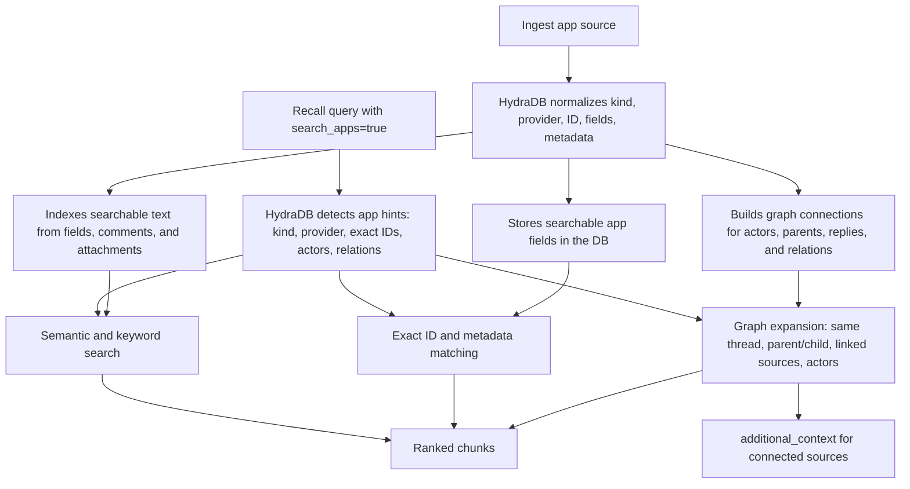

App sources are pre-parsed records from business applications: emails, chat messages, tickets, wiki pages, CRM objects, comments, and attachments.

Use app sources when you already know the item's text and structured fields. HydraDB uses that structure to build better search context than raw text alone.

<Note>
  App-source search is enabled at recall time with `search_apps: true`. In `thinking` mode, HydraDB can use app IDs, actors, threads, parent links, and explicit relations to expand the returned context.
</Note>

## Page map

- [Ingest app sources](#ingest-app-sources): what to send, which fields to use, and how to model IDs.
- [Incremental ingestion](#incremental-ingestion): how to ingest new comments, replies, messages, and pages after the initial sync.
- [How app sources affect search](#how-app-sources-affect-search): what HydraDB does with those fields during Recall.
- [Common scenarios](#common-scenarios): ready-to-adapt payloads for comments, attachments, threads, and CRM/support links.
- [TLDR field reference](#tldr-field-reference): all allowed app-source fields, when to use them, and how they affect ingestion and search.

## The mental model

Every app-source item becomes one HydraDB source.



HydraDB stores three kinds of information:

| Category | Examples | Why it matters during search |
|---|---|---|
| **Identity** | `provider`, `external_id`, `kind` | Exact ID lookup and provider-scoped graph linking |
| **Structure** | `thread_id`, `parent_id`, `relations[]` | Same-thread, parent/child, reply, linked-ticket, blocker, or CRM traversal |
| **Display and ranking** | `title`, `url`, text fields, actors, comments, attachments | Better chunk text, citations, actor-led search, attachment/comment recall |

Do not model every provider-specific field as a first-class field. Put app-specific scope values like Slack channel, Confluence space, Jira project, Salesforce pipeline, or HubSpot list in `metadata`.

## Ingest app sources

Send app sources in the `app_knowledge` form field as a single JSON object or an array. Each item is one HydraDB source and must include the ingestion envelope fields `id`, `tenant_id`, and `sub_tenant_id`.

The app-specific part of each item uses the public app-source shape:

| Field | What it does | Details |
|---|---|---|
| `kind` (recommended) | Type of app object: `email`, `message`, `ticket`, `knowledge_base`, `comment`, `custom`. | [Identity fields](#identity-fields), [Kind-specific fields](#kind-specific-fields) |
| `provider` (recommended) | System the item came from, such as `slack`, `gmail`, `jira`, `notion`, or `salesforce`. | [Identity fields](#identity-fields) |
| `external_id` (recommended) | Stable provider ID for this exact item. | [Identity fields](#identity-fields) |
| `fields` (required) | Structured content and app-specific fields for the selected `kind`. | [Kind-specific fields](#kind-specific-fields), [Thread and parent fields](#thread-and-parent-fields) |
| `metadata` | Flexible context about where the item lives, such as channel, project, space, workspace, or pipeline. | [Container metadata](#container-metadata) |
| `relations` | Explicit source-to-source connections, such as linked tickets, blockers, or CRM-to-support links. | [Relations](#relations) |
| `attachments` | Files attached to this app item. Include `content.text` or `content.markdown` when you already extracted attachment text. | [Attachments and comments](#attachments-and-comments) |
| `comments` | Embedded snapshot comments attached to this app item. For live incremental comments, prefer `kind: "comment"`. | [Attachments and comments](#attachments-and-comments), [Incremental ingestion](#incremental-ingestion) |

For typed app sources, put the main searchable item text in `fields` (`email.body`, `message.body`, `ticket.description`, `knowledge_base.body`, `comment.body`, or `custom.data`). The top-level `content` object is the older generic knowledge payload and is not required for app-native search.

The example below is a valid `app_knowledge` item for a Slack message:

```json
{
  "id": "slack_msg_1234567890_000100",
  "tenant_id": "acme",
  "sub_tenant_id": "default",
  "kind": "message",
  "provider": "slack",
  "external_id": "1234567890.000100",
  "fields": {
    "kind": "message",
    "body": "Can someone review the auth rollback?",
    "author": "alice",
    "thread_id": "1234567890.000100",
    "created_at": "2026-05-20T10:30:00Z",
    "url": "https://acme.slack.com/archives/C01/p1234567890000100"
  },
  "metadata": {
    "container_type": "channel",
    "container_id": "C01",
    "container_name": "engineering",
    "workspace": "acme"
  }
}
```

## Field categories

### Identity fields

Identity fields tell HydraDB what this item is.

| Field | Use for | Search behavior |
|---|---|---|
| `provider` | Provider namespace | Prevents ID collisions, e.g. Jira `123` vs Slack `123` |
| `external_id` | The provider's stable ID for this source | Exact ID search and relation matching |
| `kind` | Type of app object: `email`, `message`, `ticket`, `knowledge_base`, `comment`, or `custom` | Helps HydraDB route queries like "Slack messages", "Jira tickets", "ticket comments", or "wiki pages" |

Use `external_id` for the item itself. For example:

| Item | Good `external_id` |
|---|---|
| Slack message | Slack message `ts`, often combined with channel/workspace in your own ID namespace. See Slack's [`message` event](https://docs.slack.dev/reference/events/message) and [`conversations.replies`](https://api.slack.com/methods/conversations.replies). |
| Gmail email | Gmail API Message `id`. See [Gmail `users.messages`](https://developers.google.com/workspace/gmail/api/reference/rest/v1/users.messages). |
| Jira ticket | `AUTH-123` |
| Linear/Jira ticket comment | Provider comment ID, such as `comment_abc123` |
| Notion page | Page ID |
| Salesforce deal | Deal/opportunity ID |

### Thread and parent fields

| Field | Applies to | Meaning | Search behavior |
|---|---|---|---|
| `thread_id` | Email, message, comment, custom | The ID shared by all items in the same conversation or activity stream | Helps HydraDB pull nearby messages/items from the same thread when a query needs conversation context |
| `parent_id` for `message` | Message | The message this one replies to, often the thread root | Helps HydraDB answer reply/thread questions and bring in the parent message |
| `parent_id` for `comment` | Comment | The ticket, page, record, or source this comment belongs to | Connects the comment to the parent source with `comment_on` |
| `parent_id` for `ticket`, `knowledge_base`, `custom` | Ticket, page, custom | The true parent item, such as epic -> ticket, page -> subpage, account -> deal | Helps HydraDB answer parent/child and hierarchy questions |

For hierarchy fields, `parent_id` should be the parent's provider `external_id`, not the HydraDB source `id`. The child and parent should use the same `provider` namespace so HydraDB can safely connect them. For example, a Salesforce deal with `parent_id: "account_456"` should have a parent account source with `provider: "salesforce"` and `external_id: "account_456"`.

For Slack-like threads, it is OK for `thread_id` and `parent_id` to be the same when the replied-to parent is the thread root.

```json
{
  "kind": "message",
  "body": "Replying in thread",
  "thread_id": "msg_root_100",
  "parent_id": "msg_root_100"
}
```

For a direct reply where the provider gives the immediate parent:

```json
{
  "kind": "message",
  "body": "Replying to a specific message",
  "thread_id": "msg_root_100",
  "parent_id": "msg_150"
}
```

## Incremental ingestion

Use the same `POST /ingestion/upload_knowledge` endpoint for both initial sync and live updates. The important choice is whether the provider object is the **same source being updated** or a **new source that arrived later**.

| Provider event | Recommended payload | Why |
|---|---|---|
| Ticket title/status/description changed | Re-ingest the same `ticket` source with the same `id` and `external_id`, with `upsert: true` | The ticket itself changed, so replacing that source is correct |
| New Linear/Jira/Zendesk ticket comment | Ingest a new `kind: "comment"` source with its own `id` and `external_id`, plus `fields.parent_id` pointing to the ticket `external_id` | The comment is a distinct provider object and can be indexed without re-ingesting the ticket |
| Edited ticket comment | Re-ingest the same `comment` source with the same `id` and `external_id`, with `upsert: true` | The same comment changed |
| Deleted ticket comment | Delete the comment source by its HydraDB `id` using the delete endpoint | The comment should no longer be recalled |
| New Slack or Teams message | Ingest a new `message` source | Messages are standalone events linked by `thread_id` and `parent_id` |
| New email reply | Ingest a new `email` source | Email replies have their own provider message IDs, body, sender, recipients, and timestamp |
| New Notion/Confluence page in a space | Ingest a new `knowledge_base` source | A page is a standalone document; the space belongs in `metadata` |
| Existing Notion/Confluence page edited | Re-ingest the same `knowledge_base` source with the same `id` and `external_id` | The page document changed |

<Warning>
  `upsert` replaces the existing HydraDB source with the same `id`. Do not send only a new embedded `comments[]` entry on a ticket upsert unless you intend to replace the ticket snapshot. For live webhooks, model each new ticket comment as `kind: "comment"` instead.
</Warning>

### First-class ticket comment

A first-class comment is one HydraDB source. Use a stable source `id` you can reproduce from the provider, and use the provider's comment ID as `external_id`.

```json
{
  "id": "linear_comment_c123",
  "tenant_id": "acme",
  "sub_tenant_id": "default",
  "kind": "comment",
  "provider": "linear",
  "external_id": "c123",
  "fields": {
    "kind": "comment",
    "body": "I found the repro steps.",
    "author": "alice@acme.com",
    "parent_id": "UI-001",
    "thread_id": "UI-001",
    "created_at": "2026-05-25T07:00:00Z",
    "url": "https://linear.app/acme/issue/UI-001#comment-c123"
  },
  "metadata": {
    "container_type": "project",
    "container_id": "UI",
    "container_name": "Product UI"
  }
}
```

When `parent_id` is present on a `comment`, HydraDB derives a `comment_on` relation to the parent source in the same `provider` namespace. In the example above, HydraDB links the comment to the source with `provider: "linear"` and `external_id: "UI-001"`. If no parent is present, the comment is still indexed as a standalone source.

Use explicit `relations` when the parent is in a different provider namespace or when you already know the HydraDB `source_id`:

```json
{
  "relations": [
    {
      "predicate": "comment_on",
      "target": {
        "external_id": "AUTH-123",
        "provider": "jira"
      }
    }
  ]
}
```

### New Slack messages and email replies

Slack messages and email replies are not modeled as comments on an existing source. Ingest each new message or email as a new source:

- For Slack or Teams, use `kind: "message"`, a new `external_id` for the provider message ID, `thread_id` for the thread root, and `parent_id` for the replied-to message when available.
- For Gmail or Outlook, use `kind: "email"`, a new `external_id` for the provider message ID, `thread_id` for the email thread, and `reply_to_id` for the parent email when available.

This preserves message-level authorship, timestamps, URLs, and search results without re-indexing the whole conversation.

### New knowledge-base pages

A new Notion, Confluence, Google Docs, or CMS page is a new `knowledge_base` source. The space, workspace, collection, or database is container metadata, not the source identity.

```json
{
  "id": "notion_page_page_abc",
  "tenant_id": "acme",
  "sub_tenant_id": "default",
  "kind": "knowledge_base",
  "provider": "notion",
  "external_id": "page_abc",
  "fields": {
    "kind": "knowledge_base",
    "title": "Incident response runbook",
    "body": "Steps to triage production incidents...",
    "parent_id": "space_eng_root",
    "created_by": "alice@acme.com",
    "updated_by": "alice@acme.com",
    "created_at": "2026-05-25T07:00:00Z",
    "updated_at": "2026-05-25T07:00:00Z",
    "url": "https://notion.so/page_abc"
  },
  "metadata": {
    "container_type": "space",
    "container_id": "ENG",
    "container_name": "Engineering"
  }
}
```

### Container metadata

Use `metadata` for provider-specific scope and fields that help organize the source but do not identify the source itself.

A container is the place that holds many app items: a Slack channel contains many messages, a Jira project contains many tickets, a Confluence space contains many pages, and a CRM pipeline contains many deals.

```json
{
  "metadata": {
    "container_type": "channel",
    "container_id": "C01",
    "container_name": "engineering"
  }
}
```

Examples:

| Provider concept | Metadata |
|---|---|
| Slack channel | `container_type: "channel"`, `container_id: "C01"`, `container_name: "engineering"` |
| Jira project | `container_type: "project"`, `container_id: "AUTH"` |
| Confluence space | `container_type: "space"`, `container_id: "ENG"`, `container_name: "Engineering"` |
| CRM pipeline | `container_type: "pipeline"`, `container_id: "enterprise"` |

Think of `metadata` as a flexible bag for scope, grouping, and provider-specific details. HydraDB stores it with the source so results can show where the item came from and so your integration can keep provider context without forcing every app to have the same fields.

Do **not** use a container ID as `external_id`. `external_id` should identify the individual item being ingested; container IDs belong in `metadata`.

<Note>
  Put fields in `metadata` when they describe where the item lives, such as channel, project, space, workspace, pipeline, region, or team. Put fields in `fields` when they are part of the item's searchable content or structure, such as message body, ticket status, parent ID, assignee, or thread ID.
</Note>

### Actors

Actors are people or bots involved with an app source. HydraDB infers actors from kind-specific fields:

| Kind | Actor-like fields |
|---|---|
| `email` | `from`, `to`, `cc`, `bcc` |
| `message` | `author`, `mentions` |
| `ticket` | `assignee`, `reporter` |
| `knowledge_base` | `created_by`, `updated_by` |
| `comment` | `author` |
| Embedded `comments[]` | `comments[].author` |

Actors improve queries such as "emails from Alice", "tickets assigned to Bob", "messages mentioning Carol", or "comments by the support team".

## Relations

Relations tell HydraDB how app sources connect.

Use `relations` to explicitly connect two HydraDB sources when the relationship matters for search. For example, connect a ticket to a release it blocks, a CRM deal to a related support ticket, or a document page to a source it references.

```json
{
  "predicate": "linked_to",
  "target": {
    "external_id": "AUTH-123",
    "provider": "jira"
  }
}
```

The target can be either:

| Target shape | Use when |
|---|---|
| `{ "source_id": "..." }` | You already know the HydraDB `source_id` of the target |
| `{ "external_id": "...", "provider": "..." }` | You know the provider ID but the target may be ingested later |

<Warning>
  If you use `target.external_id`, always include `target.provider`. External IDs are only unique inside a provider namespace.
</Warning>

<Note>
  `linked_ticket_ids` is not a first-class field. Use `linked_issue_ids` for ticket-like items, or use explicit `relations` with `predicate: "linked_to"` for generic links.
</Note>

### Explicit relations

Use `relations` for source-to-source connections that are not already represented by typed fields:

```json
{
  "relations": [
    {
      "predicate": "blocks",
      "target": {
        "external_id": "RELEASE-2026-05",
        "provider": "jira"
      },
      "properties": {
        "reason": "release blocker"
      }
    },
    {
      "predicate": "related_to",
      "target": {
        "source_id": "src_existing_source"
      }
    }
  ]
}
```

Useful predicates include:

| Predicate | Direction |
|---|---|
| `reply_to` | reply/message/email -> parent message/email |
| `comment_on` | comment -> parent ticket/page/source |
| `forwarded_from` | forwarded email -> original email |
| `child_of` | child ticket/page/custom record -> parent |
| `linked_to` | source -> related peer source |
| `blocks` | blocker -> blocked item |
| `caused_by` | effect -> cause |
| `related_to` | generic association |

The vocabulary is extensible. If you use a custom predicate, use a stable lowercase string and keep direction consistent.

In `thinking` mode, related sources found through these connections can appear in `additional_context`. Relation-expanded chunks are tagged in metadata with `_retrieval_source: "app_relation_expansion"` and, when available, `_app_relation_type` such as `linked_to`, `child_of`, or `reply_to`.

## Kind-specific fields

Kind-specific fields are the structured fields inside `fields`; they tell HydraDB how to read each app item as an email, message, ticket, knowledge-base page, or custom record.

### Email

Use `email` for individual email messages. Put the subject and body in `fields`, plus sender, recipients, thread, reply, and forward IDs when you have them.

```json
{
  "kind": "email",
  "subject": "Q4 launch plan",
  "body": "Here is the updated plan...",
  "from": "alice@acme.com",
  "to": ["team@acme.com"],
  "cc": ["pm@acme.com"],
  "thread_id": "email-thread-1",
  "reply_to_id": "email-message-0",
  "forwarded_from_id": "email-original-9",
  "created_at": "2026-05-20T09:00:00Z",
  "url": "https://mail.google.com/..."
}
```

### Message

Use `message` for chat or collaboration messages from tools like Slack, Teams, Discord, or in-app comments that behave like messages.

```json
{
  "kind": "message",
  "body": "Can someone review AUTH-123?",
  "author": "alice",
  "thread_id": "msg-root-1",
  "parent_id": "msg-root-1",
  "mentions": ["bob"],
  "created_at": "2026-05-20T09:05:00Z",
  "url": "https://slack.com/..."
}
```

Put channel or workspace information in `metadata`.

### Ticket

Use `ticket` for issue-tracker or support-case style records: Jira issues, Linear issues, Zendesk tickets, GitHub issues, support cases, and similar workflow items.

```json
{
  "kind": "ticket",
  "title": "Login page returns 500",
  "description": "Invalid credentials return HTTP 500 instead of 401.",
  "status": "open",
  "priority": "high",
  "assignee": "alice",
  "reporter": "bob",
  "parent_id": "AUTH-100",
  "linked_issue_ids": ["AUTH-124", "AUTH-125"],
  "created_at": "2026-05-20T09:00:00Z",
  "updated_at": "2026-05-20T10:00:00Z",
  "url": "https://jira.example.com/browse/AUTH-123"
}
```

Put project information in `metadata`.

### Knowledge base

Use `knowledge_base` for wiki or documentation pages from tools like Notion, Confluence, Google Docs, or an internal CMS.

```json
{
  "kind": "knowledge_base",
  "title": "Authentication runbook",
  "body": "Steps to debug auth incidents...",
  "parent_id": "page-root-auth",
  "created_by": "alice",
  "updated_by": "bob",
  "created_at": "2026-05-01T12:00:00Z",
  "updated_at": "2026-05-20T10:00:00Z",
  "url": "https://notion.so/..."
}
```

Put space information in `metadata`.

### Comment

Use `comment` for incremental comments from ticketing, issue-tracking, support, CRM, or workflow systems. A first-class comment is its own source with its own stable `id` and `external_id`.

```json
{
  "kind": "comment",
  "body": "I confirmed the repro steps in staging.",
  "author": "carol@acme.com",
  "parent_id": "AUTH-123",
  "thread_id": "AUTH-123",
  "created_at": "2026-05-20T11:00:00Z",
  "updated_at": "2026-05-20T11:30:00Z",
  "url": "https://linear.app/acme/issue/AUTH-123#comment-c123",
  "properties": {
    "visibility": "public"
  }
}
```

`parent_id` should point to the parent source's provider `external_id` in the same `provider` namespace. HydraDB derives a `comment_on` relation from that field. If a comment belongs to a cross-provider source, use `relations[]` with `predicate: "comment_on"` instead.

### Custom and CRM

Use `custom` for records that do not fit the built-in kinds yet, especially CRM and business-system objects such as accounts, deals, contacts, renewals, invoices, or internal workflow records.

```json
{
  "kind": "custom",
  "parent_id": "account_456",
  "thread_id": "activity_stream_789",
  "data": {
    "record_type": "deal",
    "name": "Acme renewal",
    "stage": "negotiation",
    "amount": "50000"
  }
}
```

Use:

| CRM concept | Recommended mapping |
|---|---|
| Account -> deal/contact | `parent_id`, pointing to the parent account's `external_id` in the same `provider` namespace |
| Deal owner | Put in `data.owner` or `metadata.owner`; this is searchable/preserved text, not a first-class actor unless you model it with an explicit relation or a supported actor field |
| Pipeline | `metadata.container_type: "pipeline"` and `metadata.container_id` |
| Deal stage | Put in `data.stage` or `metadata.stage` |
| Related ticket | `relations[].predicate: "linked_to"` |

For CRM-style hierarchies, ingest both sides as app sources when you want traversal. For example, ingest the account as `provider: "salesforce"`, `external_id: "account_456"`, then ingest the deal or contact with `fields.parent_id: "account_456"`. During app search, HydraDB can use that link to bring the account and its children into context.

## Attachments and comments

Attachments and embedded `comments[]` are indexed separately from the main source text, but remain connected to the source.

Use `attachments[].content` when you already have extracted text for the file. HydraDB indexes that text in attachment-specific vectors. A URL by itself is treated as metadata; HydraDB does not fetch and parse arbitrary attachment URLs from app-source payloads.

Use embedded `comments[]` for initial backfills or full snapshots where you already have the complete current comment list for the parent source. For live incremental webhooks, prefer first-class `kind: "comment"` sources so you can add, update, or delete a single comment without re-ingesting the parent ticket or page.

```json
{
  "attachments": [
    {
      "id": "att-1",
      "title": "screenshot.png",
      "url": "https://...",
      "content_type": "image/png",
      "size_bytes": 204800,
      "content": {
        "text": "Screenshot shows the login form returning HTTP 500 after submit."
      },
      "properties": { "source": "jira" }
    }
  ],
  "comments": [
    {
      "id": "c-1",
      "author": "carol",
      "body": "Confirmed on staging.",
      "created_at": "2026-05-20T11:00:00Z"
    }
  ]
}
```

Search can use comment authors, comment vectors, extracted attachment text, attachment vectors, and shared-attachment graph edges as extra recall signals.

## How app sources affect search

When `search_apps: true`, HydraDB runs an app-aware search lane alongside normal retrieval.

The app-aware lane does more than search text. It first looks for app-specific clues in the query, such as a provider name, object type, exact ticket/message ID, person name, thread wording, or relation wording like "linked to", "blocked by", "parent", or "reply". It then uses those clues to build candidates and expand context around the best matches.

| Search signal | Uses |
|---|---|
| `kind`, `provider` | Route queries like "Slack messages" or "Jira tickets" |
| `external_id` | Exact ID lookup like `AUTH-123` |
| `status`, `priority`, `thread_id` | Structured filters when the query implies them |
| Actors | Queries like "tickets assigned to Alice" or "emails from Bob" |
| Relations | `reply_to`, `comment_on`, `child_of`, `linked_to`, `blocks`, `related_to` traversal |
| `thread_id` | Same-thread expansion |
| `parent_id` | Parent/child hierarchy expansion |
| Attachments / embedded comments | Auxiliary vector search and shared attachment expansion |
| First-class comments | Normal source search plus parent expansion through `comment_on` |

This means a query like "show me Slack replies from Alice about AUTH-123" can combine text relevance with Slack scoping, actor matching, exact ticket ID matching, and reply/thread expansion. A query like "what is blocking the release?" can use explicit `blocks` or `linked_to` relations instead of relying only on whether the same words appear in both sources.

This helps because app search can retrieve the surrounding work context, not just the closest text match. If a ticket, Slack thread, and release note are connected by IDs or relations, HydraDB can bring them together even when they use different wording. The result is fewer missed sources, better answers for workflow questions, and more useful context for agents that need to explain why something happened or what to do next.

### Parent and child search

Parent/child search is based on provider-scoped external IDs. When HydraDB ingests a child source with `parent_id`, it stores that value as a pointer to the parent's `external_id` in the same `provider` namespace.

At recall time, `search_apps: true` lets the app-aware lane find an initial source by text, exact ID, actor, or provider/kind filters. In `thinking` mode, if the query asks for parents, children, ancestors, descendants, epics, subtasks, accounts, deals, or similar hierarchy wording, HydraDB expands around that matched source:

- To find a parent, HydraDB matches the source's `parent_id` to another source's `external_id` with the same `provider`.
- To find children, HydraDB looks for sources whose `parent_id` equals the matched source's `external_id` with the same `provider`.
- Expansion is bounded and can include one more level, such as grandparent or grandchild context, when useful.

The expanded sources are used as connected context for the answer. Returned chunks from this path are marked with `_retrieval_source: "app_relation_expansion"` and may include `_app_relation_type` values such as `parent`, `child`, `grandparent`, `grandchild`, or `child_of`.

Use `mode: "thinking"` for best app-source behavior, because relation expansion and reranking have more room to improve context quality.

```json
{
  "tenant_id": "acme",
  "query": "show me tickets linked to AUTH-123 and comments from Alice",
  "mode": "thinking",
  "search_apps": true,
  "max_results": 10
}
```

## Common mistakes

| Mistake | Use this instead |
|---|---|
| Using `linked_ticket_ids` | Use `linked_issue_ids`, or explicit `relations` with `predicate: "linked_to"` |
| Putting Slack channel ID in `external_id` | Use the message ID as `external_id`; put channel in `metadata.container_id` |
| Using `parent_id` for every relation | Use `parent_id` only for message reply parent or true hierarchy, and point it at the parent's `external_id`; use `relations` for peers/blockers/custom links |
| Omitting `provider` on relation targets | Include `{ "external_id": "...", "provider": "..." }` |
| Creating a fake Thread source | Use `thread_id`; HydraDB treats threads as conversation groups |
| Sending only the new ticket comment in `comments[]` during an upsert | Ingest the new comment as a first-class `kind: "comment"` source |
| Re-ingesting a whole Slack thread for each new message | Ingest each new Slack message as a separate `kind: "message"` source with `thread_id` / `parent_id` |
| Modeling a new Notion page as an update to the space | Ingest each page as its own `kind: "knowledge_base"` source and put the space in `metadata` |

## End-to-end example

This example ingests a Jira ticket with a parent epic, linked issues, project metadata, embedded snapshot comments, and an explicit blocker relation. For new comments arriving after this ticket has already been indexed, use the first-class `comment` example in [Incremental ingestion](#incremental-ingestion).

```json
{
  "id": "jira_AUTH-123",
  "tenant_id": "acme",
  "sub_tenant_id": "default",
  "kind": "ticket",
  "provider": "jira",
  "external_id": "AUTH-123",
  "fields": {
    "kind": "ticket",
    "title": "Login page returns 500",
    "description": "Invalid credentials return HTTP 500 instead of 401.",
    "status": "open",
    "priority": "high",
    "assignee": "alice",
    "reporter": "bob",
    "parent_id": "AUTH-100",
    "linked_issue_ids": ["AUTH-124", "AUTH-125"],
    "created_at": "2026-05-20T09:00:00Z",
    "updated_at": "2026-05-20T10:00:00Z",
    "url": "https://jira.example.com/browse/AUTH-123"
  },
  "relations": [
    {
      "predicate": "blocks",
      "target": {
        "external_id": "RELEASE-2026-05",
        "provider": "jira"
      }
    }
  ],
  "comments": [
    {
      "id": "comment-1",
      "author": "carol",
      "body": "Confirmed on staging.",
      "created_at": "2026-05-20T11:00:00Z"
    }
  ],
  "attachments": [
    {
      "id": "att-log-1",
      "title": "auth-error.log",
      "content_type": "text/plain",
      "content": {
        "text": "Invalid credentials produced HTTP 500 in auth_service.login."
      }
    }
  ],
  "metadata": {
    "container_type": "project",
    "container_id": "AUTH",
    "container_name": "Authentication"
  }
}
```

At ingestion time, HydraDB derives:

| Input | Stored behavior |
|---|---|
| `parent_id: "AUTH-100"` | `child_of` edge to the parent ticket and parent metadata |
| `linked_issue_ids` | `linked_to` edges to each linked issue |
| `blocks` relation | A `blocks` connection to the release item |
| `container_*` metadata | Metadata only; not a source-to-source relation |
| embedded `comments[]` | Comment nodes, comment vectors, and author links for snapshot/backfill comments |
| attachment `content.text` | Attachment-specific vectors connected back to the source |

At search time, `search_apps: true` lets queries like "what is blocking the release?", "children of AUTH-100", or "tickets linked to AUTH-123" use those graph edges and IDs instead of relying only on text similarity.

## Common scenarios

Use these payload patterns when app data contains comments, attachments, threads, or cross-app links. Each example is one item in the `app_knowledge` array.

### Slack message with an attachment

Model the Slack message as `kind: "message"`, keep channel/workspace details in `metadata`, and put extracted file text in `attachments[].content`.

<Accordion title="Slack message attachment payload">
  ```json
  {
    "id": "slack_C01_1716213600_000100",
    "tenant_id": "acme",
    "sub_tenant_id": "default",
    "kind": "message",
    "provider": "slack",
    "external_id": "1716213600.000100",
    "fields": {
      "kind": "message",
      "body": "The auth rollback notes are attached here.",
      "author": "alice",
      "thread_id": "1716213600.000100",
      "created_at": "2026-05-20T10:00:00Z",
      "url": "https://acme.slack.com/archives/C01/p1716213600000100"
    },
    "attachments": [
      {
        "id": "F012AUTH",
        "title": "auth-rollback-notes.md",
        "url": "https://files.slack.com/files-pri/T01-F012AUTH/auth-rollback-notes.md",
        "content_type": "text/markdown",
        "content": {
          "markdown": "# Auth rollback\nRollback starts by disabling the new token refresh path."
        },
        "properties": {
          "slack_file_id": "F012AUTH"
        }
      }
    ],
    "metadata": {
      "container_type": "channel",
      "container_id": "C01",
      "container_name": "engineering",
      "workspace": "acme"
    }
  }
  ```
</Accordion>

### Incremental Linear ticket comment with attachment

Represent the Linear issue itself as a `ticket`. When a new comment arrives later, ingest the comment as a first-class `comment` source. Files mentioned or uploaded in that comment can go in the comment source's `attachments[]`.

<Accordion title="Linear incremental comment payload">
  ```json
  {
    "id": "linear_comment_lin-comment-1",
    "tenant_id": "acme",
    "sub_tenant_id": "default",
    "kind": "comment",
    "provider": "linear",
    "external_id": "lin-comment-1",
    "fields": {
      "kind": "comment",
      "body": "Attached the browser HAR trace from staging.",
      "author": "carol",
      "parent_id": "AUTH-123",
      "thread_id": "AUTH-123",
      "created_at": "2026-05-20T09:00:00Z",
      "url": "https://linear.app/acme/issue/AUTH-123#comment-lin-comment-1"
    },
    "attachments": [
      {
        "id": "lin-file-1",
        "title": "staging-login.har",
        "content_type": "application/json",
        "content": {
          "text": "HAR trace shows repeated 302 redirects after token refresh."
        },
        "properties": {
          "comment_id": "lin-comment-1"
        }
      }
    ],
    "relations": [
      {
        "predicate": "comment_on",
        "target": {
          "external_id": "AUTH-123",
          "provider": "linear"
        }
      }
    ],
    "metadata": {
      "container_type": "project",
      "container_id": "AUTH",
      "container_name": "Authentication"
    }
  }
  ```
</Accordion>

### Custom threaded record with comments and attachments

Use `custom` for internal systems or CRM/workflow records outside the built-in email, message, ticket, and knowledge-base shapes. `thread_id` groups activity around the record, comments make discussion searchable, and attachments add independent file recall.

<Accordion title="Custom threaded record payload">
  ```json
  {
    "id": "workflow_escalation_789",
    "tenant_id": "acme",
    "sub_tenant_id": "default",
    "kind": "custom",
    "provider": "internal_workflow",
    "external_id": "escalation_789",
    "fields": {
      "kind": "custom",
      "parent_id": "account_456",
      "thread_id": "escalation_thread_789",
      "data": {
        "record_type": "customer_escalation",
        "title": "Acme renewal escalation",
        "status": "open",
        "owner": "dana",
        "summary": "Customer needs security review before renewal approval."
      }
    },
    "comments": [
      {
        "id": "esc-comment-1",
        "author": "dana",
        "body": "Security questionnaire is complete; waiting on procurement approval.",
        "created_at": "2026-05-21T08:45:00Z"
      }
    ],
    "attachments": [
      {
        "id": "security-questionnaire",
        "title": "security-questionnaire.pdf",
        "content_type": "application/pdf",
        "content": {
          "text": "Security questionnaire confirms SSO, audit logs, and data retention requirements."
        }
      }
    ],
    "metadata": {
      "container_type": "workflow",
      "container_id": "renewals",
      "team": "customer-success"
    }
  }
  ```
</Accordion>

### CRM deal linked to a support ticket

Use `parent_id` for account -> deal/contact hierarchy and `relations[]` for cross-app context, such as a Salesforce opportunity linked to a Linear or Jira support issue.

<Accordion title="CRM deal linked to support ticket payload">
  ```json
  {
    "id": "salesforce_opp_789",
    "tenant_id": "acme",
    "sub_tenant_id": "default",
    "kind": "custom",
    "provider": "salesforce",
    "external_id": "opp_789",
    "fields": {
      "kind": "custom",
      "parent_id": "account_456",
      "thread_id": "opp_789_activity",
      "data": {
        "record_type": "opportunity",
        "name": "Acme enterprise renewal",
        "stage": "negotiation",
        "amount": "50000",
        "owner": "morgan"
      }
    },
    "relations": [
      {
        "predicate": "linked_to",
        "target": {
          "external_id": "AUTH-123",
          "provider": "linear"
        },
        "properties": {
          "reason": "Customer renewal depends on auth fix"
        }
      }
    ],
    "metadata": {
      "container_type": "pipeline",
      "container_id": "enterprise-renewals",
      "region": "north-america"
    }
  }
  ```
</Accordion>

## TLDR field reference

Use this as the compact contract for app-source ingestion. The `fields.kind` value must match the top-level `kind` when you provide typed fields.

### Top-level fields

| Field | Type / allowed values | Required? | Why send it | Search / ingestion effect |
|---|---|---|---|---|
| `id` | String | Required | Stable HydraDB source ID for this ingested item. | Used as the source ID returned by ingestion and for later updates/deletes. |
| `tenant_id` | String | Required | Tenant that owns the item. | Routes the item into the correct tenant scope. |
| `sub_tenant_id` | String | Required | Sub-tenant/user/workspace scope. Use `"default"` if you do not partition sources. | Routes the item into the correct sub-tenant scope. |
| `kind` | `email`, `message`, `ticket`, `knowledge_base`, `comment`, `custom` | Recommended | Tells HydraDB how to interpret `fields`. Defaults to `custom` if omitted. | Routes search by object type and selects the right parser for structured fields. |
| `provider` | String, e.g. `slack`, `gmail`, `jira`, `notion`, `salesforce` | Recommended | Names the app namespace the source came from. | Prevents ID collisions and lets queries scope to a provider, e.g. "Slack messages". |
| `external_id` | String | Recommended | Stable ID for this exact item in the provider. | Enables exact ID lookup and relation resolution across sources. |
| `fields` | Object matching one kind-specific shape below | Required for best results | Holds searchable content and structure. | Drives rendering, actors, thread/parent expansion, status/priority filtering, and relation derivation. |
| `metadata` | Object | Optional | Flexible provider context such as channel, project, space, workspace, pipeline, region, or team. | Preserves source context for display and filtering without adding new typed fields for every app. |
| `relations` | List of relation objects | Optional | Explicitly connects this source to another source. | Enables connected-context retrieval for links, blockers, dependencies, and CRM/support relationships. |
| `attachments` | List of attachment objects | Optional | Adds files attached to the app item. | Makes attachment content searchable and can connect sources that share attachments. |
| `comments` | List of embedded comment objects | Optional | Adds snapshot/backfill comments attached to the app item. | Makes embedded comment text and comment authors searchable. For incremental comments, use `kind: "comment"`. |

### `email` fields

| Field | Type / allowed values | Required? | Why send it | Search / ingestion effect |
|---|---|---|---|---|
| `kind` | `email` | Required inside `fields` | Discriminator for email fields. | Validates and parses the email shape. |
| `subject` | String | Recommended | Email title/subject. | Improves title, snippets, and semantic matching. |
| `body` | String | Recommended | Main email content. | Primary searchable text. |
| `from` | String | Recommended | Sender. | Enables actor queries like "emails from Alice". |
| `to` | List of strings | Optional | Recipients. | Enables actor queries like "emails to the finance team". |
| `cc` | List of strings | Optional | CC recipients. | Adds actor context. |
| `bcc` | List of strings | Optional | BCC recipients when available and safe to expose. | Adds actor context. |
| `thread_id` | String | Recommended for email threads | Conversation/thread ID. | Enables same-thread expansion. |
| `reply_to_id` | String | Optional | External ID of the email this replies to. | Connects replies to parent emails. |
| `forwarded_from_id` | String | Optional | External ID of the original forwarded email. | Connects forwards to originals. |
| `created_at` | ISO-8601 datetime | Optional | Email creation/sent time. | Helps chronology and recency-aware results. |
| `url` | String | Optional | Link back to the email. | Improves citations and source navigation. |

### `message` fields

| Field | Type / allowed values | Required? | Why send it | Search / ingestion effect |
|---|---|---|---|---|
| `kind` | `message` | Required inside `fields` | Discriminator for message fields. | Validates and parses the message shape. |
| `body` | String | Recommended | Message text. | Primary searchable text. |
| `author` | String | Recommended | Message sender. | Enables actor queries like "messages from Alice". |
| `thread_id` | String | Recommended for threaded messages | Shared thread/conversation ID. | Enables same-thread expansion. |
| `parent_id` | String | Optional | External ID of the parent/replied-to message. | Connects replies to parent messages. |
| `mentions` | List of strings | Optional | People or handles mentioned in the message. | Enables actor queries like "messages mentioning Bob". |
| `created_at` | ISO-8601 datetime | Optional | Message timestamp. | Helps chronology and recency-aware results. |
| `url` | String | Optional | Link back to the message. | Improves citations and source navigation. |

### `ticket` fields

| Field | Type / allowed values | Required? | Why send it | Search / ingestion effect |
|---|---|---|---|---|
| `kind` | `ticket` | Required inside `fields` | Discriminator for ticket fields. | Validates and parses the ticket shape. |
| `title` | String | Recommended | Ticket title. | Improves title, snippets, and semantic matching. |
| `description` | String | Recommended | Main ticket body. | Primary searchable text. |
| `status` | String | Optional, recommended for workflow apps | Workflow state such as `open`, `closed`, `in_progress`. | Enables queries like "open tickets" or "closed issues". |
| `priority` | String | Optional | Priority such as `high`, `p0`, `urgent`. | Enables priority-aware queries. |
| `assignee` | String | Optional | Owner/assignee. | Enables actor queries like "tickets assigned to Alice". |
| `reporter` | String | Optional | Creator/reporter. | Enables actor queries like "tickets reported by Bob". |
| `parent_id` | String | Optional | Parent ticket/epic external ID. | Enables parent/child traversal. |
| `linked_issue_ids` | List of strings | Optional | Related ticket/issue external IDs. | Creates linked-ticket context for retrieval. |
| `created_at` | ISO-8601 datetime | Optional | Ticket creation time. | Helps chronology and recency-aware results. |
| `updated_at` | ISO-8601 datetime | Optional | Last update time. | Helps freshness and recency-aware results. |
| `url` | String | Optional | Link back to the ticket. | Improves citations and source navigation. |

### `knowledge_base` fields

| Field | Type / allowed values | Required? | Why send it | Search / ingestion effect |
|---|---|---|---|---|
| `kind` | `knowledge_base` | Required inside `fields` | Discriminator for knowledge-base fields. | Validates and parses the page shape. |
| `title` | String | Recommended | Page title. | Improves title, snippets, and semantic matching. |
| `body` | String | Recommended | Main page content. | Primary searchable text. |
| `parent_id` | String | Optional | Parent page external ID. | Enables page hierarchy traversal. |
| `created_by` | String | Optional | Page creator. | Enables actor queries like "docs created by Alice". |
| `updated_by` | String | Optional | Last editor/updater. | Enables actor queries like "docs updated by Bob". |
| `created_at` | ISO-8601 datetime | Optional | Page creation time. | Helps chronology and recency-aware results. |
| `updated_at` | ISO-8601 datetime | Optional | Last update time. | Helps freshness and recency-aware results. |
| `url` | String | Optional | Link back to the page. | Improves citations and source navigation. |

### `comment` fields

| Field | Type / allowed values | Required? | Why send it | Search / ingestion effect |
|---|---|---|---|---|
| `kind` | `comment` | Required inside `fields` | Discriminator for first-class comment fields. | Validates and parses the comment shape. |
| `body` | String | Recommended | Main comment text. | Primary searchable text. |
| `author` | String | Recommended | Comment author. | Enables actor queries like "comments from Carol". |
| `parent_id` | String | Optional, recommended for ticket/page comments | Parent source external ID in the same provider namespace. | Derives a `comment_on` relation to the parent source. |
| `thread_id` | String | Optional | Shared discussion/activity thread ID. | Enables same-thread expansion around comments. |
| `created_at` | ISO-8601 datetime | Optional | Comment creation time. | Helps chronology and recency-aware results. |
| `updated_at` | ISO-8601 datetime | Optional | Comment edit/update time. | Helps freshness and recency-aware results. |
| `url` | String | Optional | Link back to the comment. | Improves citations and source navigation. |
| `properties` | Object | Optional | Extra comment metadata. | Carries provider-specific comment context. |

### `custom` fields

| Field | Type / allowed values | Required? | Why send it | Search / ingestion effect |
|---|---|---|---|---|
| `kind` | `custom` | Required inside `fields` | Discriminator for custom fields. | Validates and parses the custom shape. |
| `parent_id` | String | Optional | Parent `external_id` for custom hierarchies in the same `provider` namespace, e.g. account -> deal. | Enables parent/child traversal. |
| `thread_id` | String | Optional | Shared activity stream or conversation ID. | Enables same-thread/activity-stream expansion. |
| `data` | Object | Recommended | App-specific structured payload. | Preserves CRM/business fields without requiring a new kind. |

### Attachment fields

| Field | Type / allowed values | Required? | Why send it | Search / ingestion effect |
|---|---|---|---|---|
| `id` | String | Optional | Stable attachment ID. | Helps deduplicate and connect attachment context. |
| `url` | String | Optional | Attachment URL. | Lets results point back to the attachment. |
| `title` | String | Optional | File name/title. | Improves attachment search and display. |
| `content_type` | String | Optional | MIME type such as `application/pdf` or `image/png`. | Helps classify attachment content. |
| `size_bytes` | Integer | Optional | Attachment size. | Useful for display/debugging. |
| `content.text` | String | Optional | Pre-extracted plain-text attachment body. | Indexed in attachment-specific vectors. |
| `content.markdown` | String | Optional | Pre-extracted Markdown attachment body. | Indexed like `content.text` when plain text is not provided. |
| `content.html_base64` | String | Optional | Base64-encoded HTML, kept for structured attachment payloads. | Preserved in the payload; provide `content.text` or `content.markdown` for search. |
| `content.csv_base64` | String | Optional | Base64-encoded CSV, kept for structured attachment payloads. | Preserved in the payload; provide `content.text` or `content.markdown` for search. |
| `properties` | Object | Optional | Extra attachment metadata. | Carries provider-specific attachment context in the payload; use `title`, `url`, and `content` for searchable attachment context. |

### Embedded `comments[]` fields

| Field | Type / allowed values | Required? | Why send it | Search / ingestion effect |
|---|---|---|---|---|
| `id` | String | Optional | Stable comment ID. | Helps deduplicate comments. |
| `author` | String | Recommended | Comment author. | Enables queries like "comments from Carol". |
| `body` | String | Recommended | Comment text. | Makes comments searchable. |
| `created_at` | ISO-8601 datetime | Optional | Comment timestamp. | Helps chronology and recency-aware results. |
| `properties` | Object | Optional | Extra comment metadata. | Carries provider-specific comment context in the payload; use `author` and `body` for searchable comment context. |

### Relation fields

| Field | Type / allowed values | Required? | Why send it | Search / ingestion effect |
|---|---|---|---|---|
| `predicate` | String, e.g. `linked_to`, `blocks`, `child_of`, `reply_to`, `comment_on`, `related_to` | Optional, defaults to `linked_to` | Names the relationship. | Lets search traverse only the relevant relationship type. |
| `target.source_id` | String | One target required | Use when you already know the HydraDB source ID. | Connects directly to an existing source. |
| `target.external_id` | String | One target required | Use when you know the provider ID but not the HydraDB source ID. | Lets HydraDB resolve or connect to the target by provider ID. |
| `target.provider` | String | Required when `target.external_id` is set | Disambiguates provider ID namespaces. | Prevents false links across apps that share the same ID text. |
| `properties` | Object | Optional | Extra relation metadata, such as reason or confidence. | Preserves why the relation exists. |
