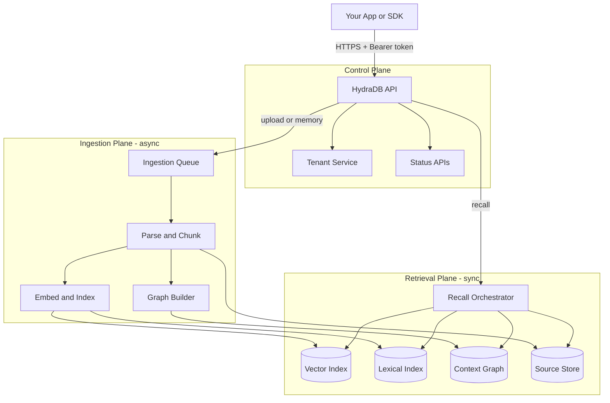
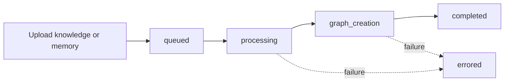

HydraDB is context infrastructure for AI applications. From the outside, you call a small set of HTTP APIs. Inside, HydraDB coordinates tenant isolation, async ingestion, indexing, graph construction, and hybrid retrieval so your application can store context once and recall the right pieces later.

## The Big Picture

HydraDB has three logical planes:

| Plane | What It Handles |
|---|---|
| Control plane | API authentication, tenant lifecycle, plan limits, and status endpoints |
| Ingestion plane | File/app knowledge uploads, memory ingestion, parsing, chunking, embedding, and graph construction |
| Retrieval plane | Hybrid recall, metadata filtering, graph context, lexical search, and response shaping |

Your client talks only to the API. Storage, indexing, and graph internals stay behind the service boundary.

## Ingestion Lifecycle

Ingestion is asynchronous. A successful upload means HydraDB accepted the work and queued it for processing; it does not mean the content is immediately fully indexed.

Use `POST /ingestion/verify_processing` with the returned `source_id` to track indexing. Wait for `completed` when you need full recall and graph context.

## From Upload To Recall

1. Create a tenant with `POST /tenants/create`.
2. Poll `GET /tenants/infra/status?tenant_id=...` until tenant infrastructure is ready.
3. Upload documents or app knowledge with `POST /ingestion/upload_knowledge`, or user memories with `POST /memories/add_memory`.
4. Poll `POST /ingestion/verify_processing?file_ids=<source_id>&tenant_id=...`.
5. Query knowledge with `POST /recall/full_recall`, user memories with `POST /recall/recall_preferences`, or exact text matches with `POST /recall/boolean_recall`.

## Tenant Isolation

A `tenant_id` is the top-level isolation boundary. Within it, `sub_tenant_id` scopes content to a user, team, workspace, or project.

If `sub_tenant_id` is omitted, HydraDB resolves it to the tenant's default sub-tenant. In the current API implementation, that default is the tenant's internal primary tenant identifier, so omitted sub-tenant values consistently land in the same default scope.

Use this model for common product patterns:

| Product Shape | Tenant Pattern | Sub-Tenant Pattern |
|---|---|---|
| B2B SaaS | One tenant per customer organization | One sub-tenant per team, workspace, or user |
| B2C app | One tenant for your application | One sub-tenant per end user |
| Internal tools | One tenant per company or environment | One sub-tenant per department or project |

## Retrieval Pipeline

`/recall/full_recall` and `/recall/recall_preferences` use the same request model and differ by collection: knowledge sources vs user memories.

At a high level, recall:

1. Validates `tenant_id`, resolves the tenant, and applies the requested `sub_tenant_id`.
2. Applies `metadata_filters` before ranking.
3. Runs hybrid retrieval over semantic and lexical signals.
4. Uses `alpha` to blend semantic vs lexical ranking.
5. Optionally includes graph context when `graph_context: true`.
6. Returns ranked `chunks`, deduplicated `sources`, `graph_context`, and any `additional_context`.

The response is retrieved context, not a final LLM answer. Pass the relevant chunks and graph context into your own agent or model prompt.

## Key Controls

| Field | Where | What It Does |
|---|---|---|
| `tenant_id` | All core APIs | Selects the isolated workspace |
| `sub_tenant_id` | Ingestion and recall | Narrows data to a user, team, or workspace |
| `metadata` | Ingestion | Tenant-level metadata; matching keys are validated and indexed when `tenant_metadata_schema` is configured |
| `additional_metadata` | Ingestion | Flexible source-level metadata attached to a source |
| `metadata_filters` | Recall | Deterministically scopes candidates before ranking |
| `alpha` | Recall | Blends semantic and lexical scores (`1.0` = semantic-heavy, `0.0` = lexical-heavy) |
| `graph_context` | Recall | Requests graph paths and chunk relations in the response |

## Operational Mental Model

HydraDB separates write-time work from query-time work. Uploads are accepted quickly, then processed in the background. Recall stays synchronous and returns only indexed content. When results look incomplete, first check processing status, then tenant/sub-tenant scope, then metadata filters.
