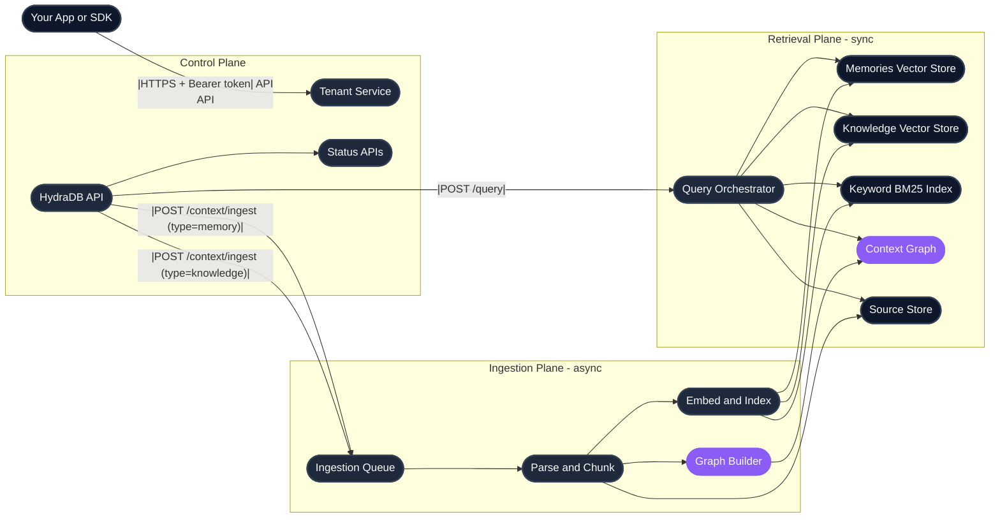
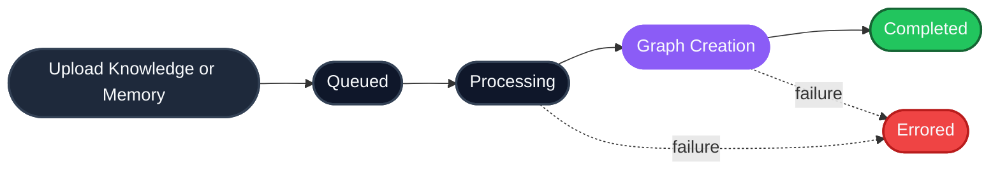

HydraDB is context infrastructure for AI applications. From the outside, you call a small set of HTTP APIs. Inside, HydraDB orchestrates tenant isolation, asynchronous ingestion, indexing, graph construction, and hybrid retrieval  -  so your application can store context once and query the right pieces later. This page walks through what happens behind the scenes, and points at the endpoints and concepts you'll touch along the way.

---

## The big picture

HydraDB organizes its work into three logical planes. You interact only with the API; everything else stays behind the service boundary.

| Plane | What it handles | Endpoints |
|---|---|---|
| **Control** | API authentication, tenant lifecycle, provisioning, and status | [`/tenants`](/api-reference/v2/endpoint/tenants-overview) family |
| **Ingestion** | File and app-source uploads, memory writes, parsing, chunking, embedding, and graph construction | [`POST /context/ingest`](/api-reference/v2/endpoint/ingest-context), [`GET /context/status`](/api-reference/v2/endpoint/source-status) |
| **Retrieval** | Hybrid query, metadata filtering, graph context, keyword bm25 search, and response shaping | [`POST /query`](/api-reference/v2/endpoint/query), [`GET /context/relations`](/api-reference/v2/endpoint/source-relations) |

Two details to notice in the diagram:

- **Two vector stores, one ingest endpoint.** [`POST /context/ingest`](/api-reference/v2/endpoint/ingest-context) routes to the [Knowledge](/essentials/v2/knowledge) store when `type=knowledge` and to the [Memories](/essentials/v2/memories) store when `type=memory`. Same endpoint, different bucket.
- **One query endpoint, every retrieval method.** [`POST /query`](/api-reference/v2/endpoint/query) is the only retrieval entry point. The `type` and `query_by` parameters decide what gets queried and how  -  see [Query](/essentials/v2/query) for the full picture.

---

## Ingestion lifecycle

Ingestion is asynchronous. A successful upload means HydraDB accepted the work and queued it; it does not mean the content is immediately queryable. Each source moves through a status pipeline before it becomes fully queryable:

Poll [`GET /context/status`](/api-reference/v2/endpoint/source-status) with the returned `id` to follow each item through the pipeline. Two practical notes:

- **`graph_creation` is already queryable.** Chunks become retrievable as soon as embedding finishes; you only need to wait for `completed` when you specifically need full graph context (`graph_context: true` on query).
- **Failures surface with detail.** An `errored` status comes back with an `error_code` and `message` so you can distinguish parse failures from validation problems from infrastructure issues.

The full status table and polling pattern lives at [Ingestion Status](/api-reference/v2/endpoint/source-status).

---

## From upload to query

Here's the canonical end-to-end flow. Each step links to the endpoint that owns it:

1. **Create a tenant** with [`POST /tenants`](/api-reference/v2/endpoint/create-tenant)  -  your isolated workspace, optionally with a [metadata schema](/essentials/v2/metadata) declared up front.
2. **Wait for provisioning** by polling [`GET /tenants/status`](/api-reference/v2/endpoint/tenant-status) until `vectorstore_status.knowledge`, `vectorstore_status.memories`, and `graph_status` are all `true`.
3. **Ingest content** with [`POST /context/ingest`](/api-reference/v2/endpoint/ingest-context)  -  pick `type=knowledge` for shared documents or `type=memory` for per-user context. See [Knowledge](/essentials/v2/knowledge) and [Memories](/essentials/v2/memories) for the content models.
4. **Watch indexing finish** by polling [`GET /context/status`](/api-reference/v2/endpoint/source-status) until each `id` reaches `completed` (or `graph_creation` if you don't need graph traversal).
5. **Query** with [`POST /query`](/api-reference/v2/endpoint/query). Pick `type: "knowledge"` for Knowledge, `type: "memory"` for Memories, or `type: "all"` for both. Pair with `query_by: "hybrid"` (default) or `"text"` (BM25, with `operator`). The mechanics live in [Query](/essentials/v2/query).

That's the whole loop. Most of what changes between integrations is *what* you put in the metadata, *what* you query with, and *which* `type` and `query_by` combination fits the task.

---

## Tenant isolation

A `database` (formerly `tenant_id`, still accepted as a deprecated alias) is the top-level isolation boundary  -  no tenant can read another tenant's data. Within a tenant, `collection` (formerly `sub_tenant_id`) carves out logical partitions: users, teams, workspaces, or projects. Omitting `collection` on any call resolves to the tenant's default sub-tenant, which is auto-created with the tenant itself.

The right mapping depends on your product shape:

| Product shape | Tenant pattern | Sub-tenant pattern |
|---|---|---|
| **B2B SaaS** | One tenant per customer organization | One sub-tenant per team, workspace, or end user |
| **B2C app** | One tenant for your application | One sub-tenant per end user |
| **Internal tools** | One tenant per company or environment | One sub-tenant per department or project |

The deeper trade-offs  -  when to spin up a new tenant vs. a new sub-tenant, how scoping interacts with [metadata filters](/essentials/v2/metadata), and how this affects [Memories](/essentials/v2/memories)  -  are covered in [Multi-Tenant Support](/essentials/v2/multi-tenant).

---

## Retrieval pipeline

[`POST /query`](/api-reference/v2/endpoint/query) is the single retrieval endpoint. Two parameters describe the request: `type` picks the collection, `query_by` picks the method. From there, every call goes through the same pipeline:

1. **Authenticate and scope.** Validate `database`, resolve the tenant, and apply the requested `collection`.
2. **Filter before ranking.** Apply `metadata_filters` to narrow the candidate set (see [Metadata](/essentials/v2/metadata)).
3. **Retrieve.** Run hybrid retrieval over the semantic vector store and the keyword bm25 index, or BM25-only retrieval when `query_by: "text"`.
4. **Blend.** Use `alpha` to weight semantic vs. keyword bm25 contributions (`1.0` = pure semantic, `0.0` = pure BM25).
5. **Enrich.** When `graph_context: true`, traverse the [context graph](/essentials/v2/context-graphs) and attach related paths. When `mode: "thinking"`, expand the query, rerank, and pull in author-declared forceful relations.
6. **Shape the response.** Return ranked `chunks`, deduplicated `sources`, optional `graph_context`, and any `additional_context`.

The response is *retrieved context*, not a final LLM answer. You pass the chunks (and any graph context) into your own agent or model prompt  -  see [How to Use API Results](/essentials/v2/api-results) for the helper that formats it.

---

## Key controls

A short cheat sheet for the parameters you'll touch most often, and where each one lives:

| Field | Used in | What it does |
|---|---|---|
| `database` | Every call | Selects the isolated workspace. Required on every request. |
| `collection` | Ingest + query | Narrows data to a user, team, or workspace inside the tenant. |
| `metadata` | [Ingest](/api-reference/v2/endpoint/ingest-context) | Schema-aligned metadata indexed at ingest. Must match the [tenant metadata schema](/essentials/v2/metadata) declared at tenant creation. |
| `additional_metadata` | [Ingest](/api-reference/v2/endpoint/ingest-context) | Free-form per-document metadata. Stored alongside the source; filterable at query via `metadata_filters.additional_metadata`. |
| `metadata_filters` | [Query](/api-reference/v2/endpoint/query) | Deterministic narrowing before ranking. Top-level keys match `metadata`; nested `additional_metadata` filters free-form fields. |
| `alpha` | [Query](/api-reference/v2/endpoint/query) | Blends semantic vs. keyword bm25 scores in `query_by: "hybrid"`. |
| `graph_context` | [Query](/api-reference/v2/endpoint/query) | When `true`, attaches the relevant slice of the [context graph](/essentials/v2/context-graphs) to the response. |
| `mode` | [Query](/api-reference/v2/endpoint/query) | `"fast"` for low-latency single-pass retrieval; `"thinking"` for multi-query expansion and reranking. |

---

## Operational mental model

HydraDB separates **write-time** work from **query-time** work. Uploads return quickly and run in the background; query stays synchronous and reads only indexed content. When results look incomplete, walk the chain in order:

1. **Status first.** Did every `id` reach `completed` (or at least `graph_creation`)? Check [Ingestion Status](/api-reference/v2/endpoint/source-status).
2. **Scope second.** Is the `database` correct? Did you write under one `collection` and read under another? See [Multi-Tenant](/essentials/v2/multi-tenant).
3. **Filters third.** Are your `metadata_filters` keys actually declared in `tenant_metadata_schema` with `enable_match: true`? Undeclared keys are silently ignored. See [Metadata](/essentials/v2/metadata).

This order catches almost every "I uploaded but query returns nothing" debugging session.

---

## Related

- [Core Concepts](/get-started/core-concepts)  -  the five primitives: Memories, Knowledge, Query, Tenants, Metadata
- [Quickstart](/get-started/v2/quickstart)  -  build your first integration in five minutes
- [Knowledge](/essentials/v2/knowledge) and [Memories](/essentials/v2/memories)  -  the two content models
- [Query](/essentials/v2/query)  -  deep dive on `POST /query`
- [Multi-Tenant Support](/essentials/v2/multi-tenant)  -  scoping patterns and pitfalls
- [Context Graphs](/essentials/v2/context-graphs)  -  how the graph layer enriches retrieval
- [Metadata](/essentials/v2/metadata)  -  designing filterable fields
