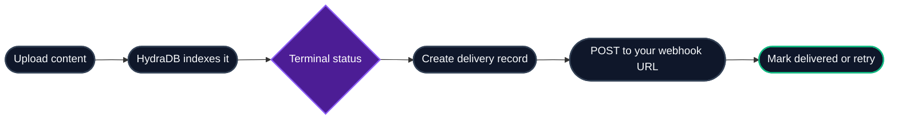

Webhooks let your application receive an HTTP callback when HydraDB finishes processing a document or memory.

Use them when you want to:

- Update your own database when content is ready for search
- Notify users that an upload has finished
- Trigger downstream jobs after indexing completes
- Track indexing failures without polling

<Info>
Webhooks are sent for terminal indexing states. For progress updates before completion, use [Source Status](/api-reference/v2/endpoint/source-status).
</Info>

---

## 1. How it works

When an ingested item reaches a terminal state, HydraDB creates a delivery record and sends a `POST` request to your webhook URL.



The supported event today is:

| Event | When it fires |
|---|---|
| `indexing.status_changed` | When an item reaches `completed`, `errored`, or `success` |

`success` is a legacy alias for `completed`.

---

## 2. Register a webhook

Open the HydraDB dashboard and go to **Webhooks**.

1. Click **Register Webhook**.
2. Enter your public HTTPS endpoint.
3. Select `indexing.status_changed`.
4. Optional: enter a signing secret.
5. Save the webhook.
6. Use **Send Test** to confirm your endpoint receives a request.

<Warning>
Your webhook URL must be reachable from the public internet. Localhost and private network addresses are blocked.
</Warning>

### Register with cURL

Use your HydraDB API key to register a webhook from your backend or terminal.

```bash cURL
curl -X POST 'https://api.hydradb.com/webhooks/indexing' \
  -H "Authorization: Bearer $HYDRADB_API_KEY" \
  -H "Content-Type: application/json" \
  -d '{
    "url": "https://api.example.com/webhooks/hydradb",
    "event_types": ["indexing.status_changed"],
    "signing_secret": "replace-with-at-least-16-characters"
  }'
```

**Response:**

```json
{
  "registered": true,
  "url": "https://api.example.com/webhooks/hydradb",
  "event_types": ["indexing.status_changed"],
  "signing_secret_configured": true,
  "message": "Webhook registered."
}
```

`signing_secret` is optional. If you include it, your receiver should verify `X-HydraDB-Signature`.

### Check the current registration

```bash cURL
curl 'https://api.hydradb.com/webhooks/indexing' \
  -H "Authorization: Bearer $HYDRADB_API_KEY"
```

**Response:**

```json
{
  "registered": true,
  "url": "https://api.example.com/webhooks/hydradb",
  "event_types": ["indexing.status_changed"],
  "signing_secret_configured": true
}
```

### Edit a webhook

Use the same `POST /webhooks/indexing` endpoint to replace the existing registration.

```bash cURL
curl -X POST 'https://api.hydradb.com/webhooks/indexing' \
  -H "Authorization: Bearer $HYDRADB_API_KEY" \
  -H "Content-Type: application/json" \
  -d '{
    "url": "https://api.example.com/webhooks/hydradb-v2",
    "event_types": ["indexing.status_changed"],
    "signing_secret": "new-secret-at-least-16-characters"
  }'
```

If you omit `signing_secret` while editing, signing is disabled for future deliveries.

### Send a test delivery

```bash cURL
curl -X POST 'https://api.hydradb.com/webhooks/indexing/test' \
  -H "Authorization: Bearer $HYDRADB_API_KEY"
```

**Response:**

```json
{
  "delivered": true,
  "status_code": 204,
  "message": "Test delivery succeeded."
}
```

### Delete a webhook

```bash cURL
curl -X DELETE 'https://api.hydradb.com/webhooks/indexing' \
  -H "Authorization: Bearer $HYDRADB_API_KEY"
```

**Response:**

```json
{
  "deleted": true,
  "message": "Webhook unregistered."
}
```

---

## 3. Request format

HydraDB sends a `POST` request with a JSON body.

### Headers

| Header | Description |
|---|---|
| `Content-Type` | Always `application/json` |
| `X-HydraDB-Delivery-ID` | Stable delivery ID for this event |
| `X-HydraDB-Event` | Event name, such as `indexing.status_changed` |
| `X-HydraDB-Signature` | Present when you configured a signing secret |

### Payload

```json
{
  "event": "indexing.status_changed",
  "delivery_id": "<delivery_id>",
  "id": "<source_id>",
  "tenant_id": "<tenant_id>",
  "sub_tenant_id": "<sub_tenant_id>",
  "status": "completed",
  "timestamp": "<ISO-8601 timestamp>"
}
```

For failed indexing, the payload can include `error_code` and `error_message`:

```json
{
  "event": "indexing.status_changed",
  "delivery_id": "<delivery_id>",
  "id": "<source_id>",
  "tenant_id": "<tenant_id>",
  "sub_tenant_id": "<sub_tenant_id>",
  "status": "errored",
  "timestamp": "<ISO-8601 timestamp>",
  "error_code": "<error_code>",
  "error_message": "<error_message>"
}
```

| Field | Description |
|---|---|
| `event` | Event type. Currently `indexing.status_changed`. |
| `delivery_id` | Stable ID for this event. Store it to deduplicate retries. |
| `id` | The document, memory, or app-source ID you supplied during ingestion. |
| `tenant_id` | Tenant scope for the indexed item. |
| `sub_tenant_id` | Sub-tenant scope for the indexed item. |
| `status` | Terminal indexing status. Usually `completed` or `errored`. |
| `timestamp` | Time the webhook payload was created. |
| `error_code` | Present when available for failed processing. |
| `error_message` | Present when available for failed processing. |

<Note>
Older examples may refer to this document identifier as `doc_id`. New webhook payloads use `id`.
</Note>

---

## 4. Test delivery payload

The dashboard **Send Test** button sends a synthetic event. It does not create a real indexing delivery.

```json
{
  "event": "indexing.status_changed",
  "delivery_id": "test_<random>",
  "id": "test_document",
  "tenant_id": "<org_id>",
  "sub_tenant_id": "<org_id>",
  "status": "completed",
  "timestamp": "<ISO-8601 timestamp>",
  "test": true
}
```

Use `test: true` to ignore test events in production workflows.

---

## 5. Receiver examples

Your endpoint should return a `2xx` response quickly. Do any slow work after you acknowledge the request.

<CodeGroup>

```python Python
import hashlib
import hmac
import json
import os

from fastapi import FastAPI, Header, Request, Response

app = FastAPI()
SIGNING_SECRET = os.getenv("HYDRADB_WEBHOOK_SECRET")


@app.post("/webhooks/hydradb")
async def hydradb_webhook(
    request: Request,
    delivery_id: str | None = Header(default=None, alias="X-HydraDB-Delivery-ID"),
    signature: str | None = Header(default=None, alias="X-HydraDB-Signature"),
):
    raw_body = await request.body()

    if SIGNING_SECRET:
        digest = hmac.new(
            SIGNING_SECRET.encode(),
            raw_body,
            hashlib.sha256,
        ).hexdigest()
        expected = f"sha256={digest}"

        if not signature or not hmac.compare_digest(signature, expected):
            return Response(status_code=401)

    event = json.loads(raw_body)

    # Store delivery_id and skip it if you have already processed it.
    print("HydraDB webhook", delivery_id, event["id"], event["status"])

    return Response(status_code=204)
```

```typescript TypeScript
import crypto from "node:crypto";
import express from "express";

const app = express();
const signingSecret = process.env.HYDRADB_WEBHOOK_SECRET;

app.post(
  "/webhooks/hydradb",
  express.raw({ type: "application/json" }),
  (req, res) => {
    const deliveryId = req.header("X-HydraDB-Delivery-ID");
    const signature = req.header("X-HydraDB-Signature");
    const rawBody = req.body as Buffer;

    if (signingSecret) {
      const expected =
        "sha256=" +
        crypto.createHmac("sha256", signingSecret).update(rawBody).digest("hex");
      const expectedBuffer = Buffer.from(expected);
      const signatureBuffer = Buffer.from(signature || "");

      if (
        signatureBuffer.length !== expectedBuffer.length ||
        !crypto.timingSafeEqual(signatureBuffer, expectedBuffer)
      ) {
        return res.status(401).send("Invalid signature");
      }
    }

    const event = JSON.parse(rawBody.toString("utf8"));

    // Store deliveryId and skip it if you have already processed it.
    console.log("HydraDB webhook", deliveryId, event.id, event.status);

    return res.status(204).send();
  }
);

app.listen(3000);
```

</CodeGroup>

---

## 6. Delivery and retries

HydraDB records every delivery attempt. You can inspect delivery history from the dashboard Webhooks page.

Delivery states:

| State | Meaning |
|---|---|
| `pending` | The event was recorded and is waiting to be sent. |
| `sweeping` | HydraDB has claimed the event for delivery or retry. |
| `delivered` | Your endpoint returned a successful status code. |
| `failed` | The current send attempt failed and will be retried. |
| `permanently_failed` | HydraDB stopped retrying this event. |

HydraDB retries failed deliveries in the background. If a worker shuts down during delivery, the sweep process recovers the event later.

Your receiver should be idempotent:

- Store `delivery_id`.
- If the same `delivery_id` arrives again, return `2xx` without repeating side effects.
- Do not depend on receiving events exactly once.

### List deliveries with cURL

```bash cURL
curl 'https://api.hydradb.com/webhooks/indexing/deliveries?limit=20' \
  -H "Authorization: Bearer $HYDRADB_API_KEY"
```

**Response:**

```json
{
  "deliveries": [
    {
      "delivery_id": "<delivery_id>",
      "doc_id": "<source_id>",
      "status": "delivered",
      "indexing_status": "completed",
      "event_type": "indexing.status_changed",
      "attempts": 1,
      "error_code": null,
      "error_message": null,
      "created_at": "<ISO-8601 timestamp>",
      "updated_at": "<ISO-8601 timestamp>"
    }
  ],
  "count": 1,
  "next_cursor": null
}
```

Delivery history uses `doc_id` internally. The outbound webhook payload uses `id`.

### Filter deliveries

```bash cURL
curl 'https://api.hydradb.com/webhooks/indexing/deliveries?limit=20&status=failed' \
  -H "Authorization: Bearer $HYDRADB_API_KEY"
```

Valid filters are:

- `pending`
- `sweeping`
- `delivered`
- `failed`
- `permanently_failed`

### Paginate deliveries

When `next_cursor` is not `null`, pass it back as `cursor`.

```bash cURL
curl 'https://api.hydradb.com/webhooks/indexing/deliveries?limit=20&cursor=<next_cursor>' \
  -H "Authorization: Bearer $HYDRADB_API_KEY"
```

`limit` can be between `1` and `100`.

### Get one delivery

Replace `<delivery_id>` with a value from a webhook payload or from the delivery list response.

```bash cURL
curl 'https://api.hydradb.com/webhooks/indexing/deliveries/<delivery_id>' \
  -H "Authorization: Bearer $HYDRADB_API_KEY"
```

### Retry a failed delivery

Only `failed` and `permanently_failed` deliveries can be retried manually.

```bash cURL
curl -X POST 'https://api.hydradb.com/webhooks/indexing/deliveries/<delivery_id>/retry' \
  -H "Authorization: Bearer $HYDRADB_API_KEY"
```

**Response:**

```json
{
  "delivery_id": "<delivery_id>",
  "queued": true,
  "message": "Delivery queued for retry."
}
```

---

## 7. Security checklist

- Use HTTPS for your webhook URL.
- Configure a signing secret in the dashboard.
- Verify `X-HydraDB-Signature` using the raw request body.
- Return `2xx` only after you accept the event.
- Deduplicate using `delivery_id`.
- Keep the endpoint fast. Put slow work in a queue or background job.

---

## 8. Common issues

| Issue | What to check |
|---|---|
| Test delivery fails | Confirm your endpoint is public and returns a `2xx` status. |
| Signature check fails | Verify the HMAC is computed over the raw request body, not parsed JSON. |
| Event arrives more than once | This is expected during retries. Deduplicate with `delivery_id`. |
| Event never arrives | Check the dashboard delivery history for `failed` or `permanently_failed`. |
| `id` is unexpected | It is the ID you supplied at ingestion, such as file ID, memory ID, or app-source ID. |
