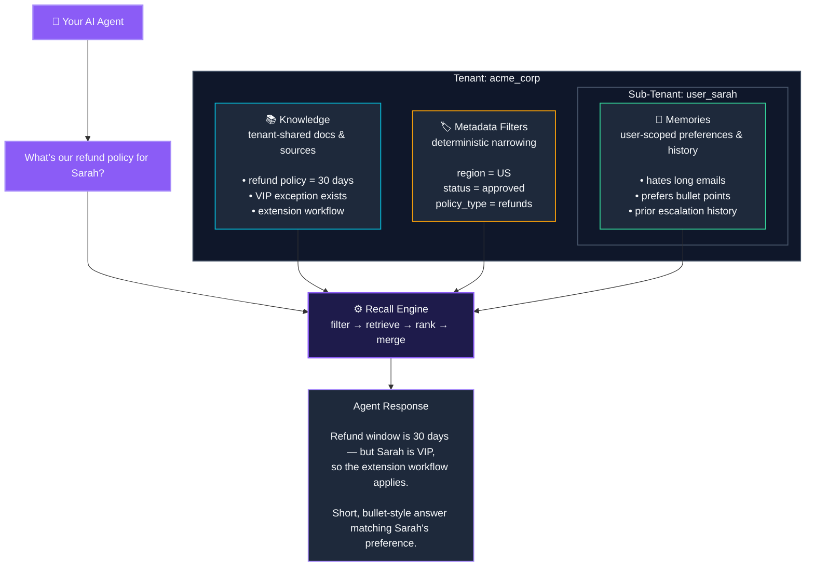

> A short overview of each primitive, with links to deeper [Essentials](/essentials) pages.

## The five primitives

| Primitive | What it is | Deep dive |
|---|---|---|
| **Memories** | User-scoped context - preferences, conversations, inferred traits | [Essentials → Memories](/essentials/memories) |
| **Knowledge** | Shared, tenant-wide context - documents, PDFs, app sources | [Essentials → Knowledge](/essentials/knowledge) |
| **Recall** | How agents read context from HydraDB | [Essentials → Recall](/essentials/recall) |
| **Tenants** | Isolated workspaces with sub-tenant hierarchy | [Essentials → Multi-Tenant](/essentials/multi-tenant) |
| **Metadata** | Structured filters for deterministic retrieval | [Essentials → Metadata](/essentials/metadata) |

**Looking for something else?** [API Reference](/api-reference) · [Quickstart](/get-started/quickstart) · [Architecture](/essentials/architecture)

---

## The mental model

Memories are scoped by sub-tenant. Knowledge is shared inside the tenant. Metadata filters retrieval, and Recall is how your agent reads across the structure.



---

## Memories

Memories are a user-scoped context that your agent writes and reads over time - preferences, conversation history, and inferred behavioral traits.

When you add a memory with `infer: true`, HydraDB automatically extracts the underlying preference. You can ship raw behavioral logs (interaction events, UI actions, dialogue), and HydraDB derives the structured insight. You don't have to do the extraction.

When you add a memory with `infer: false` (the default), HydraDB stores exactly what you send - useful for facts you've already captured.

Memories are retrieved exclusively through [`/recall/recall_preferences`](/api-reference/endpoint/recall-preferences). They are **not** searchable via `full_recall`.

Read More: [Essentials → Memories](/essentials/memories)

---

## Knowledge

Knowledge is shared, tenant-wide context ingested from documents and app sources - PDFs, DOCX, Markdown, Slack threads, Notion pages, CSVs, emails.

HydraDB parses, chunks, embeds, and links each source into the context graph at write time. Entities and relationships are extracted automatically. At recall time, the graph traversal step surfaces structurally connected material that vector search alone would miss.

Knowledge is retrieved through [`/recall/full_recall`](/api-reference/endpoint/full-recall). It is **not** searchable via `recall_preferences`.

Read More: [Essentials → Knowledge](/essentials/knowledge)

---

## Why they're separate

Memories and Knowledge are distinct at the storage layer, not just conceptually:

| | Memories | Knowledge |
|---|---|---|
| **Content** | User preferences, conversation history, inferred traits | Documents, files, app-generated content |
| **Scope** | Per-user (scoped by `sub_tenant_id`) | Shared across all users in a tenant |
| **Mutability** | Dynamic - evolves with every interaction | Versioned - replaced or deleted explicitly |
| **Recall endpoint** | `recall_preferences` | `full_recall` |
| **Inference** | `infer` flag extracts traits automatically | Not applicable - content is parsed and chunked |
| **`vectorstore_status`** | Index `0` | Index `1` |

For personalized answers grounded in shared documents, call both endpoints in parallel and merge the results before prompting your LLM. See [How to Use API Results](/essentials/api-results).

---

## Recall

Recall is how agents read from HydraDB. Storing data is easy; knowing *what* to retrieve, *when*, and *why* is the hard part.

HydraDB's recall is not a vector search. It's a multi-stage pipeline that combines metadata filtering, semantic and keyword retrieval, graph traversal, and personalized ranking - all in a single API call.

Vector search asks *"what's similar to my query?"* Graph traversal asks *"What's structurally connected to it?"* HydraDB does both, then weights the results by usefulness for the current task.

Read More: [Essentials → Recall](/essentials/recall)

---

## Tenants and Sub-Tenants

A **Tenant** is a completely isolated workspace. No tenant can read another tenant's data. In most cases, each organization has one tenant.

A **sub-tenant** is a logical partition within a tenant - a user, team, project, or department.

- **B2B** - each customer is a tenant; their departments are sub-tenants
- **B2C** - one tenant for the organization; each end user is a sub-tenant

Read More: [Essentials → Multi-Tenant Support](/essentials/multi-tenant)

---

## Metadata

Metadata makes recall deterministic. Semantic search is powerful, but production systems need hard filters: "only Engineering docs," "only approved policies," "only refund policies."

Two tiers:

- **`metadata`** - filterable fields defined in the tenant schema. Plan these fields before ingestion and pass them through `metadata_filters` at recall time.
- **`additional_metadata`** - free-form fields attached per document at ingestion. Flexible. Not matchable at recall time.

At ingestion:

```json
{
  "metadata": { "compliance_framework": "SOC2", "region": "us" },
  "additional_metadata": {
    "owner": "sarah.chen@acme.com",
    "status": "approved"
 }
}
```

At query time:

```json
{
  "query": "latest pricing strategy",
  "metadata_filters": { "compliance_framework": "SOC2" }
}
```

Filters apply *before* semantic ranking - turning "semantically similar" into "semantically similar *and* properly scoped."

Read More: [Essentials → Metadata](/essentials/metadata)

---

## What's next

- [Architecture Overview](/essentials/architecture) - how the graph, vector store, and ranking layers fit together
- [Quickstart](/get-started/quickstart) - build your first integration in five minutes
- [Essentials](/essentials) - deeper coverage of every concept on this page
