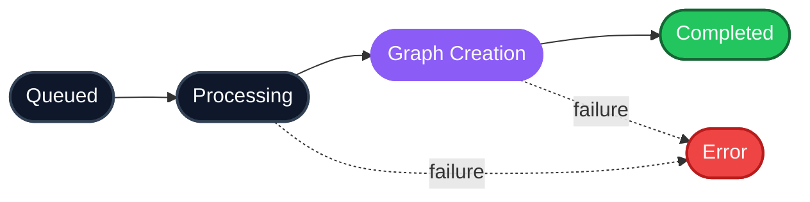

**Already have a tenant?** Jump to [Step 2 - Ingest data](#step-2-ingest-data)

**Already ingested data?** Jump to [Step 4 - Recall context](#step-4-recall-context)

---

## What you'll build


Step 3 is async - HydraDB parses, chunks, embeds, and graphs your content in the background. Steps 1, 2, 4, and 5 run in real time.

---

## Prerequisites

- An API key from [app.hydradb.com](https://app.hydradb.com)
- A backend that can make HTTP calls, or one of the HydraDB SDKs

**Base URL:** `https://api.hydradb.com`
**Authentication:** `Authorization: Bearer <your_api_key>` on every request

### Install the SDK (optional)

<CodeGroup>
```bash cURL
# No install needed - use curl directly
```
```typescript TypeScript SDK
npm install @hydradb/sdk
```
```python Python SDK
pip install hydradb-sdk
```
</CodeGroup>

Initialize a client:

<CodeGroup>
```bash cURL
# Set your key as an environment variable
export HYDRADB_API_KEY="your_api_key"
```
```typescript TypeScript SDK
import { HydraDBClient } from "@hydradb/sdk";

const client = new HydraDBClient({
  token: process.env.HYDRADB_API_KEY,
});
```
```python Python SDK
import os
from hydra_db import HydraDB

client = HydraDB(token=os.environ["HYDRADB_API_KEY"])
```
</CodeGroup>

---

## Step 1 - Create a tenant

A tenant is your fully isolated workspace. Everything you ingest and recall lives inside it.

<CodeGroup>
```bash cURL
curl -X POST 'https://api.hydradb.com/tenants/create' \
  -H "Authorization: Bearer $HYDRADB_API_KEY" \
  -H "Content-Type: application/json" \
  -d '{"tenant_id": "my_first_tenant"}'
```
```typescript TypeScript SDK
const response = await client.tenant.create({
  tenant_id: "my_first_tenant",
});
```
```python Python SDK
response = client.tenant.create(tenant_id="my_first_tenant")
```
</CodeGroup>

**Response:**

```json
{
  "status": "accepted",
  "tenant_id": "my_first_tenant",
  "message": "Tenant creation started in the background. Use GET /tenants/infra/status?tenant_id=... to check progress."
}
```

Tenant creation is **asynchronous**. Poll until provisioning completes before ingesting:

<CodeGroup>
```bash cURL
curl 'https://api.hydradb.com/tenants/infra/status?tenant_id=my_first_tenant' \
  -H "Authorization: Bearer $HYDRADB_API_KEY"
```
```typescript TypeScript SDK
const status = await client.tenant.getInfraStatus({
  tenant_id: "my_first_tenant",
});
```
```python Python SDK
status = client.tenant.get_infra_status(tenant_id="my_first_tenant")
```
</CodeGroup>

**Response:**

```json
{
  "tenant_id": "my_first_tenant",
  "org_id": "free",
  "infra": {
    "scheduler_status": true,
    "graph_status": true,
    "vectorstore_status": [true, true]
  },
  "message": "Deployed infrastructure status"
}
```

Wait until `graph_status` is `true` and both values in `vectorstore_status` are `true`.

<Note>
  **`vectorstore_status` index mapping:** `[0]` is the **Memories** vector store; `[1]` is the **Knowledge** vector store. Both must be `true` before ingesting.
</Note>

---

## Step 2 - Ingest data

HydraDB has two distinct data stores. Pick the one that matches what you're ingesting.

### Option A - Knowledge (documents and app sources)

Use for shared, tenant-wide content that all users can recall: PDFs, DOCX, Slack threads, Notion pages, CSVs.

<CodeGroup>
```bash cURL
curl -X POST 'https://api.hydradb.com/ingestion/upload_knowledge' \
  -H "Authorization: Bearer $HYDRADB_API_KEY" \
  -F "tenant_id=my_first_tenant" \
  -F "files=@/path/to/contract.pdf"
```
```typescript TypeScript SDK
import { createReadStream } from "node:fs";

const result = await client.upload.knowledge({
  tenant_id: "my_first_tenant",
  files: [createReadStream("/path/to/contract.pdf")],
});
```
```python Python SDK
with open("/path/to/contract.pdf", "rb") as f:
    result = client.upload.knowledge(
        tenant_id="my_first_tenant",
        files=[("contract.pdf", f, "application/pdf")],
    )
```
</CodeGroup>

**Response:**

```json
{
  "success": true,
  "results": [
    { "source_id": "ef3ea754019855e2b39e9ab5c2d26096", "filename": "contract.pdf", "status": "queued" }
  ],
  "success_count": 1,
  "failed_count": 0
}
```

### Option B - Memories (user preferences and conversation history)

Use for user-specific, dynamic context: preferences, chat history, behavioral signals, inferred traits.

<CodeGroup>
```bash cURL
curl -X POST 'https://api.hydradb.com/memories/add_memory' \
  -H "Authorization: Bearer $HYDRADB_API_KEY" \
  -H "Content-Type: application/json" \
  -d '{
    "tenant_id": "my_first_tenant",
    "sub_tenant_id": "user_alex_123",
    "memories": [
      {
        "text": "User prefers detailed technical explanations and dark mode",
        "infer": true,
        "user_name": "Alex"
      }
    ]
  }'
```
```typescript TypeScript SDK
const result = await client.upload.addMemory({
  tenant_id: "my_first_tenant",
  sub_tenant_id: "user_alex_123",
  memories: [
    {
      text: "User prefers detailed technical explanations and dark mode",
      infer: true,
      user_name: "Alex",
    },
  ],
});
```
```python Python SDK
result = client.upload.add_memory(
    tenant_id="my_first_tenant",
    sub_tenant_id="user_alex_123",
    memories=[
        {
            "text": "User prefers detailed technical explanations and dark mode",
            "infer": True,
            "user_name": "Alex",
        }
    ],
)
```
</CodeGroup>

**Response:**

```json
{
  "success": true,
  "results": [
    { "source_id": "1d50e5cd7c196a2bbcc1a59b037b3a44", "status": "queued", "infer": true }
  ],
  "success_count": 1,
  "failed_count": 0
}
```

Both paths return a `source_id` you can use to track processing.

---

## Step 3 - Verify processing

Ingestion is asynchronous. Content passes through a pipeline before it is searchable:



<CodeGroup>
```bash cURL
curl -X POST \
  'https://api.hydradb.com/ingestion/verify_processing?file_ids=<source_id>&tenant_id=my_first_tenant' \
  -H "Authorization: Bearer $HYDRADB_API_KEY"
```
```typescript TypeScript SDK
const status = await client.upload.verifyProcessing({
  tenant_id: "my_first_tenant",
  file_ids: ["<source_id>"],
});
```
```python Python SDK
status = client.upload.verify_processing(
    tenant_id="my_first_tenant",
    file_ids=["<source_id>"],
)
```
</CodeGroup>

**Response:**

```json
{
  "statuses": [
    {
      "file_id": "<source_id>",
      "indexing_status": "completed",
      "success": true
    }
  ]
}
```

Poll every few seconds until `indexing_status` is `completed`. Most documents index in under 60 seconds. Still, larger documents may take upto 5 minutes.

---

## Step 4 - Recall context

Now the interesting part. HydraDB exposes two recall endpoints - one per store. Use the right one for what you ingested.

### For Knowledge (documents)

<CodeGroup>
```bash cURL
curl -X POST 'https://api.hydradb.com/recall/full_recall' \
  -H "Authorization: Bearer $HYDRADB_API_KEY" \
  -H "Content-Type: application/json" \
  -d '{
    "tenant_id": "my_first_tenant",
    "query": "What are the pricing tiers?",
    "max_results": 5,
    "mode": "fast",
    "graph_context": true
  }'
```
```typescript TypeScript SDK
const result = await client.recall.fullRecall({
  tenant_id: "my_first_tenant",
  query: "What are the pricing tiers?",
  max_results: 5,
  mode: "fast",
  graph_context: true,
});
```
```python Python SDK
result = client.recall.full_recall(
    tenant_id="my_first_tenant",
    query="What are the pricing tiers?",
    max_results=5,
    mode="fast",
    graph_context=True,
)
```
</CodeGroup>

### For Memories (user preferences)

<CodeGroup>
```bash cURL
curl -X POST 'https://api.hydradb.com/recall/recall_preferences' \
  -H "Authorization: Bearer $HYDRADB_API_KEY" \
  -H "Content-Type: application/json" \
  -d '{
    "tenant_id": "my_first_tenant",
    "sub_tenant_id": "user_alex_123",
    "query": "answer style and tone preferences",
    "mode": "fast",
    "max_results": 3
  }'
```
```typescript TypeScript SDK
const memories = await client.recall.recallPreferences({
  tenant_id: "my_first_tenant",
  sub_tenant_id: "user_alex_123",
  query: "answer style and tone preferences",
  mode: "fast",
  max_results: 3,
});
```
```python Python SDK
memories = client.recall.recall_preferences(
    tenant_id="my_first_tenant",
    sub_tenant_id="user_alex_123",
    query="answer style and tone preferences",
    mode="fast",
    max_results=3,
)
```
</CodeGroup>

**Key flags:**

- `mode: "thinking"` - multi-stage recall with query expansion and reranking. Better results, higher latency. Default is `"fast"`.
- `graph_context: true` - enriches the response with entity relationships from the knowledge graph. Only applies to `full_recall`.

**Sample response** (`full_recall`):

```json
{
  "chunks": [
    {
      "chunk_uuid": "a1b2c3d4-...",
      "source_id": "doc_12345",
      "chunk_content": "Tiered pricing: $29/month Starter, $79/month Pro, $199/month Enterprise...",
      "source_title": "Q4 Pricing Strategy",
      "relevancy_score": 0.92
    }
  ],
  "graph_context": {
    "query_paths": [
      {
        "triplets": [
          {
            "source": { "name": "Pricing Strategy" },
            "relation": { "canonical_predicate": "OWNED_BY" },
            "target": { "name": "Product Team" }
          }
        ]
      }
    ],
    "chunk_relations": [],
    "chunk_id_to_group_ids": {}
  }
}
```
<Note>
  **`relevancy_score`:** A metric to evaluate each chunk's relevance to the query. Ranges from `0.0` to `2.0`.
</Note>

`chunks` is retrieved content ranked by relevance. `graph_context` contains entity relationships extracted from your data - useful for reasoning about *how* things connect, not just *what* was said.

---

## Step 5 - Pass it to your LLM

For personalized, grounded answers, call both `full_recall` and `recall_preferences` in parallel and merge into one prompt:

<CodeGroup>
```bash cURL
# Run both recall calls, then merge in your application layer
```
```typescript TypeScript SDK
const [knowledge, memories] = await Promise.all([
  client.recall.fullRecall({
    tenant_id: "my_first_tenant",
    query: "What are the pricing tiers?",
    mode: "thinking",
    max_results: 5,
    graph_context: true,
  }),
  client.recall.recallPreferences({
    tenant_id: "my_first_tenant",
    sub_tenant_id: "user_alex_123",
    query: "answer style and tone preferences",
    mode: "thinking",
    max_results: 3,
  }),
]);

const knowledgeCtx = buildContextString(knowledge);
const memoryCtx = buildContextString(memories);

const completion = await openai.chat.completions.create({
  model: "gpt-4o",
  messages: [
    {
      role: "system",
      content: "Answer using only the provided context. Match the user's preferred style.",
    },
    {
      role: "user",
      content: `User preferences:\n${memoryCtx}\n\nRelevant docs:\n${knowledgeCtx}\n\nQuestion: What are the pricing tiers?`,
    },
  ],
});
```
```python Python SDK
import asyncio
from hydra_db import AsyncHydraDB

async_client = AsyncHydraDB(token=os.environ["HYDRADB_API_KEY"])

async def run():
    knowledge, memories = await asyncio.gather(
        async_client.recall.full_recall(
            tenant_id="my_first_tenant",
            query="What are the pricing tiers?",
            mode="thinking",
            max_results=5,
            graph_context=True,
        ),
        async_client.recall.recall_preferences(
            tenant_id="my_first_tenant",
            sub_tenant_id="user_alex_123",
            query="answer style and tone preferences",
            mode="thinking",
            max_results=3,
        ),
    )
    knowledge_ctx = build_context_string(knowledge)
    memory_ctx = build_context_string(memories)
    return knowledge_ctx, memory_ctx
```
</CodeGroup>

For the `build_context_string()` helper, see [How to Use API Results](/essentials/api-results).

---

## You're done

That's the full loop: create a tenant, ingest Knowledge and Memories, wait for processing, recall context, feed it to an LLM. Everything else in HydraDB - metadata filters, sub-tenants, graph traversal, personalization - builds on this foundation.

**Where to go next:**

- [Essentials → Memories](/essentials/memories) - how user-scoped memory works
- [Essentials → Knowledge](/essentials/knowledge) - how document ingestion works
- [Essentials → Recall](/essentials/recall) - parameters, modes, and tuning
- [API Reference](/api-reference) - full endpoint documentation
- [Cookbooks](/cookbooks) - end-to-end use case guides

Stuck? Reach out at [founders@hydradb.com](mailto:founders@hydradb.com).
