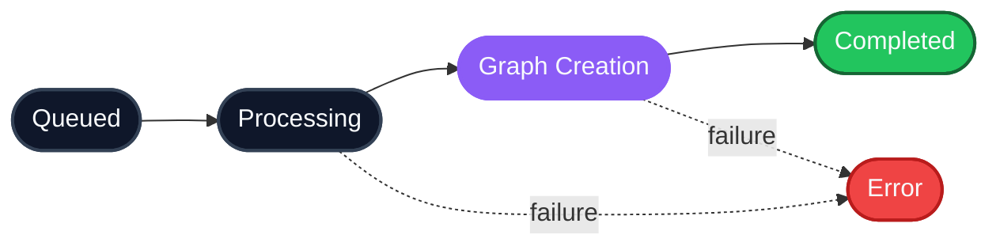

This guide walks you through the full HydraDB loop end-to-end  -  create a workspace, ingest some content, wait for indexing, and run a search  -  using the [API](/api-reference/v2). By the end you'll have a working personalized-RAG flow that you can plug into your own LLM prompt.

If you're new to HydraDB, the [Core Concepts](/get-started/core-concepts) page is a useful 5-minute primer first. If you want the architecture-level story, see [Architecture](/essentials/v2/architecture).

---

## What you'll build

By the end of this quickstart you'll have a working **production grade super scalable search that scales from 10 documents to 10,000+ with no code changes** and reaches across content that extends to **millions of tokens**. HydraDB does the parsing, chunking, embedding, graph construction, and hybrid retrieval; your application sends the query and gets back the right slice of context  -  ready to feed into an LLM prompt.


Steps 1 and 3 are **asynchronous**(runs in background)  -  HydraDB provisions infrastructure and indexes your content in the background, so each one needs a short polling loop. Steps 2, 4, and 5 run in real time. The same loop scales as your corpus grows; nothing in the code changes between 10 documents and 10,000.

---

## Prerequisites

- An API key from [app.hydradb.com](https://app.hydradb.com)
- A backend that can make HTTP calls, or one of the HydraDB [SDKs](/api-reference/v2/sdks)

| Setting | Value |
|---|---|
| **Base URL** | `https://api.hydradb.com` |
| **Auth header** | `Authorization: Bearer <your_api_key>` |
| **Version header** | `API-Version: 2` (auto-set by the SDKs) |

### Install the SDK (optional)

<CodeGroup>
```bash cURL
# No install needed — smoke-test the connection directly.
# Lists tenants visible to this key. A 200 response confirms
# auth + the version header are both wired up.
export HYDRA_DB_API_KEY="your_api_key"

curl 'https://api.hydradb.com/tenants' \
  -H "Authorization: Bearer $HYDRA_DB_API_KEY" \
  -H "API-Version: 2"
```
```bash TypeScript SDK
npm install @hydradb/sdk@^2
```
```bash Python SDK
pip install "hydradb-sdk>=2,<3"
```
</CodeGroup>

### Initialize a client

<CodeGroup>
```bash cURL
# Set your key once and reuse it on every request
export HYDRA_DB_API_KEY="your_api_key"
```
```typescript TypeScript SDK
import { HydraDBClient } from "@hydradb/sdk";

const client = new HydraDBClient({
  token: process.env.HYDRA_DB_API_KEY,
});
```
```python Python SDK
import os
from hydra_db import HydraDB

client = HydraDB(token=os.environ["HYDRA_DB_API_KEY"])
```
</CodeGroup>

---

## Fast path: create, ingest, search

Create a tenant, add one memory to the default sub-tenant, wait for indexing, then search it.

<CodeGroup>
```python Python SDK
import json, time

tenant_id = "my_first_tenant"

client.tenants.create(tenant_id=tenant_id)

while True:
    infra = client.tenants.status(tenant_id=tenant_id).infra
    if infra.ready_for_ingestion:
        break
    time.sleep(5)

ingest = client.source.ingest(
    type="memory",
    tenant_id=tenant_id,
    memories=json.dumps([
        {"text": "User prefers detailed technical explanations and dark mode"}
    ]),
)

source_id = ingest.results[0].source_id

while True:
    status = client.source.status(
        tenant_id=tenant_id,
        file_ids=[source_id],
    ).statuses[0]

    if status.indexing_status == "completed":
        break
    if status.indexing_status == "errored":
        raise RuntimeError(status.error_message)

    time.sleep(2)

results = client.search.query(
    tenant_id=tenant_id,
    source="memories",
    query="What does the user prefer?",
)

print(results.chunks)
```
```typescript TypeScript SDK
const tenantId = "my_first_tenant";

await client.tenants.create({ tenant_id: tenantId });

while (true) {
  const { infra } = await client.tenants.status({ tenant_id: tenantId });
  if (infra.ready_for_ingestion) break;
  await new Promise((resolve) => setTimeout(resolve, 5_000));
}

const ingest = await client.source.ingest({
  type: "memory",
  tenant_id: tenantId,
  memories: JSON.stringify([
    { text: "User prefers detailed technical explanations and dark mode" },
  ]),
});

const sourceId = ingest.results[0].source_id;

while (true) {
  const status = (await client.source.status({
    tenant_id: tenantId,
    file_ids: [sourceId],
  })).statuses[0];

  if (status.indexing_status === "completed") break;
  if (status.indexing_status === "errored") {
    throw new Error(status.error_message);
  }

  await new Promise((resolve) => setTimeout(resolve, 2_000));
}

const results = await client.search.query({
  tenant_id: tenantId,
  source: "memories",
  query: "What does the user prefer?",
});

console.log(results.chunks);
```
```bash cURL
export HYDRA_DB_API_KEY="your_api_key"
TENANT_ID="my_first_tenant"

curl -s -X POST 'https://api.hydradb.com/tenants' \
  -H "Authorization: Bearer $HYDRA_DB_API_KEY" \
  -H "API-Version: 2" \
  -H "Content-Type: application/json" \
  -d "{\"tenant_id\":\"${TENANT_ID}\"}"

until curl -s "https://api.hydradb.com/tenants/status?tenant_id=${TENANT_ID}" \
  -H "Authorization: Bearer $HYDRA_DB_API_KEY" \
  -H "API-Version: 2" \
  | jq -e '.data.infra.ready_for_ingestion' > /dev/null; do
  sleep 5
done

SOURCE_ID=$(curl -s -X POST 'https://api.hydradb.com/source/ingest' \
  -H "Authorization: Bearer $HYDRA_DB_API_KEY" \
  -H "API-Version: 2" \
  -F "type=memory" \
  -F "tenant_id=${TENANT_ID}" \
  -F 'memories=[{"text":"User prefers detailed technical explanations and dark mode"}]' \
  | jq -r '.data.results[0].source_id')

while true; do
  STATUS=$(curl -s -G 'https://api.hydradb.com/source/status' \
    -H "Authorization: Bearer $HYDRA_DB_API_KEY" \
    -H "API-Version: 2" \
    --data-urlencode "tenant_id=${TENANT_ID}" \
    --data-urlencode "file_ids=${SOURCE_ID}")

  INDEXING_STATUS=$(echo "$STATUS" | jq -r '.data.statuses[0].indexing_status')

  if [ "$INDEXING_STATUS" = "completed" ]; then break; fi
  if [ "$INDEXING_STATUS" = "errored" ]; then
    echo "$STATUS" | jq -r '.data.statuses[0].error_message'
    exit 1
  fi

  sleep 2
done

curl -s -X POST 'https://api.hydradb.com/search' \
  -H "Authorization: Bearer $HYDRA_DB_API_KEY" \
  -H "API-Version: 2" \
  -H "Content-Type: application/json" \
  -d "{\"tenant_id\":\"${TENANT_ID}\",\"source\":\"memories\",\"query\":\"What does the user prefer?\"}" \
  | jq '.data.chunks'
```
</CodeGroup>

---

<Steps>

<Step title="Step 1a — Create a tenant">

A [tenant](/essentials/v2/multi-tenant) is your fully isolated workspace. Everything you ingest and search lives inside it, and no other tenant can read your data. Most apps create one tenant per customer (B2B) or one shared tenant with per-user [sub-tenants](/essentials/v2/multi-tenant) (B2C).

Call [`POST /tenants`](/api-reference/v2/endpoint/create-tenant):

<CodeGroup>
```bash cURL
curl -X POST 'https://api.hydradb.com/tenants' \
  -H "Authorization: Bearer $HYDRA_DB_API_KEY" \
  -H "API-Version: 2" \
  -H "Content-Type: application/json" \
  -d '{"tenant_id": "my_first_tenant"}'
```
```typescript TypeScript SDK
const response = await client.tenants.create({
  tenant_id: "my_first_tenant",
});
```
```python Python SDK
response = client.tenants.create(tenant_id="my_first_tenant")
```
</CodeGroup>

<Accordion title="Response" icon="square-code">
```json
{
  "status": "accepted",
  "tenant_id": "my_first_tenant",
  "message": "Tenant creation started in the background. Use GET /tenants/status?tenant_id=... to check progress."
}
```
</Accordion>

<Info>
`"status": "accepted"` means HydraDB **queued** the provisioning job  -  your tenant is not ready to accept ingestion yet. Move on to Step 1b to wait for it to come online.
</Info>

</Step>

<Step title="Step 1b - Wait for provisioning">

Poll [`GET /tenants/status`](/api-reference/v2/endpoint/tenant-status) until `vectorstore_status.knowledge`, `vectorstore_status.memories`, and `graph_status` are all `true`. The snippets below loop automatically:

<CodeGroup>
```bash cURL
TENANT="my_first_tenant"
until curl -s "https://api.hydradb.com/tenants/status?tenant_id=${TENANT}" \
       -H "Authorization: Bearer $HYDRA_DB_API_KEY" \
       -H "API-Version: 2" \
     | jq -e '.data.infra | .graph_status and .scheduler_status and .vectorstore_status.knowledge and .vectorstore_status.memories' \
       > /dev/null; do
  echo "Provisioning…"
  sleep 5
done
echo "Tenant ready"
```
```typescript TypeScript SDK
while (true) {
  const status = await client.tenants.status({ tenant_id: "my_first_tenant" });
  const { graph_status, scheduler_status, vectorstore_status } = status.infra;
  if (graph_status && scheduler_status && vectorstore_status.knowledge && vectorstore_status.memories) {
    console.log("Tenant ready");
    break;
  }
  console.log("Provisioning…");
  await new Promise((r) => setTimeout(r, 5_000));
}
```
```python Python SDK
import time

while True:
    status = client.tenants.status(tenant_id="my_first_tenant")
    infra = status.infra
    if infra.graph_status and infra.scheduler_status and infra.vectorstore_status.knowledge and infra.vectorstore_status.memories:
        print("Tenant ready")
        break
    print("Provisioning…")
    time.sleep(5)
```
</CodeGroup>

<Note>
  Provisioning typically takes 1–2 minutes on Free and Ship plans, and 4–5 minutes on Enterprise plans (which get complete physical isolation).
</Note>

</Step>

<Step title="Step 2a - Ingest data">

HydraDB has two content models. Pick the one that matches what you have:

| If your content is… | Use [`POST /source/ingest`](/api-reference/v2/endpoint/ingest-content) with… | Lives in |
|---|---|---|
| Shared across users (PDFs, docs, Slack threads, Notion) | `type=knowledge` | [Knowledge](/essentials/v2/knowledge) |
| Specific to one user (preferences, conversation history) | `type=memory` | [Memories](/essentials/v2/memories) |

You can ingest both in this quickstart  -  they'll come together at search time.

### Knowledge  -  upload a document

<CodeGroup>
```bash cURL
curl -X POST 'https://api.hydradb.com/source/ingest' \
  -H "Authorization: Bearer $HYDRA_DB_API_KEY" \
  -H "API-Version: 2" \
  -F "type=knowledge" \
  -F "tenant_id=my_first_tenant" \
  -F "files=@/path/to/contract.pdf"
```
```typescript TypeScript SDK
const result = await client.source.ingest({
  type: "knowledge",
  tenant_id: "my_first_tenant",
  files: [
    { path: "/path/to/contract.pdf", filename: "contract.pdf", contentType: "application/pdf" },
  ],
});
```
```python Python SDK
with open("/path/to/contract.pdf", "rb") as f:
    result = client.source.ingest(
        type="knowledge",
        tenant_id="my_first_tenant",
        files=[("contract.pdf", f, "application/pdf")],
    )
```
</CodeGroup>

<Accordion title="Response" icon="square-code">
```json
{
  "success": true,
  "data": {
    "results": [
      { "source_id": "ef3ea754019855e2b39e9ab5c2d26096", "filename": "contract.pdf", "status": "queued" }
    ],
    "success_count": 1,
    "failed_count": 0
  }
}
```
</Accordion>

For pre-extracted text from connected apps (Slack, Notion, Gmail), use the `app_knowledge` field instead  -  see [Knowledge](/essentials/v2/knowledge) for the full shape.

### Memories  -  store a user preference

<CodeGroup>
```bash cURL
curl -X POST 'https://api.hydradb.com/source/ingest' \
  -H "Authorization: Bearer $HYDRA_DB_API_KEY" \
  -H "API-Version: 2" \
  -F "type=memory" \
  -F "tenant_id=my_first_tenant" \
  -F "sub_tenant_id=user_alex_123" \
  -F 'memories=[
    {
      "text": "User prefers detailed technical explanations and dark mode",
      "infer": true,
      "user_name": "Alex"
    }
  ]'
```
```typescript TypeScript SDK
const result = await client.source.ingest({
  type: "memory",
  tenant_id: "my_first_tenant",
  sub_tenant_id: "user_alex_123",
  memories: JSON.stringify([
    {
      text: "User prefers detailed technical explanations and dark mode",
      infer: true,
      user_name: "Alex",
    },
  ]),
});
```
```python Python SDK
import json

result = client.source.ingest(
    type="memory",
    tenant_id="my_first_tenant",
    sub_tenant_id="user_alex_123",
    memories=json.dumps([
        {
            "text": "User prefers detailed technical explanations and dark mode",
            "infer": True,
            "user_name": "Alex",
        }
    ]),
)
```
</CodeGroup>

<Info>
**`infer: true`** lets HydraDB extract the underlying preference from raw text or dialogue. Use it when you have messy signal (chat logs, behavior streams). Use `infer: false` (the default) when you've already done the extraction and want to store the text verbatim. See [Memories  -  How it works](/essentials/v2/memories#5-how-it-works).
</Info>

Both responses include a `source_id` per item. Save them  -  you'll use them in Step 2b to confirm indexing finished.

</Step>

<Step title="Step 2b - Verify processing">

Ingestion is asynchronous(runs in background). Content passes through this pipeline(Queued --> Processing --> Graph Creation --> Completed) before it becomes fully searchable:



Items become **searchable** when they reach `graph_creation`. Wait for `completed` only if you need full graph context (`graph_context: true` on search). The full status table lives at [Source Status](/api-reference/v2/endpoint/source-status).

Poll [`GET /source/status`](/api-reference/v2/endpoint/source-status) until every `source_id` lands in a terminal state:

<CodeGroup>
```bash cURL
SOURCE_ID="<source_id from step 2a>"

while true; do
  response=$(curl -s -G 'https://api.hydradb.com/source/status' \
    -H "Authorization: Bearer $HYDRA_DB_API_KEY" \
    -H "API-Version: 2" \
    --data-urlencode "tenant_id=my_first_tenant" \
    --data-urlencode "source_ids=${SOURCE_ID}")

  statuses=$(echo "$response" | jq -r '.data.statuses[].indexing_status')

  if echo "$statuses" | grep -qv '^\(completed\|errored\)$'; then
    echo "Indexing… ($statuses)"
    sleep 5
    continue
  fi

  echo "Done:"
  echo "$response" | jq '.data.statuses'
  break
done
```
```typescript TypeScript SDK
const sourceIds = ["<source_id from step 2a>"];
const terminal = new Set(["completed", "errored"]);

while (true) {
  const status = await client.source.status({
    tenant_id: "my_first_tenant",
    source_ids: sourceIds,
  });

  const allDone = status.statuses.every((s) => terminal.has(s.indexing_status));
  if (allDone) {
    console.log("Done:", status.statuses);
    break;
  }
  console.log("Indexing…", status.statuses.map((s) => s.indexing_status));
  await new Promise((r) => setTimeout(r, 5_000));
}
```
```python Python SDK
import time

source_ids = ["<source_id from step 2a>"]
terminal = {"completed", "errored"}

while True:
    status = client.source.status(
        tenant_id="my_first_tenant",
        source_ids=source_ids,
    )
    if all(s.indexing_status in terminal for s in status.statuses):
        print("Done:", status.statuses)
        break
    print("Indexing…", [s.indexing_status for s in status.statuses])
    time.sleep(5)
```
</CodeGroup>

<Accordion title="Response shape" icon="square-code">
```json
{
  "success": true,
  "data": {
    "statuses": [
      { "source_id": "<source_id>", "indexing_status": "completed", "success": true, "message": "..." }
    ]
  }
}
```
</Accordion>

Most documents complete in 1–5 minutes. Larger PDFs or DOCX files can take up to 15. Memories complete in seconds.

</Step>

<Step title="Step 3 - Search context">

there's a single retrieval endpoint  -  [`POST /search`](/api-reference/v2/endpoint/search)  -  and two parameters control everything:

- **`source`** picks the bucket: `"knowledge"` (Knowledge), `"memories"` (Memories), or `"all"` (both, merged).
- **`search_by`** picks the method: `"hybrid"` (default  -  dense + BM25), `"text"` (BM25 only), or `"vector"` (dense only).

For a personalized answer that pulls from both shared docs **and** the user's memories, use `source: "all"`:

<CodeGroup>
```bash cURL
curl -X POST 'https://api.hydradb.com/search' \
  -H "Authorization: Bearer $HYDRA_DB_API_KEY" \
  -H "API-Version: 2" \
  -H "Content-Type: application/json" \
  -d '{
    "tenant_id": "my_first_tenant",
    "sub_tenant_id": "user_alex_123",
    "query": "What are the pricing tiers?",
    "source": "all",
    "search_by": "hybrid",
    "mode": "thinking",
    "max_results": 8,
    "graph_context": true
  }'
```
```typescript TypeScript SDK
const result = await client.search.query({
  tenant_id: "my_first_tenant",
  sub_tenant_id: "user_alex_123",
  query: "What are the pricing tiers?",
  source: "all",
  search_by: "hybrid",
  mode: "thinking",
  max_results: 8,
  graph_context: true,
});
```
```python Python SDK
result = client.search.query(
    tenant_id="my_first_tenant",
    sub_tenant_id="user_alex_123",
    query="What are the pricing tiers?",
    source="all",
    search_by="hybrid",
    mode="thinking",
    max_results=8,
    graph_context=True,
)
```
</CodeGroup>

**Key flags:**

- **`mode: "thinking"`**  - ensures more accurate results. Higher quality. Use for customer-facing answers. The default `"fast"` skips expansion. See [Search](/essentials/v2/search) for the full deep-dive.
- **`graph_context: true`**  -  enriches results with entity relationships from the [context graph](/essentials/v2/context-graphs).
- **`alpha`** (not set above, defaults to `0.8`)  -  blends semantic vs. keyword bm25 scoring. Lower it (`0.3–0.5`) when the query contains literal tokens like error codes or SKUs.

<Accordion title="Sample response" icon="square-code">
```json
{
  "success": true,
  "data": {
    "chunks": [
      {
        "chunk_uuid": "a1b2c3d4-...",
        "source_id": "doc_12345",
        "chunk_content": "Tiered pricing: $29/month Starter, $79/month Pro, $199/month Enterprise...",
        "source_title": "Q4 Pricing Strategy",
        "relevancy_score": 0.92
      }
    ],
    "graph_context": {
      "query_paths": [
        {
          "triplets": [
            {
              "source": { "name": "Pricing Strategy" },
              "relation": { "canonical_predicate": "OWNED_BY" },
              "target": { "name": "Product Team" }
            }
          ]
        }
      ],
      "chunk_relations": [],
      "chunk_id_to_group_ids": {}
    }
  }
}
```
</Accordion>

<Note>
  **`relevancy_score`** is a metric to evaluate each chunk's relevance to the query, ranging from `0.0` to `2.0`.
</Note>

`chunks` is the retrieved content, ranked by relevance. `graph_context` carries entity relationships  -  useful when you want to reason about *how* things connect, not just *what* was said.

</Step>

<Step title="Step 4 - Pass it to your LLM">

[`POST /search`](/api-reference/v2/endpoint/search) returns structured JSON; your model wants prose. The bridge is a context-building helper that flattens chunks (and optional graph context) into a string you can drop into a system or user prompt. The full helper, with all the formatting edge cases, lives in [How to Use API Results](/essentials/v2/api-results).

Here's the minimal version:

<CodeGroup>
```typescript TypeScript SDK
const result = await client.search.query({
  tenant_id: "my_first_tenant",
  sub_tenant_id: "user_alex_123",
  query: "What are the pricing tiers?",
  source: "all",
  search_by: "hybrid",
  mode: "thinking",
  graph_context: true,
});

const context = buildContextString(result);

const completion = await openai.chat.completions.create({
  model: "gpt-4o",
  messages: [
    {
      role: "system",
      content: "Answer using only the provided context. Match the user's preferred style.",
    },
    {
      role: "user",
      content: `${context}\n\nQuestion: What are the pricing tiers?`,
    },
  ],
});
```
```python Python SDK
result = client.search.query(
    tenant_id="my_first_tenant",
    sub_tenant_id="user_alex_123",
    query="What are the pricing tiers?",
    source="all",
    search_by="hybrid",
    mode="thinking",
    graph_context=True,
)

context = build_context_string(result)

completion = openai_client.chat.completions.create(
    model="gpt-4o",
    messages=[
        {"role": "system", "content": "Answer using only the provided context. Match the user's preferred style."},
        {"role": "user", "content": f"{context}\n\nQuestion: What are the pricing tiers?"},
    ],
)
```
</CodeGroup>

That's it  -  one search call, one prompt, one personalized grounded answer.

</Step>

</Steps>

---

## You're done

That's the full HydraDB v2 loop: [create a tenant](/api-reference/v2/endpoint/create-tenant), [ingest](/api-reference/v2/endpoint/ingest-content) knowledge and memories, [verify](/api-reference/v2/endpoint/source-status) processing, [search](/api-reference/v2/endpoint/search), and feed the result to an LLM. Everything else in HydraDB  -  [metadata filters](/essentials/v2/metadata), [sub-tenants](/essentials/v2/multi-tenant), [graph traversal](/essentials/v2/context-graphs), forceful relations  -  layers on top of this foundation.

### Where to go next

| If you want to… | Read… |
|---|---|
| Understand how content gets stored and retrieved | [Architecture](/essentials/v2/architecture) |
| Tune search behavior (`alpha`, `mode`, `recency_bias`) | [Search](/essentials/v2/search) |
| Design a filterable metadata schema | [Metadata](/essentials/v2/metadata) |
| Scope data per user or workspace | [Multi-Tenant](/essentials/v2/multi-tenant) |
| Format the LLM prompt from `RetrievalResult` | [How to Use API Results](/essentials/v2/api-results) |
| See the full endpoint reference | [API Reference](/api-reference/v2) |
| Pick from real-world recipes | [Cookbooks](/cookbooks/index) |

Stuck? Reach out at [founders@hydradb.com](mailto:founders@hydradb.com).
