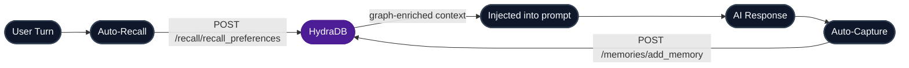

## Quick Start

<Steps>
  <Step title="Install the plugin">
    ```bash
    openclaw plugins install @hydradb/openclaw
    ```

    <Note>
      Requires **OpenClaw 2026.1.29 or later**. Run `openclaw --version` to check.
    </Note>
  </Step>

  <Step title="Get credentials">
    1. Create an API key from the [HydraDB dashboard](https://app.hydradb.com/keys)
    2. Create or copy your tenant ID from the [HydraDB dashboard](https://app.hydradb.com/tenants)
  </Step>

  <Step title="Run interactive onboarding (recommended)">
    ```bash
    # Basic onboarding
    openclaw hydra onboard

    # Advanced onboarding
    openclaw hydra onboard --advanced
    ```

    The wizard writes credentials to `plugins.entries.openclaw.config` inside your OpenClaw settings file.
  </Step>

  <Step title="Restart OpenClaw gateway">
    ```bash
    openclaw gateway restart
    ```
  </Step>
</Steps>

<Note>
  The onboarding wizard auto-detects your config path using OpenClaw's normal resolution order. Manual path selection is usually not needed.
</Note>

### Config path resolution order

1. `$OPENCLAW_CONFIG_PATH` (if set)
2. `$OPENCLAW_STATE_DIR/openclaw.json` (if set)
3. `$OPENCLAW_HOME/.openclaw/openclaw.json` (if set)
4. Default path by OS:
   - macOS/Linux: `~/.openclaw/openclaw.json`
   - Windows: `%USERPROFILE%\.openclaw\openclaw.json`

---

## Manual Configuration

If you prefer not to use the onboarding wizard, configure credentials directly.

Two required values: your **API key** and **Tenant ID**.

**Environment variables (recommended for secrets):**

<Tabs>
  <Tab title="macOS/Linux (bash or zsh)">
    ```bash
    export HYDRA_OPENCLAW_API_KEY="your-api-key"
    export HYDRA_OPENCLAW_TENANT_ID="your-tenant-id"
    ```
  </Tab>

  <Tab title="Windows (PowerShell)">
    ```powershell
    [System.Environment]::SetEnvironmentVariable("HYDRA_OPENCLAW_API_KEY", "your-api-key", "User")
    [System.Environment]::SetEnvironmentVariable("HYDRA_OPENCLAW_TENANT_ID", "your-tenant-id", "User")
    ```
  </Tab>
</Tabs>

**Or set them directly in your OpenClaw settings file:**

<Tabs>
  <Tab title="macOS/Linux">
    `~/.openclaw/openclaw.json`
  </Tab>
  <Tab title="Windows">
    `%USERPROFILE%\.openclaw\openclaw.json`
  </Tab>
</Tabs>

```json5
{
  "plugins": {
    "entries": {
      "openclaw": {
        "enabled": true,
        "config": {
          "apiKey": "${HYDRA_OPENCLAW_API_KEY}",
          "tenantId": "${HYDRA_OPENCLAW_TENANT_ID}"
        }
      }
    }
  }
}
```

After any config change, restart the gateway so the plugin reloads:

```bash
openclaw gateway restart
```

---

## Configuration Options

| Key                  | Type      | Default                   | Description                                                                     |
| -------------------- | --------- | ------------------------- | ------------------------------------------------------------------------------- |
| `subTenantId`        | `string`  | `"hydra-openclaw-plugin"` | Sub-tenant for data partitioning within your tenant                             |
| `autoRecall`         | `boolean` | `true`                    | Inject relevant memories before every AI turn                                   |
| `autoCapture`        | `boolean` | `true`                    | Store conversation exchanges after every AI turn                                |
| `maxRecallResults`   | `number`  | `10`                      | Max memory chunks injected into context per turn                                |
| `recallMode`         | `string`  | `"fast"`                  | `"fast"` for low latency; `"thinking"` for deeper graph-traversal recall        |
| `graphContext`       | `boolean` | `true`                    | Include knowledge graph relations in recalled context                           |
| `ignoreTerm`         | `string`  | `"hydra-ignore"`          | Messages containing this string are excluded from recall and capture            |
| `debug`              | `boolean` | `false`                   | Verbose debug logs                                                              |

---

## How It Works



- **Auto-Recall** - Before every AI turn, queries HydraDB (`POST /recall/recall_preferences`) for relevant memories and injects graph-enriched context: entity paths, chunk relations, and linked extra context.
- **Auto-Capture** - After every AI turn, the last user/assistant exchange is sent to HydraDB (`POST /memories/add_memory`) with `infer: true` and `upsert: true`. The session ID is used as `source_id` so HydraDB groups exchanges per session and builds the knowledge graph automatically.

---

## Slash Commands

| Command                     | Description                            |
| --------------------------- | -------------------------------------- |
| `/hydra-onboard`            | Show current configuration status      |
| `/hydra-remember <text>`    | Save something to HydraDB memory       |
| `/hydra-recall <query>`     | Search memories with relevance scores  |
| `/hydra-list`               | List all stored user memories          |
| `/hydra-delete <id>`        | Delete a specific memory by its ID     |
| `/hydra-get <source_id>`    | Fetch the full content of a source     |

---

## AI Tools

| Tool                   | Description                                                    |
| ---------------------- | -------------------------------------------------------------- |
| `hydra_store`          | Save the recent conversation history to HydraDB as memory      |
| `hydra_search`         | Search HydraDB memories (returns graph-enriched context)       |
| `hydra_list_memories`  | List all stored user memories (IDs and summaries)              |
| `hydra_get_content`    | Fetch full content for a specific `source_id`                  |
| `hydra_delete_memory`  | Delete a memory by `memory_id` - use only on explicit request  |

---

## CLI Reference

```bash
openclaw hydra onboard             # Interactive onboarding wizard
openclaw hydra onboard --advanced  # Advanced onboarding wizard
openclaw hydra search <query>      # Search memories
openclaw hydra list                # List all user memories
openclaw hydra delete <id>         # Delete a memory
openclaw hydra get <source_id>     # Fetch source content
openclaw hydra status              # Show plugin configuration
```

---

## Context Injection

Recalled context is injected inside `<hydra-context>` tags containing:

- **Entity Paths** - Knowledge graph paths connecting entities relevant to the query
- **Context Chunks** - Retrieved memory chunks with source titles, graph relations, and linked extra context

---

## Troubleshooting

<AccordionGroup>
  <Accordion title="`Not configured. Run openclaw hydra onboard`">
    The plugin is enabled but credentials are missing. Run:

    ```bash
    openclaw hydra onboard
    openclaw gateway restart
    ```
  </Accordion>

  <Accordion title="CLI says a command is unknown">
    The gateway needs to reload plugin commands after installation or config changes:

    ```bash
    openclaw gateway restart
    ```
  </Accordion>
</AccordionGroup>

---

## Source & Show Support

<Note>
  If this HydraDB plugin makes your OpenClaw workflow smarter, please star the open-source repos that power it.
  <Card
    title="openclaw-hydradb"
    icon="star"
    href="https://github.com/usecortex/openclaw-hydradb"
  >
    Star on GitHub if you use OpenClaw too.
  </Card>
</Note>
