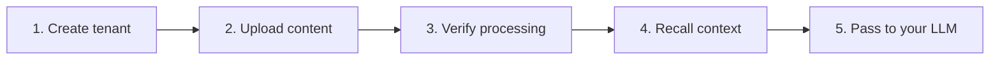

> Base URL: `https://api.hydradb.com`
>
> [Sign up](https://hydradb.com/) or contact [founders@hydradb.com](mailto:founders@hydradb.com) to get your API key.

All endpoints require an API key as a Bearer token:

```bash
Authorization: Bearer <your_api_key>
```

## What You'll Build



Ingestion is async. HydraDB accepts content quickly, then parses, chunks, embeds, and builds graph context in the background.

## Step 1: Create a tenant

A tenant is your isolated workspace.

```bash
curl -X POST 'https://api.hydradb.com/tenants/create' \
  -H "Authorization: Bearer <your_api_key>" \
  -H "Content-Type: application/json" \
  -d '{"tenant_id": "your_tenant_id"}'
```

**Response:**

```json
{
  "status": "accepted",
  "tenant_id": "your_tenant_id",
  "message": "Tenant creation started in the background. Use GET /tenants/infra/status?tenant_id=... to check progress."
}
```

Poll infrastructure status before ingesting:

```bash
curl 'https://api.hydradb.com/tenants/infra/status?tenant_id=your_tenant_id' \
  -H "Authorization: Bearer <your_api_key>"
```

Wait until `graph_status` is `true` and both values in `vectorstore_status` are `true`.

```json
{
  "tenant_id": "your_tenant_id",
  "org_id": "your_org_id",
  "infra": {
    "scheduler_status": true,
    "graph_status": true,
    "vectorstore_status": [true, true]
  },
  "message": "Deployed infrastructure status"
}
```

## Step 2: Upload content

Choose the upload path based on what you are adding.

### Option A: Upload files

Use this for PDFs, DOCX, TXT, CSV, and other files HydraDB should parse.

```bash
curl -X POST 'https://api.hydradb.com/ingestion/upload_knowledge' \
  -H "Authorization: Bearer <your_api_key>" \
  -F "tenant_id=your_tenant_id" \
  -F "files=@/path/to/document.pdf"
```

**Response:**

```json
{
  "success": true,
  "message": "Knowledge uploaded successfully",
  "results": [
    {
      "source_id": "source_123",
      "filename": "document.pdf",
      "status": "queued",
      "error": null
    }
  ],
  "success_count": 1,
  "failed_count": 0
}
```

### Option B: Add user memories

Use this for text, markdown, or conversation memory tied to a user or workspace.

```bash
curl -X POST 'https://api.hydradb.com/memories/add_memory' \
  -H "Authorization: Bearer <your_api_key>" \
  -H "Content-Type: application/json" \
  -d '{
    "tenant_id": "your_tenant_id",
    "sub_tenant_id": "user_123",
    "memories": [
      {
        "text": "User prefers concise bullet-point responses",
        "infer": false
      }
    ]
  }'
```

**Response:**

```json
{
  "success": true,
  "message": "Memories queued for ingestion successfully",
  "results": [
    {
      "source_id": "memory_123",
      "title": null,
      "status": "queued",
      "infer": false,
      "error": null
    }
  ],
  "success_count": 1,
  "failed_count": 0
}
```

## Step 3: Verify processing

Use the returned `source_id` as `file_ids`.

```bash
curl -X POST \
  'https://api.hydradb.com/ingestion/verify_processing?file_ids=source_123&tenant_id=your_tenant_id' \
  -H "Authorization: Bearer <your_api_key>"
```

**Response:**

```json
{
  "statuses": [
    {
      "file_id": "source_123",
      "indexing_status": "completed",
      "error_code": "",
      "success": true,
      "message": "Processing status retrieved successfully"
    }
  ]
}
```

Status values include `queued`, `processing`, `graph_creation`, `completed`, and `errored`. Wait for `completed` when you need full graph context.

## Step 4: Recall context for your agent

For knowledge sources, use `full_recall`. For user memories, use `recall_preferences`.

```bash
curl -X POST 'https://api.hydradb.com/recall/full_recall' \
  -H "Authorization: Bearer <your_api_key>" \
  -H "Content-Type: application/json" \
  -d '{
    "tenant_id": "your_tenant_id",
    "query": "What did the team say about pricing?",
    "max_results": 10,
    "graph_context": true
  }'
```

**Sample response:**

```json
{
  "chunks": [
    {
      "chunk_uuid": "a1b2c3d4-e5f6-7890-1234-567890abcdef",
      "source_id": "source_123",
      "chunk_content": "The team discussed a tiered pricing model: $29/month for Starter, $79/month for Pro, and $199/month for Enterprise.",
      "source_type": "file",
      "source_title": "Q4 Pricing Strategy",
      "source_upload_time": "2026-04-27T10:00:00Z",
      "relevancy_score": 0.92,
      "additional_metadata": { "author": "Product Team" },
      "metadata": { "department": "Sales" }
    }
  ],
  "sources": [
    {
      "id": "source_123",
      "title": "Q4 Pricing Strategy",
      "type": "file",
      "description": "",
      "url": "",
      "timestamp": "2026-04-27T10:00:00Z",
      "metadata": { "department": "Sales" },
      "additional_metadata": { "author": "Product Team" }
    }
  ],
  "graph_context": {
    "query_paths": [],
    "chunk_relations": [],
    "chunk_id_to_group_ids": {}
  },
  "additional_context": {}
}
```

Pass `chunks[*].chunk_content`, source metadata, and any graph context into your LLM prompt. See [How to Use API Results](/essentials/use-api-results) for a complete formatter.
